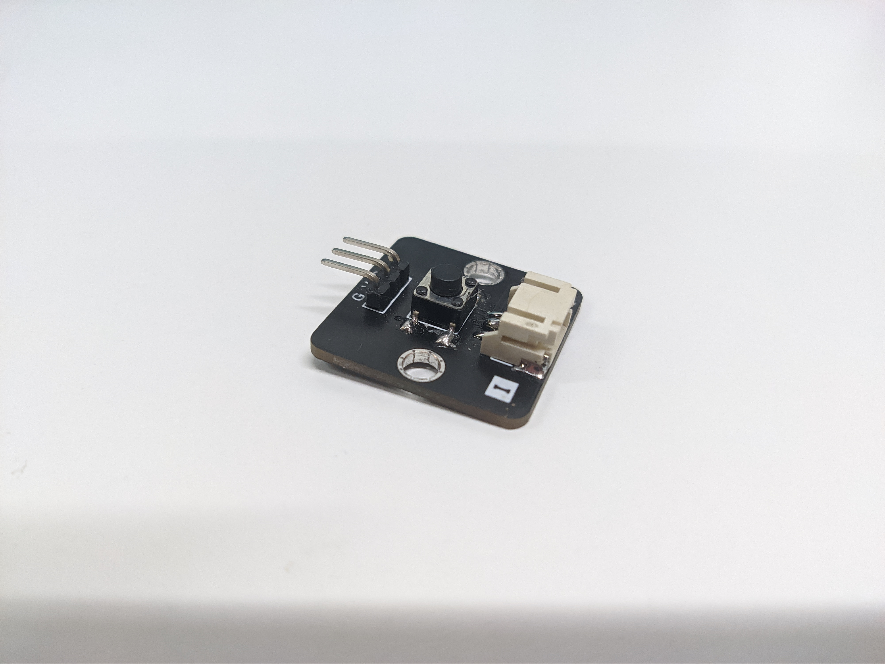
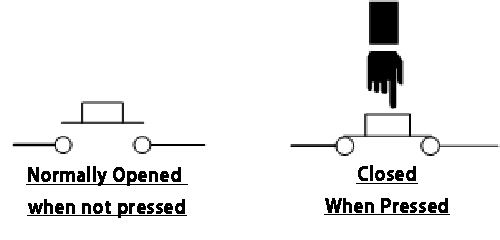
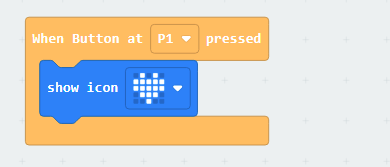

# Button

## Introduction
Button is a sensor that allow user to physical switch the circuit open or close, so it is commonly use as control component.

## The principle
The Button use a simple switch mechanism to control the connection state of circuit. Depending the construction of the button, it will have two normally states. Normally Open push button is one of common use button structure, default states is open circuit, the two terminal not connected each other, cause no current through. After pressed, the two terminal will connected and circuit will be close. 

## Specification
* Operate voltage: 0 - 5V
* Interface: Analog
* Output voltage: 0 (pressed) / same as Operate voltage (not press)

## Pinout Diagram

|Pin|Function|
|--|--|
|G|Ground|
|V|Voltage Supply|
|S|Output (same as Voltage supply)|

## Outlook and Dimension

Size: 25mm X 25mm

## Quick to Start/Sample

* Connect the sensor to development board (direct plugin or using wire)

* Open Makecode, using the [https://github.com/smarthon/pxt-smarthome](https://github.com/smarthon/pxt-smarthome) PXT 

* Use the `When Button at P1 pressed` to perform action after pressed the button

## Result
When pressed the button, the micro:bit LED will show a heart icon.

