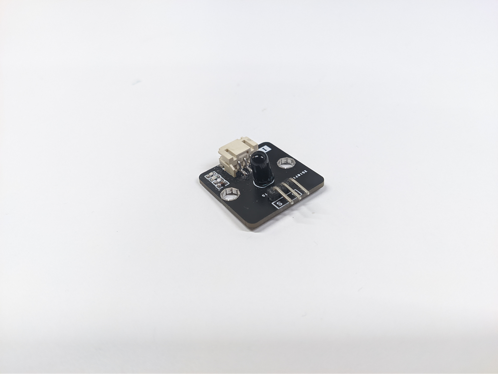
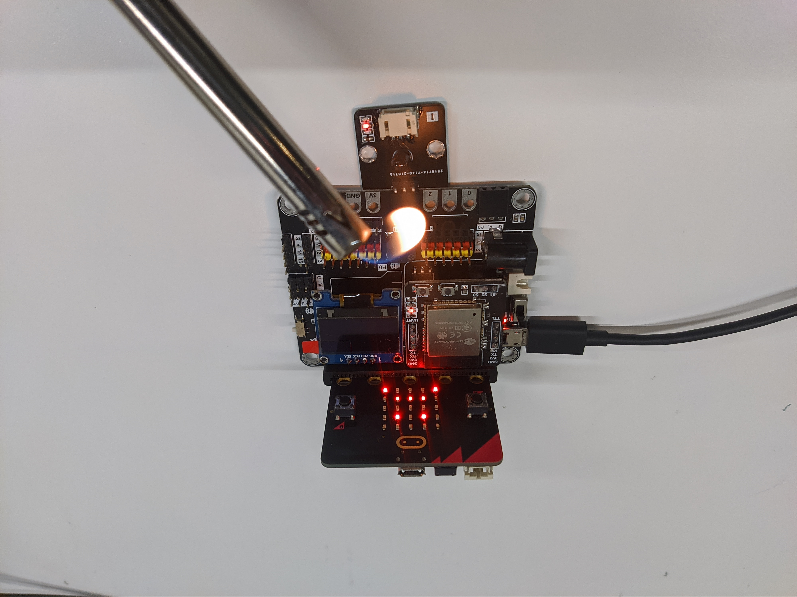

# Flame Sensor

## Introduction
Flame sensor use the infrared(IR) sensor which sensitive to the spectrum of flame to detect the flame source.

## The principle
Flame will emit different light to surrounding, besides the visible light from the luminous part, most of them are the non-visible. Depend on different fuel source, the emission spectrum is covered from UV to IR. For example, when burning the most common fuel (hydrocarbon), it will have a extreme strong emission peek on the IR region.

The flame sensor use the IR sensor which is sensitive to the wavelength above 760nm. When it point to the flame source, the strong IR light will be catch by the IR sensor, it will change the output voltage of sensor, if the value pass threshold, which means the flame was detected.

## Specification
* Operate voltage: 3.3/5V
* Interface: Analog
* Sensitive spectrum wavelength: 760nm and above
* Detection range: < 100 cm
* Output voltage: 0 (no flame detected) ~ Operate voltage (flame detected with max intensity)

## Pinout Diagram

|Pin|Function|
|--|--|
|G|Ground|
|V|Voltage Supply|
|S|Output|

## Outlook and Dimension

Size: 25mm X 25mm

## Quick to Start/Sample

* Connect the sensor to development board (direct plugin or using wire)

* Open Makecode, using the [https://github.com/smarthon/pxt-smarthome](https://github.com/smarthon/pxt-smarthome) PXT 

* Use the `Get flame detection at Pin P1` to read the flame sensor detection result

## Result
When the flame exist, the sensor detected and micro:bit LED will show a sad icon.

