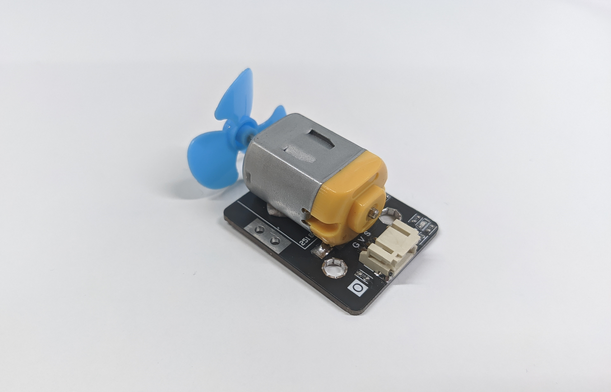
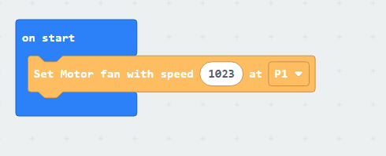

# Motor

## Introduction
The Motor is a actuator that converts electrical energy into  mechanical energy. When providing power to the motor, the axis will start spin to drive the connected components.

## The principle
The Motor make use of Fleming's left-hand rule to convert the electrical energy into mechanical energy. When the current is passing in a magnetic field, it will produce a net force as motion.

Inside the motor, overall can classify as two parts

* Stator - the component which provide the magnetic field, usually is a permanent magnet.
* Rotor - the moving part which produce the mechanical energy to drive the axis turning. It contain the armature and commutator, when current passing, it will start act with the magnetic field from stator by left-hand rule, then rotate in specific direction.

For more detail information, you may take reference from [wiki](https://en.wikipedia.org/wiki/Electric_motor) and [youtube video](https://www.youtube.com/watch?v=CWulQ1ZSE3c) 

## Specification
* Supply Voltage: 3V to 6V
* Interface: analog
* Input Signal voltage: 1.5V~5V
* Axis diameter: 2mm
* Operate current (without loading): 220ma(3V) ~ 370ma(6V) 
* Operate current (Stall): 600ma(3V)
* Speed: 15000rpm(3V) ~ 27400rpm(6V)

## Pinout Diagram

|Pin|Function|
|--|--|
|G|Ground|
|V|Voltage Supply|
|S|Signal Input(Analog)|

## Outlook and Dimension

Size: 50mm X 30mm

## Quick to Start/Sample

* Connect the sensor to development board (direct plugin or using wire)

* Open Makecode, using the [https://github.com/smarthon/pxt-smarthome](https://github.com/smarthon/pxt-smarthome) PXT 

* Use the `Set motor fan with speed 1023 at P1` to turn on the motor to full power

## Result

When the micro:bit started, the motor at P1 will start rotate with max speed. 

## FAQ

Q: Why the micro:bit or other modules got malfunction when using motor? 
A: Check the power supply is strong enough or not. Since the motor is a heavy loading module, a weak power supply may cause voltage drop, overloaded, unstable, or every damage to the micro:bit and power supply itself. It may happen on some old USB charger, PC standard USB port(5V 0.5A), or a battery holder with the near drain out battery.

