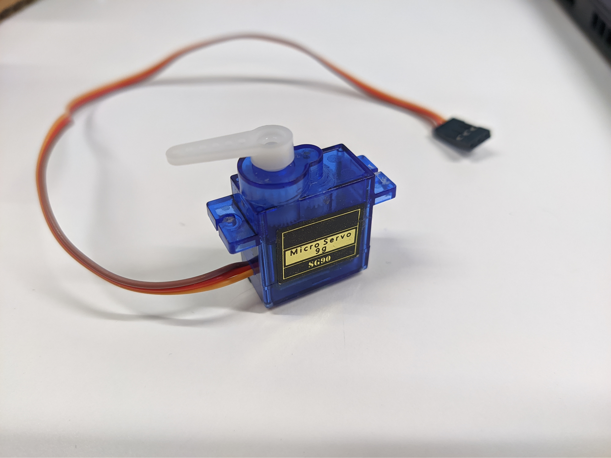
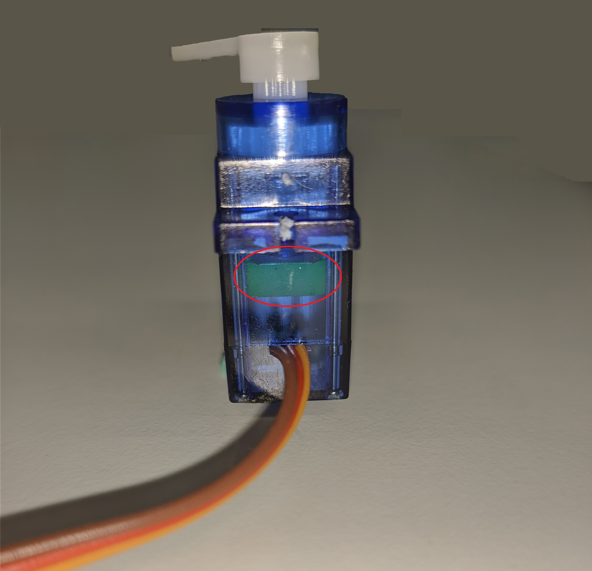
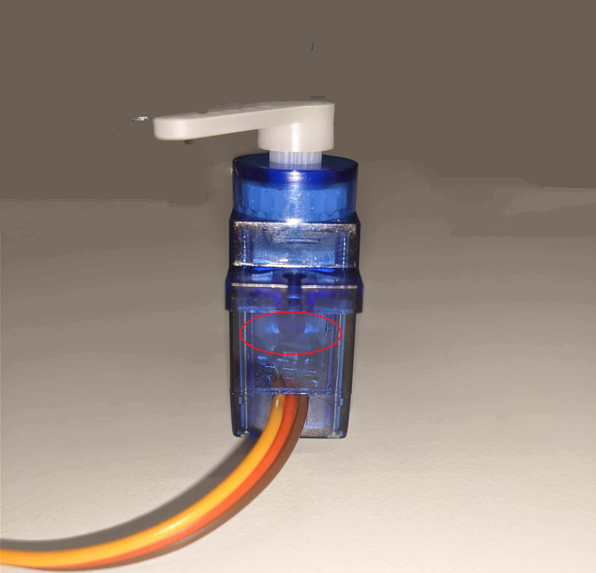
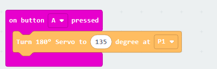
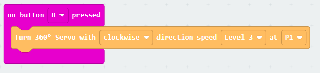
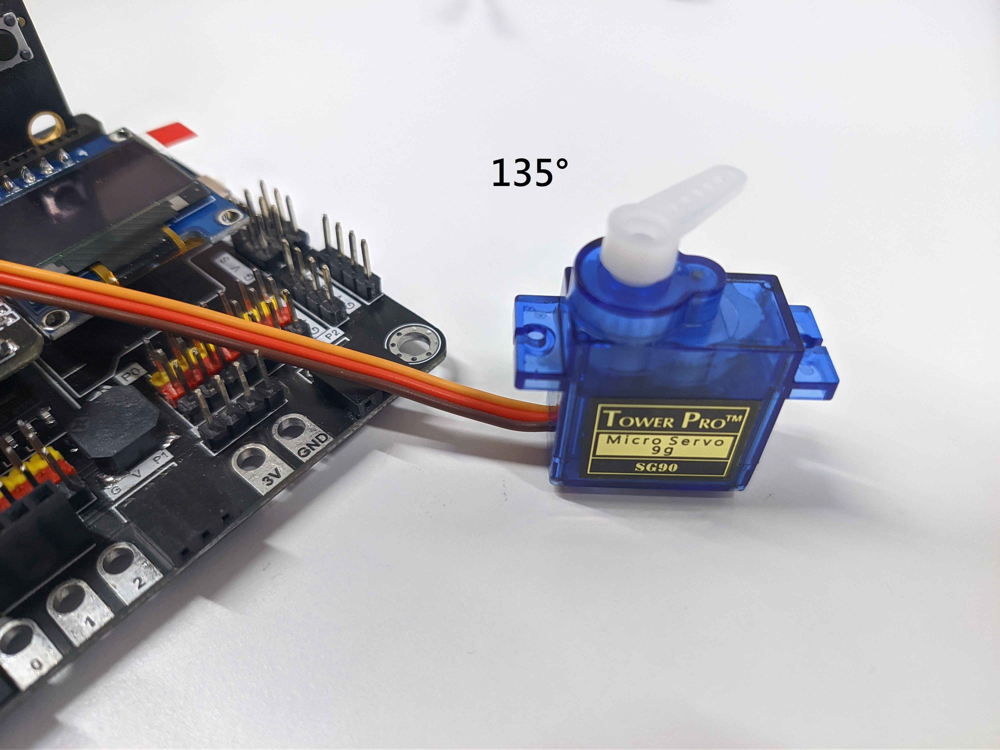

# Servo SG90 (180° / 360°)

## Introduction
The SG90 servo motor is a tiny and lightweight motor which can perform different angle adjustment (180° servo) or rotation control (360° servo).

## The principle
The Servo motor operate base on the PWM signal, the action of servo motor will following the input signal's duty cycle. 
The SG90 designed duty cycle (pulse length) is 500µs to 2500µs, during this range, the duty cycle will be representing different meaning.

### 180° Servo

For 180° Servo, the duty cycle will represent to the position 

|Duty cycle(us)|Degree|
|--|--|
|500|0°|
|833|30°|
|1166|60°|
|1500|90°|
|1832|120°|
|2165|150°|
|2500|180°|

### 360° Servo

For 360° Servo, the duty cycle range is different, and the meaning represent to direction and speed 

|Duty cycle(us)|Direction|Speed|
|--|--|--|
|1000|clockwise|100%|
|1166|clockwise|60%|
|1333|clockwise|30%|
|1500|N/A|stop|
|1666|anti-clockwise|30%|
|1832|anti-clockwise|60%|
|2000|anti-clockwise|100%|

## Specification
* Operating voltage: 4.8V (~5V) 
* Weight: 9g
* Operating speed: 0.1 sec / 60 degree
* Stall torque: 1.8 kgfcm
* Interface: PWM signal
* PWM period: 20ms(50Hz)
* Duty cycle: 500µs ~ 2400µs 
* Operation degree: 0~180° (180° Servo) / N/A (360° Servo)
* Temperature range: 0 ~ 55°C 

## Pinout Diagram

|Pin|Function|
|--|--|
|G|Ground|
|V|Voltage Supply|
|S|Input (PWM signal with duty cycle)|

## Outlook and Dimension

Size: 32mm\*12mm\*32mm

## Determine the type of servo (180°/360°)
Look at the side that have cable pull out, checking there have a variable resistor or not. 

If have "green variable resistor", that is 180° servo.

 Otherwise, that is 360° servo.

## Quick to Start/Sample

* Connect the sensor to development board (direct plugin or using wire)

* Open Makecode, using the [https://github.com/smarthon/pxt-smarthome](https://github.com/smarthon/pxt-smarthome) PXT 

<H3>The extension contain two functions that provide convenience to set the specific position or rotation.</H3>

For 180° Servo, you may control that turn to specific degree position

* Use the `Turn 180° Servo to 135 degree at P1` to make it to turn to 135° position

For 360° Servo, you may control that turning in specific direction and the rotation speed

* Use the `Turn 360° Servo with clockwise direction speed Level 3 at P1` to make it rotate at max speed and clockwise direction.

## Result
If you using 180° servo with the corresponding program, after the button A is pressed, the servo will turn to the 135° position.

If you using 360° servo with the corresponding program, after the button B is pressed, the servo will keep rotate in clockwise direction with max speed.

## Datasheet
[SG90](https://content.instructables.com/ORIG/FA2/O1SS/J7ARLNBW/FA2O1SSJ7ARLNBW.pdf)

