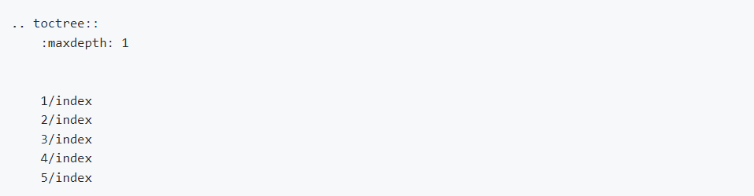
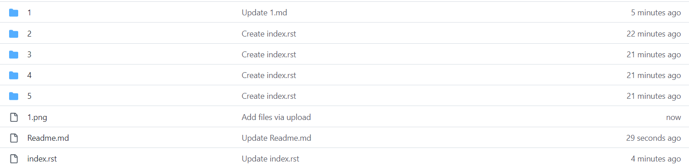
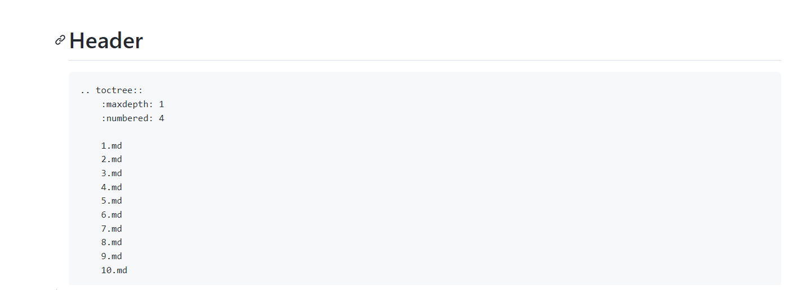
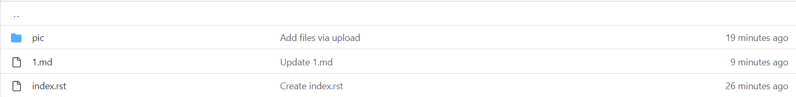

1. add path in docs/index.rst

2. create relative folder in same path

3. create index.rst in folder

4. create relative file in folder

<a href="https://github.com/StemhubSmarthome/codesmine-docs-en/blob/master/docs/guide/1/1.md">Markdown Example</a>
