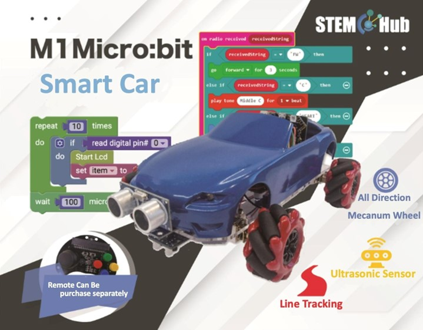

# Lesson 1

## Introduction

Welcome to the Micro: bit Smart Car Tutorial！In this course, we will explore the Micro: bit and learn how to control the Micro: bit car in programming.

## Teaching Objectives

Let students master different Micro: bit SMART CAR’s parts and their functions，And learn about the various block coding features.

## Understand micro: bit expansion Circuit Board

## Understand the Mecanum Wheel Car
+ 4 Motors
+ 4 Mecanum Wheels
+ Micro bit
+ Micro bit Expansion Circuit Board

+ Ultrasonic Sensor

+ Infrared Line Follower
          	  

 
### Preparing Micro:  bit Programming Software Makecode

Online Programming:   <a href="https://makecode.microbit.org/">https://makecode.microbit.org/</a>

Install on mobile device: Android

                      
Install on mobile device: Apple iOS

### New Extensions

Step 1: Choose Extensions on Advanced category.

Step 2: Put this link to the yellow box as shown below <a href="https://github.com/stemhub/pxt-Stemhubbit">https://github.com/stemhub/pxt-Stemhubbit</a>

step 3:  Adding extansions into makecode

### Connect micro:  bit to the computer

1) Connect the micro:  bit to your computer with a USB cable, then press “Pair device”

2) Choose micro: bit’s port and connect it

3)”Connected to micro: bit” will be shown when finished

### Save program file（.hex) to micro: bit

1) After finished the above process successfully，click download or save program file（.hex)

2) After connecting micro: bit to the computer with the USB, you will able to find MICROBIT device, and move the file to MICROBIT device.

3) After moving the file to MICROBIT device.

MICROBIT device may disappear for a few second and appears again later. when the device appears again, you can disconnect the USB cable. 

## understand Block Programming
### PAUSE Block module:

It can control how long the program execute, 

PAUSE Block module can be found in "Basic" category

The waiting time can be set by the number in yellow box.

1000 millisecond = 1 second

### IF Logic Block Module: 

It is put into "Logic” category

The condition can be put after the word “if”.

Command to be execute can be put into the IF block module.

The plus sign in the bottom left corner can used to attach some additional condition:

+ “else if” can be used to set additional condition
+ “else“ is used to set the action to be taken when condition of both “if” and “else if” did not fulfilled.	

### Comparison block module:

In “Logic” category,

  

you can put numbers into this type of block and choose the comparing condition like equal (=) 、not equal (≠) 、less than (<) 、less than or equal to (≤) 、greater than (>) 、greater than or equal to (≥)

### Mathematical operation block module:

Basic Mathematical operation，addition (+) 、subtraction (-) 、multiplication (×) 、division (÷) 、square (**)

### ”AND,OR” block module

‘AND’: Execute when both condition before and after ‘and’ are fulfilled

‘OR’: Execute when one or more condition before or after ‘or’ are fulfilled

Table for “AND” and “OR” operation

A|B|A AND B|A OR B
---|---|---|---
False|False|False|False
False|True|False|True
True|False|False|True
True|True|True|True

### ” Variable” 

Variable used to record data

Variable can be set as value, binary number or event variable which can be establish in ‘Make a variable’

After established a new variable, there will have three block modules can be used

This block call variable

This block initializes the data stored in the variable

This Block add the numbers in the white box to the variable.

