# Lesson 2
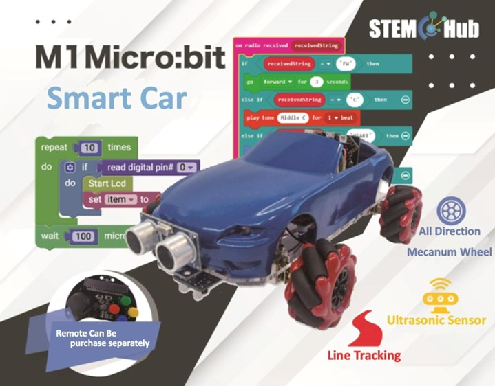
## Introduction

Welcome to the Micro: bit Smart Car Tutorial！In this course, we will explore the Micro: bit and learn how to control the Micro: bit car in programming.

## Teaching Objectives

Let student master how to control RGB LED on Micro: bit SMART CAR’s expansion board and it’s function and understand how to play music on buzzer by block programming.

## Control of RGB light (LED) on expansion board

Choose Stemhub: bit > On-board Light one show color red

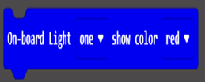

option in the yellow box allows you to choose which LED control

option in the red box allows you to choose the color of the LED

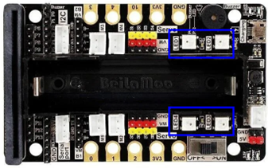

LED 1 to 4 on the expansion box corresponding to “one” to “four”.

setting the color and brightness，the value for the brightness starts from 0 to 255

 
### Exercise 1: design a program to flash the LED on the expansion board in order. 
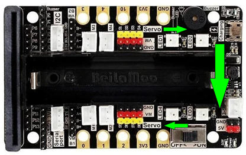

Hint: Turn on each RGB light for a period，turn off the previous light before turning on the next light

### Exercise 2: design a program to change the brightness of the LED on expansion board start from dim to bright and then bright to dim. （Breathing light effect）

Hint: Using loop and variable to dim the RGB light

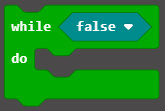

Breathing light effect:

## Buzzer

Buzzer on the expansion board is the same to the one on Micro: bit，they can control by block module under “Music” category. Notes that when expansion board is plugged to Micro: bit, only buzzer on expansion board will produce melody.

Music > Melody > play melody ♫ … at tempo … (bpm)

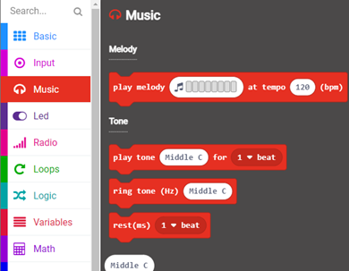

Choosing the melody in the yellow box, and choose the speed in blue box

Selecting tune in yellow box, and select bit in the blue box

 

Choosing the volume level in yellow box

### Delay of the word display

Comparing two programs shown below, is there any different between them？

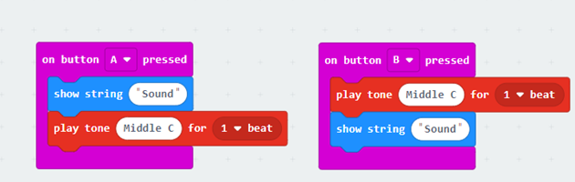
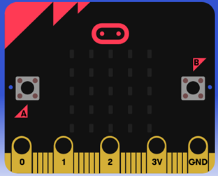

（1）After pressing button A，the word” Sound” will display on Micro: bit’s screen letter by letter. The middle C will be played after all the letters has been displayed.

（2）After pressing button B, the middle c will be played very fast, and then display “Sound” letter by letter. These two events will be executed almost at the same time.

Thus，Micro: bit board can move to the next step only when it finished displaying all the letters. We need to consider this huge amount of delay when we are designing a program. If we want to play the sound and display the letters at the same time, we should put the statement of displaying letter into the last step. 

### Exercise: Play a song, design a program to play the song below by your car

1: “Twinkle Twinkle Little Star”

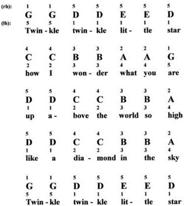

2: “Jingle Bells”

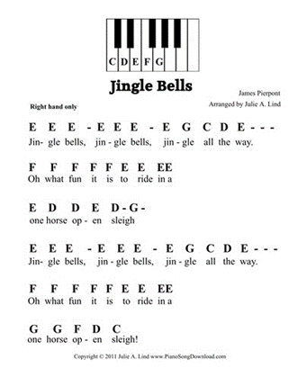
  
### Answers
#### Exercise 1:

After turning on the first light, use the ‘PAUSE’ block module to set the lighting time to 100 milliseconds, and turn off the first light when the second light is turned on. And so on, turn the lights on and off one by one. The forever program makes it flash from left to right continuously.

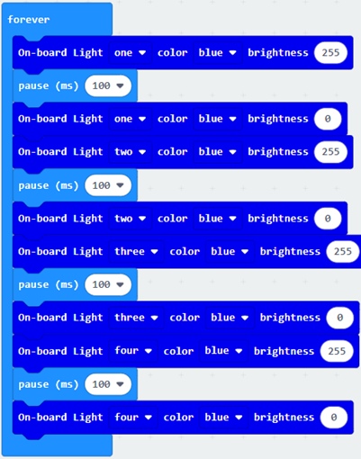
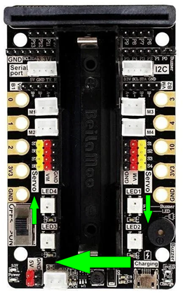

#### Exercise 2: Breathing light

The whole program is separated into two parts (yellow box) (brighter、dimmer)

1.	Initializing the Variable (‘value’) by setting it to 0. Also setting it as the repeating condition.

2.	When ‘value’ is smaller or equal to 255：

    a.	Changing the color of all the light into orange，brightness of the light will change as ‘value’ change.
    b.	Stop for 0.01 second
    c.	‘value’ ADD  5
  

3.	When’ value’ larger than 255，the condition for the first yellow box will not be fulfilled.

4.	Setting ‘value’ into 255, When ‘value’ is larger than 0：

    a.	Changing the color of all the light into orange，brightness of the light will change as’ value’ change.
    b.	stop for 0.01 second
    c.	‘value’ SUBTRACT 5
    d.	Program will end when’ value’ drop to 0.
 
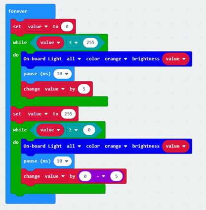
