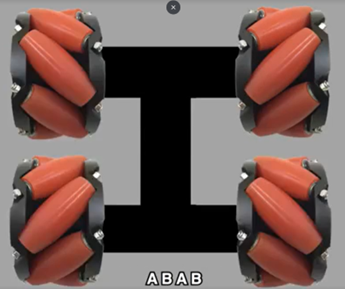
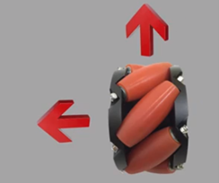
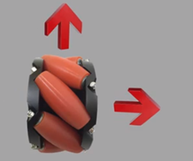
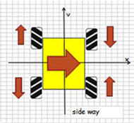
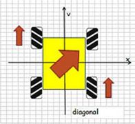
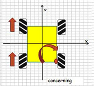
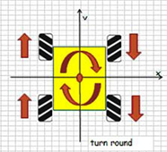
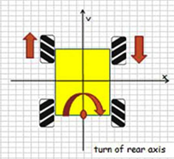

# Lesson 3

## Introduction

Welcome to the Micro: bit Smart Car Tutorial！In this course, we will explore the Micro: bit and learn how to control the Micro: bit car in programming.

## Teaching Objectives

Let student master the movement principal of Mecanum wheels, and understood how to move the car forward, backward, or left, right by controlling the motors.

## Understanding the Mecanum wheels

Mecanum wheels are formed with multiple rollers. The distribution of rollers with separate the wheels into two pairs. Wheels in diagonal position have the same roller distribution.

 

When the wheels spin, the roller will carry out a horizontal movement. Wheels with different direction of roller will bring the wheels to another side.

4 Mecanum wheels will connect to 4 different motors, and different direction of spinning of 4 motors decide which direction the car will go.

## Principal of the wheels

1.	When 4 wheels are spinning forward, the care will move forward.

2.	When 2 pair of diagonal wheels spinning in reverse direction，the car will translate toward left or right.

3.	When 1 pair of diagonal wheels spinning in same direction，the car will move diagonally.

4.	When 1 side of wheels (left or right) spinning in same direction，the car will turn toward opposite side.

5.	When 2 side of wheels (left and right) spinning in reverse direction，the car will spin on the original location.

6.	When front wheels (left and right) spinning in reverse direction, the car will spin with trail as the center.

