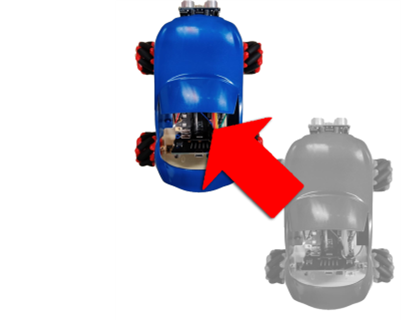

# Lesson 4

## Movement of Car

motors’ distribution

## Block module that control motor

Select motor in yellow box.

Set speed in orange box. From -100 to 100,

negative means the wheel is spinning 

backward and positive means the wheel is spinning forward.

### Forward

When 4 wheels are spinning forward, the care will move forward.  

### Backward

Change the number in the block to -100(all the wheels moving backward)

### Turn to the left

Changing the speed of “M1”and “M3” to 0, “M2” and “M4” be 100， and the car will turn to left.

### Turn to the right

Vice versa，changing the speed of “M1”and “M3” to 100, “M2” and “M4” be 0, and the car will turn to right.

### Spinning in anti-clockwise direction

Changing the speed “M1”and “M3” to -100, “M2” and “M4” to 100。

### Spinning in clockwise direction

Changing the speed “M1”and “M3” to 100, “M2” and “M4” to -100。		

### Conclusion：

 
As the speed of each motor change, the trolley will be able to make different movements.

## Exercise1: Horizontal movement of the car 

Design a program allows the car to move left and right horizontally。

hint：If 2 diagonal pairs of wheels is set to different rotating direction, the car will be able to move horizontally.

## Exercise 2: Diagonal movement of the car

Design a program, and let the car move in diagonal direction.

Hint：If 1 pair of diagonal wheels is rotating; the car will be able to move diagonally. 

## Exercise 3: Different ways to drive the car

Design programs that control the car to move around in a square, circle, and M shape route driving.

### Moving around in a square:

Hint：Whenever the car arrives the corner of the square, you need to rotate the car by 90 degree and continue moving forward.

### Moving around  in a circle:

Hint：See example 4.2

### M shape route driving： 

Hint：The rotating angle is related to the rotating second of the car.

## Answer
### Exercise 1:

If 2 diagonal pairs of wheels are set to different rotating direction, the car will be able to move horizontally.

Setting the speed of “M2” and “M3” to 100， “M1” and “M4” to -100，the car will move to the left horizontally.

   
Vice versa, speed of “M1” and “M4” set to 100， “M2”and “M3” set to -100，the car will move to the right horizontally.

### Exercise 2:
#### Moving toward right upper corner:

Changing the speed of “M1”and “M4” to 60, “M2” and “M3” to 0.

		
#### Moving toward left upper corner:

Changing the speed of “M2”and “M3” to 60, “M1” and “M4” to 0.

#### Moving toward right lower corner:

Changing the speed of “M2”and “M3” to -60, “M1” and “M4” to 0.

#### Moving toward left lower corner:

Changing the speed of “M1”and “M4” to -60，“M2” and  “M3” to 0。

### Exercise 3:
#### Moving around in a square:

（1） changing all the speed of the motors to 100 and ‘stop’ 2000 milliseconds，the car will move straight ahead for 2 second。

（2） And then set the speed of “M2” and ”M4“to 0，“M1”and “M3” keep at 100，and ‘stop’ for 1000 millisecond，the car will rotate to right for 1 second （about -90 degree，and will vary for different car）。

（3 - 8）repeat step 1 – 2 for 3 times，and the car will moving around in a square。

#### Moving around in a circle:

Setting the speed of “M1”and” M3“to be 100, “M2”and” M4“to be 60（setting the speed of “M1”and ”M3“lower and greater than 0, and will vary for different car）repeat infinitely, and the car will move around in a circle

#### M shape route driving：

Separate the program into two types (forward, rotating)

Attention! (2) and (6) rotate for 2.5 second. Comparing (2) and (6) to (4), (4) has a larger rotating angle

** The rotating angle is related to the rotating second of the car, the second it takes will vary for different car **

