# Lesson 7 and Lesson 8
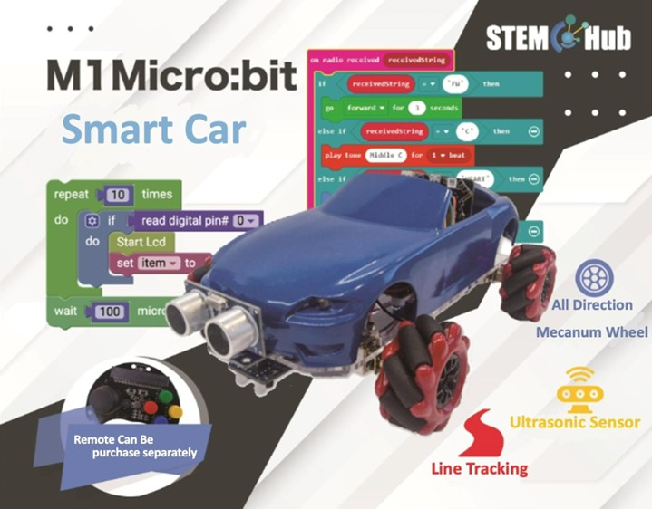
## Introduction

Welcome to the Micro: bit Smart Car Tutorial！In this course, we will explore the Micro: bit and learn how to control the Micro: bit car in programming.

## Teaching Objectives

Let student master the principal and the function of line tracking on Micro: bit SMART CAR and understand how to let the car cruising with the black line and U-turn.

## Movement through line tracking 

The line tracking module is located at the bottom of the car, and it is separated into left and right parts for detection.

+ Infrared Line Tracking sensor

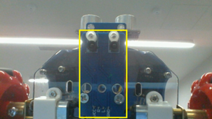
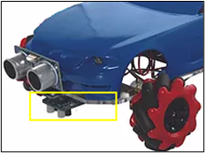
+ Line following Basic Module

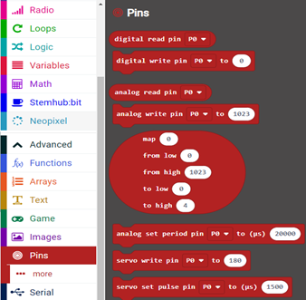
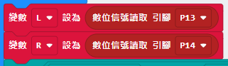

When the line tracking module is running, the indicator light will be on. When one of them detects black, the indicator light will be off. Digital signal will turn from 1 to 0 (Output can only be 1 or 0)

**(Black=0，Write=1) **                    

Condition1: the car is on the black line    

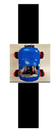

The car will continue to drive along the black line 

Condition 2: The car deviates from the black line to the left  

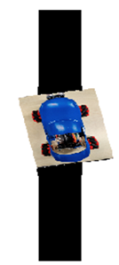

The car will sense the deviation and adjust toward right for a proper position and follow the black line again.

Condition 3: The car deviates from the black line to the right

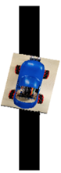

The car will sense the deviation and adjust toward right for a proper position and follow the black line again.

Condition 4: the car arrived to the end of the black line and can no longer sense black line

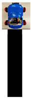

The car will move backward until it find the black line again 

## Exercise 1

Design a program to let the car move following the black line

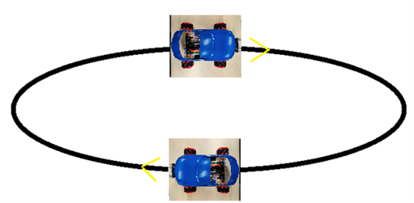

Hint：Refer to 4 examples in page 4. Separating the program into 4 parts.

## Exercise 2

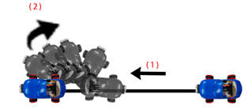

Design a program to let the car move following the black line, and U-turn when it reached the end of the black line.

Hint：Notice the speed when U-turn

## Exercise 3

Design a program to let the car move following the black line, U-turn when there is an obstacle in the front of it.

Hint：Using ultrasonic to sense the position of the obstacle, using Infrared line tracker to let the car move following the black line.

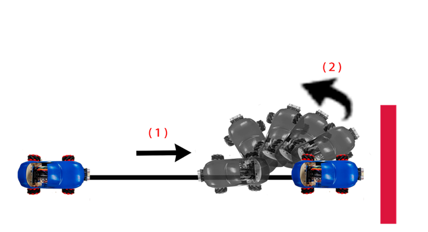

## Exercise 4：Maze

The car must avoid obstacles and start from the starting point to the end point.

Hint：Ultrasonic and Infrared line tracking module will be used (Refer to exercise 7 in lesson 6, and exercise 1 in lesson 7)

Discussion：When dodging the obstacle, Which way has more efficiency？

 

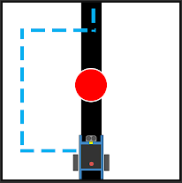
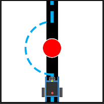

## Challenge

In exercise 1, we need to check the digital signals of the left and right sensors (L and R) separately for 4 times to achieve line tracking.

Try to design a quicker, shorter, and more convenient procedure to achieve a similar effect, and make sure the car won’t move backward after going out of bounds but turn to the direction closest to the black line and return to the line.

Hint：

+ Build Variable "BW_value", think about how to store both digital signal of both left and right sensor at the same time.
+ Build Variable "last_value" to store the signal when it is out of bounds and decide the turning direction when out of bounds.

## Answer
### Exercise 1: Design a program to let the car move following the black line
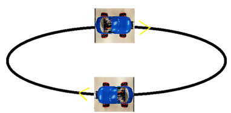

1.	Codes in the yellow box setting the digital signal of the sensor

2.	Refer to 4 examples in page 4, separate the program into 4 parts

**Notice that the speed of the car cannot be too fast ，sensor require times to sense the line. **

### Exercise 2:
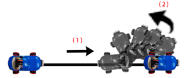

Design a program to let the car move following the black line, and U-turn when it reached the end of the black line.

Basically, it’s the same method as exercise 1. Only thing you notice is that the different between moving backward and U-turn

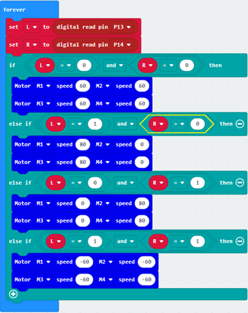

### Exercise 3：

Design a program to let the car move following the black line, U-turn when there is an obstacle in the front of it.

Hint：Using ultrasonic to sense the position of the obstacle, using Infrared line tracker to let the car move following the black line 

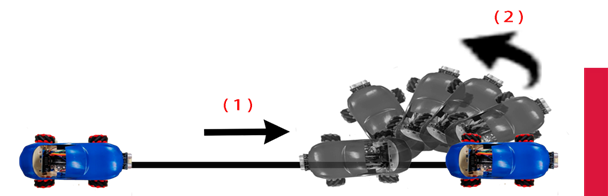
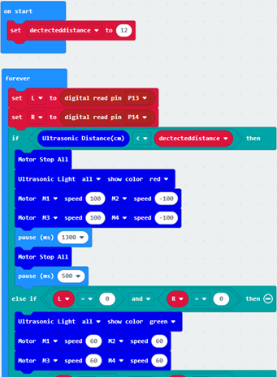
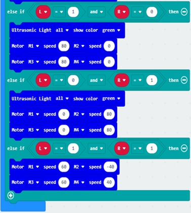

### Exercise 4：

The car must avoid obstacles and start from the starting point to the end point.

This program uses functions, and the purpose of functions is to make the program more concise, because it does not have to be repeated all the time. For example, there are two functions (sensor, ultrasound) below, and the function of ultrasound can be called in the sensor program.

The first red box on the left demonstrates that if the car faces an obstacle, it will call the ultrasound function to dodge the obstacle, otherwise it will start to follow the black line.

The function of the sensor is the same as in Exercise 3. It will also follow the black line. When the black line is not detected, it will rotate 180 degrees until the black line is found.

The function of ultrasound is the same as Exercise 7 in Lesson 6, it will bypass obstacles. In particular, the second red box avoids the situation that the line is not continued after bypassing.

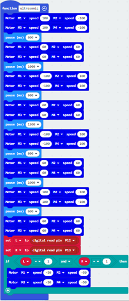
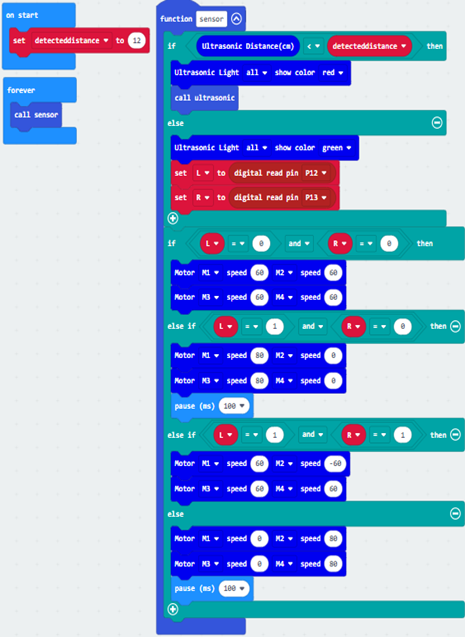

### Challenge

Through the following procedure, running a procedure only needs to check up to 3 times, less than the original 8 times, so it is faster and shorter

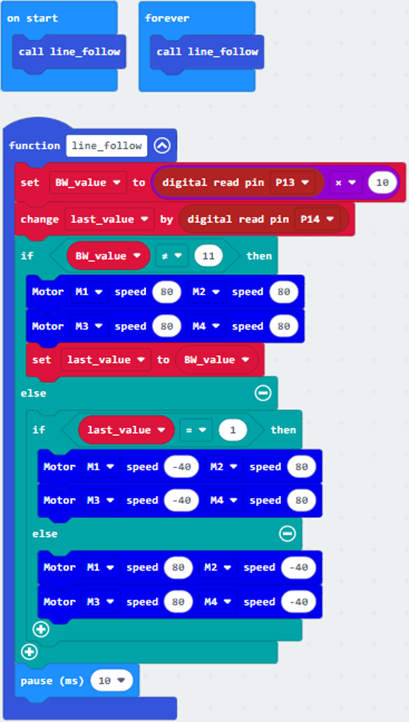
