# Lesson 1
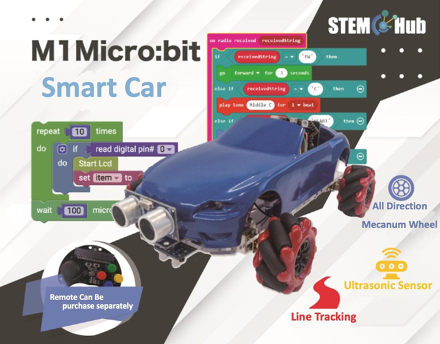

## Introduction

Welcome to Micro : bit Smart Car! In the lesson, we will explore Micro : bit, and learn how to control the Micro : bit Smart Car through programming.

## Objective

Students will fully understand the theory, and the function of the Micro : bit of the AI lens in the Smart Car. Also, they will learn how to program the AI lens for achieving more functions of the Smart Car.

## Introduction of HuskyLens
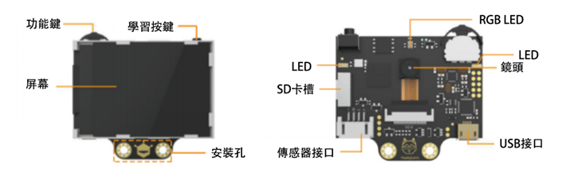

Huskylens is an easy-to-use AI machine vision sensor with 7 built-in functions. Apart from the following 6 functions below, there is also an object classification function that learns the differences between different objects and automatically classifies them.

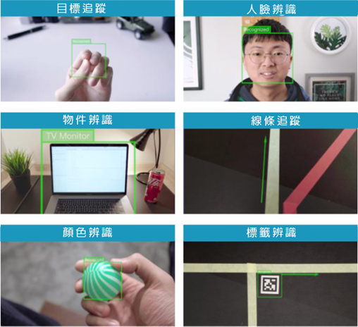

### Method
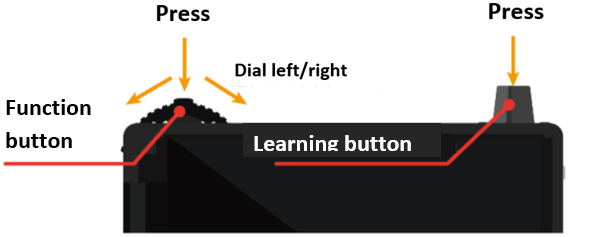

Huskylens mainly has two buttons, function button and learning button.

+ Dialing the function button to the left/right to switch functions/modes
+ Click on the function button to call out the function menu
+ After long pressing the function button, you can set whether to learn multiple targets.
+ Click the function button again to drag the scroll bar to the right to enable "Learn More".

After scrolling to the “save and return”, you can press the function button to call the confirmation window. Pressing the function button for saving.

+ Click the Learn button to learn a new object, and the object ID will be displayed on the screen.
+ Press and hold the learning button to learn to recognize new object from different angle, and distance.
+ After studying the new object, it is required to press the learning button again for further study within 4s.（Otherwise, stop studying after 4 seconds, you must first forget the target and then re-study）

+ After terminating the study, press learning button twice for forgetting the learned objects.

## Installing HuskyLens in Smart Car

Components：

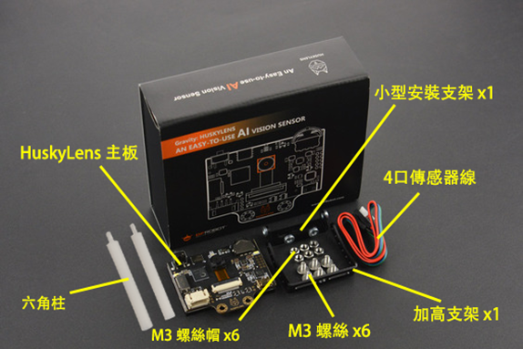

1）Attach the small mounting bracket to the heightened bracket with two screws.

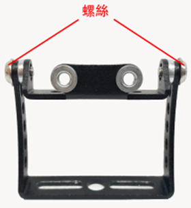

2）Attach the HuskyLens motherboard to the small mounting bracket with two screws.

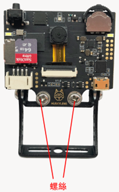

3）Attach the AI lens to the hole in the rear of the Smart Car with two hexagonal posts (plastic), two screws, and Nuts.

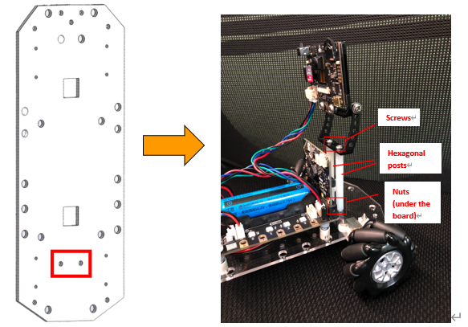

4）Follow the figure in bottom to connect the HuskyLens to micro:bit extend board by using 4 color wires.

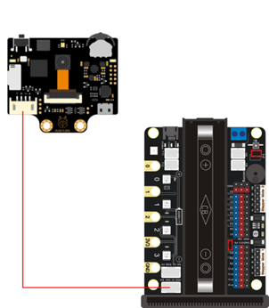

Completed picture：

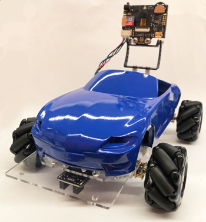
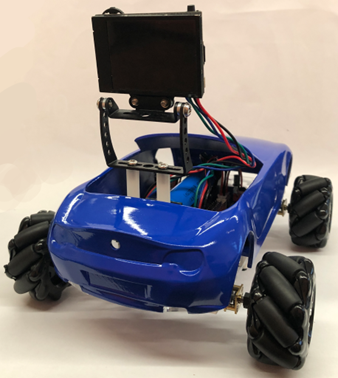

## HuskyLens expansion pack

Select Extensions in Advanced Category. Then search “huskylens”, and add the DFRobot_HuskyLens expansion pack:

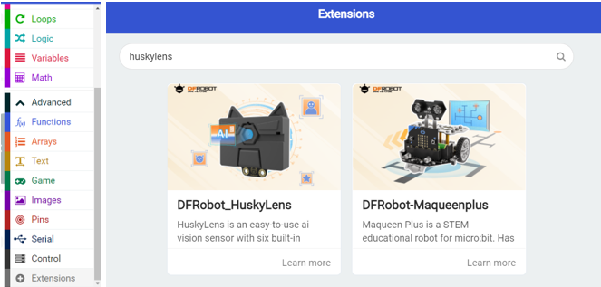
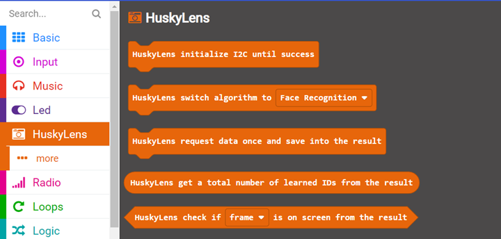
  
## HuskyLens building block module

Perform I2C initialization communication protocol, **Must be executed in the "on start" block

Switch to other functional mode（The car can only run one mode at a time）

Send a one-time request to HuskyLens, and save the data into the “result” (variables in memory), Make it readable by other HuskyLens blocks (each request refreshes the data in "results")

Get a total number of learned IDs from the result.

Logical condition: check if target ID is on screen from the result

(You can choose the target as a box or an arrow, arrows are generally only used for line tracing)  

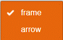

Let's familiarize with the most basic building blocks of HuskyLens introduced above. 

  
## Exercise 1
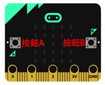

Design the program by using HuskyLens, Micro:bit board A button, B button to complete the task:

    1）When the program starts, it automatically switches to the object classification mode.
    2）Use HuskyLens to learn 5 kinds of objects (ID)
    3）Press the button A: display the number of learning objects - (a)
    4）Press the button B: clear learning object data
    5）Press the button A again to display the number of learning objects - (b)

Tip: Use HuskyLens >> More >> "Forgotten Blocks" to clear learning object data  

Location|Number
---|---
(a)|
(b)|

**Try to re-open HuskyLens after learning an object, and press the button A again to show number. See what numbers come up? What conclusions can be drawn from this? Can your program be improved?

## Exercise 2:

Design the program by using HuskyLens, Micro:bit board initial lights, and onboard LEDs to complete tasks.

First add the stemhub:bit expansion pack: <a href="https://github.com/stemhub/pxt-Stemhubbit">https://github.com/stemhub/pxt-Stemhubbit</a>

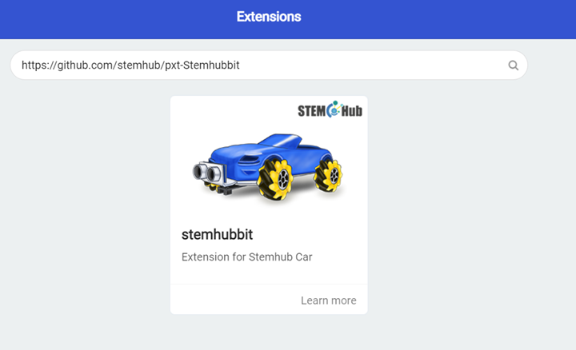

Mission：

    1）When the program starts, it automatically switches to the object classification mode.
    2）Use HuskyLens to learn multiple objects.
    3）If there is a learned object within the screen, the Micro:bit board displays the object ID closest to the center of the screen and lights all onboard LEDs green, otherwise lights up red.

If there is no learned object within the screen, what number will the Micro:bit board show?

    

**Tip: If it cannot return there is no learned object after learning a object.（For example: non-learned object is classified as ID 1），You can press the learning button twice to forget all learned data.

The building blocks for controlling the onboard LEDs are in the Stemhub:bit module

At last, you can switch different modes and try the steps (2-3) of the exercise 1. You will find that the number of learning objects obtained in each mode is calculated independently.

## Answer
### Exercise 1
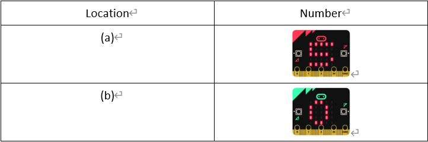

Re-open HuskyLens after learning the object, press the button A and the number displayed will be 0, and then press it again to get the actual ID number.

HuskyLens does not read the actual learning data after each startup and receives the "Data Incoming Result" request for the first time, but first turns the result to 0 for the first time, after which the request will be actually read. Learning data. So the final program:  

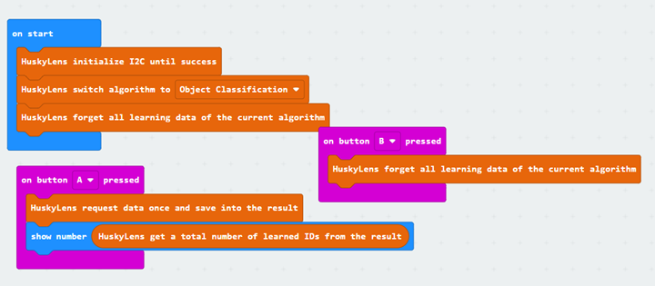

### Exercise 2

Micro:bit boards will display -1 if no learning objects are on the screen

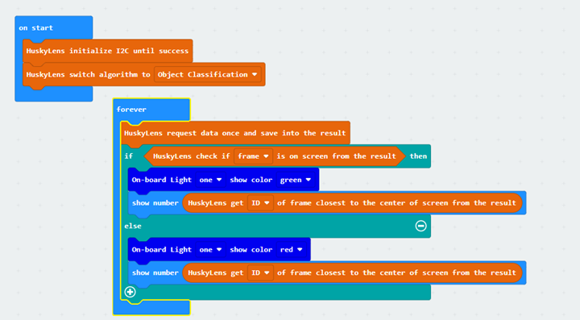
