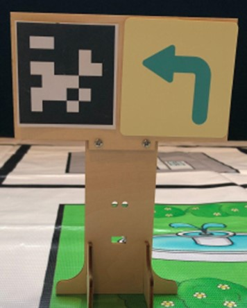

# Lesson 10

## Introduction

Welcome to Micro : bit Smart Car! In the lesson, we will explore Micro : bit, and learn how to control the Micro : bit Smart Car through programming.

## Objective

Students will fully understand the theory, and the function of the Micro : bit of the AI lens in the Smart Car. Also, they will learn how to program the AI lens for achieving more functions of the Smart Car.

## Conclusion Micro:bit AI Smart Cart

In Lesson 9, students were familiar with how to combine the different recognition functions of HuskyLens, such as identifying different labels to lead to different HuskyLens modes, or categorizing objects before switching to the corresponding mode, thus enabling the AI vehicle to perform more complex and meaningful tasks. In addition, students have become proficient in other HuskyLens features, such as saving and loading models to reduce the number of repetitions, or saving object information as pictures by taking screenshots. In the final lesson, we will summarize the different recognition features of HuskyLens and compete against each other.

Function|Application
---|---
Face recognition|Detecting, learning and recognizing faces
Color recognition|Detect, learning and recognizing colors
Tag recognition|Detect, learning and recognizing tags
Object classification|Learn any unspecified object
Line tracking|Detect labels, learn and predict different color lines
Object tracking|Learn and track a specific object
 
## Competition 1

Set up the venue yourself, with a starting point, a finishing point and various turning positions, plus a human face and six colorful signs. 

The design program allows the car to start from the starting point, complete the task while walking to the end point.

Use HuskyLens to learn all the objects first, then put the micro:bit board with the self-designed program on the car, and put the car at the starting point for the competition.

When the vehicle identifies different objects, it performs different actions to prove the success of the identification.

+ Face: micro:bit board showing smile symbols
+ Color: Lights up one RGB on-board light or ultrasonic light (six in total, each a different color)

### Rules
    1.	The competition is a score system, there are two rounds, the highest score of the round will be the final score
    2.	when the car successfully identify the face, +5 points
    3.	Whenever the car successfully identifies a color, +2 points
    4.	If all RGB on-board lights and ultrasound lights are successfully lit, +6 point
    5.	If the car does not go to the end point within the time limit, the score will be reduced by half

** The color and direction signs can be placed together to correspond with each other as in Lesson 4.  

## Competition 2

Similar to Competition 1, but with a shift from recognizing faces and colors to identifying tags.

Design a program allows the car to start from the starting point, complete the task while walking to the end point.

Learn all the objects with HuskyLens, then put the micro:bit board with self-designed program on the car, and put the car at the starting point for the competition.

Whenever the car recognizes a tag ID, the HuskyLens screen displays a single word

Single words can be added together to form phrases, e.g. Weather is good and Hello everyone

### Rules
    1.	The competition is a score system, there are two rounds, the highest score of the round will be the final score
    2.	Whenever the car successfully identifies a tag, +2 points
    3.	Each time a single word in the HuskyLens screen is successfully linked into a phrase, an additional +5 points will be awarded.
    4.	If the car does not go to the end point within the time limit, the score will be reduced by half. The fastest group to complete will +6 points, the second group will +4 points, the third group will +2 points.

** You can refer to the practice in Lesson 4 to put the labels and direction signs together to correspond with each other.

