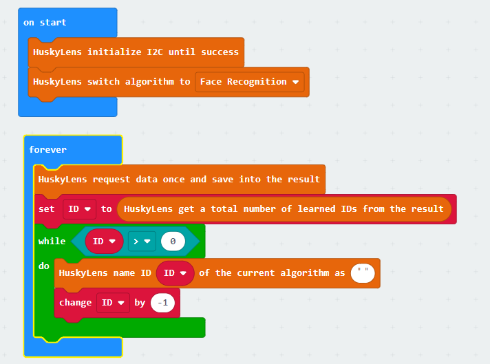

# Lesson 2

## Introduction

Welcome to Micro : bit Smart Car! In the lesson, we will explore Micro : bit, and learn how to control the Micro : bit Smart Car through programming.

## Objective

Students will fully understand the theory, and the function of the Micro : bit of the AI lens in the Smart Car. Also, they will learn how to program the AI lens for achieving more functions of the Smart Car.

## HuskyLens facial recognition function
### What is facial recognition?

Let’s simply introduce the four steps of facial recognition

1.	Face Detection: Detect face position and select by frame.

2.	Face Alignment: Identify other people's faces from different angles through localization features.

3.	Face Encoding: Extracting face information and making it easy for computers to understand.

4.	Face matching: Match the face information with the existing database, get the similarity score and give the matching result.

### Applications of facial recognition

+ Access right system: assess the right for entering protected areas such as prisons, detention centers, communities, schools, and residences by using facial recognition.
+ Surveillance system：It can be used to monitor crowds in public places, such as banks, airports, stadiums, shopping malls and supermarkets.
+ Internet application: use face recognition to assist online payment, prevent others from stealing credit cards and protect society.
 
### facial recognition with Husky lens

The facial recognition function of HuskyLens can be divided into three parts: face detection, learning and recognition.

#### Face Detection:

Point the lens at the face, a white frame will automatically appear on the screen to outline all the detected faces, and the words "Face" will be displayed respectively. The RGB blue light switches on the other side respectively represent whether the cross in the center of the screen is facing the face.

#### face learning:

Align the "+" in the center of the HuskyLens screen with the face of the desired person and click the "Learn Button" to learn. If the same face is recognized, a non-white frame will appear on the screen and display "Face: ID1", which means face recognition is ready. (If there is no "+" sign in the center of the screen, it means that HuskyLens has learned the object under this function) 

Since the human face is stereoscopic, HuskyLens cannot recognize all the angles of a human face with only one angle of image. Therefore, it is necessary to long press the learning button to learn a face from multiple directions at a time, or multiple photos of the same person. During the learning process, the RGB lights on the other side are yellow. 

#### facial recognition:

The face information learned by HuskyLens will be automatically saved. When a learned face is detected, HuskyLens will frame the face with different colors and mark "Face:ID". At this time, the RGB indicator is green. 

To clear the learned faces, short press the "learning button" after stopping learning, and the screen prompts "press again to forget!". Short press the "learning button" again to delete what you have learned before. To learn multiple different faces, please refer to the Learning Multiple Target Objects section of Lesson 1.

## Exercise 1

Familiarize with the face recognition function of HuskyLens and learn to change the object name.

After learning faces, HuskyLens can still only distinguish faces by ID1 and ID2. Unlike distinguishing object types, it is difficult for us to remember various faces, even the combinations with digital IDs, so we need to give them different names. After learning different faces, design a program and try giving different faces a name.

Tip：

+ In HuskyLens >> More. There are blocks that change name by ID

+ If you don't have an idea for giving a name, try the following names: Peter, Sam, Mary
+ Since it takes time for HuskyLens to change objects, changing the names of multiple objects at one time may fail
+ Therefore use “forever”

Result:

## Restore changed object names

After using the HuskyLens building block to change the object name, it will be found that even after forgetting the learning data, the new ID1, 2, and 3 object names remain in the changed state. However, Makecode's HuskyLens extension package does not directly restore all the building blocks with one name. So there are two methods.

1) use the function button to select initialization, but this action will reset all system settings to the original factory settings, so other changed settings need to be reset.

2) use the Change Name block again, but with the name set to "" (empty string), the object name will revert to "Face". Therefore, just follow the practice of Exercise 1 to restore all the changed names.

## Exercise 2

Design a program to restore all names to the default name "Face".

Tip：

+ Create variable "ID" to store each face ID 
+ Use Loop >> Repeat Judgment... Execute Blocks to change face names one by one

## Exercise 3

Program the HuskyLens to perform different actions when it detects different faces.

ID|Car’s movement|indicator light
---|---|---
1|Move forward|1
2|move rightward|2
3|move leftward|3
4|back|4
Non/other|stop|X

Tip：

+ Assume HuskyLens sees only one face at a time
+ Since the angle of the lens cannot be adjusted in real time, it is better to place different photos in front of the car in turn, or hold the car and place the lens on the face.
+ The blocks for controlling the car's motor are in the Stemhub:bit expansion pack:<a href="https://github.com/stemhub/pxt-Stemhubbit">https://github.com/stemhub/pxt-Stemhubbit</a>

## Exercise 4

Combining ultrasonic sensors and HuskyLens to design program:

The car will only move forward when the HuskyLens detects a face and the ultrasonic wave cannot detect an object (to prevent the car from hitting a face/photo) and display the ID, otherwise stop and display the icon.

## Answer
### Exercise 1

Even if you change the object name, remember to initialize it first.

### Exercise 2

### Exercise 3

### Exercise 4

