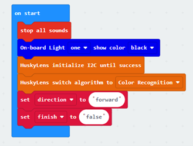

# Lesson 3

## Introduction

Welcome to Micro : bit Smart Car! In the lesson, we will explore Micro : bit, and learn how to control the Micro : bit Smart Car through programming.

## Objective

Students will fully understand the theory, and the function of the Micro : bit of the AI lens in the Smart Car. Also, they will learn how to program the AI lens for achieving more functions of the Smart Car.

## HuskyLens Color Recognition Function
### What is Color Recognition？

The color recognition function in HuskyLens, Huskylens can learn new colors. by entering different color names, the next time Huskylens senses the same color, it will display the color ID.

### Applications of Color Recognition

Accessibility Services: Helping people with color blindness understand the color difference of different things, or transforming colors that people with color blindness can recognize and distinguish.  

Surveillance system: can track criminals' escape vehicles by color

Logistics management: It is very convenient to automatically identify the type or model of the goods, with low cost and convenient operation. 

### Color Recognition of Huskylens

The color recognition function of HuskyLens can be divided into three parts: detecting color, learning color and identifying color.

#### Detecting color

Align the cross in the center of the screen with the target color block, and a white box will appear on the screen to select it. Adjust the angle and distance so that the white box can frame the entire target color block as much as possible. 

#### Learning color

After detecting the color, press the "Learn Button" to learn the color, and release it to end the learning. Press the "Learn button" before the countdown message ends to continue learning the next color. If you no longer need to learn other colors, press the "function button" before the countdown ends, or wait for the countdown to end.

#### Identifying color

If the same color is encountered, there will be a colored border on the screen to select the color block and display the color ID. The border automatically tracks the color patch, and its size changes with the area of the color patch. HuskyLens can recognize and track multiple different colors at the same time, and different colors correspond to different border colors.

#### Adjusting the threshold of the recognition border

When identifying color blocks of similar colors, the accuracy of identification can be adjusted by setting the threshold. For example, in the figure below, the yellow balloons of similar color are not identified, the threshold value is set too high. In the color recognition function of the secondary menu parameter setting interface, there is a "recognition box threshold" parameter, the lower the value of the parameter, the lower the accuracy, but the identification of similar color blocks will be more.

Take the following figure as an example, HuskyLens can only recognize one yellow ball when the threshold is 20. When the threshold is 0, all three yellow balls can be recognized.

## Exercise 1

Let's get familiarize with the color recognition function of HuskyLens. First, learn several colors, and display different color IDs and boxes on the screen. (If the picture is too small, please enlarge the picture or use the appendix at the end of the course)

Then design a program to target one of the color IDs, and use the Micro:bit board indicator to display the number of blocks of that color.

For example, the number of red color blocks in the upper left picture = 2, and the Micro:bit board displays:

Tip: Use the following blocks

## Exercise 2

Design a program, after learning one of the colors (assumed to be ID1), calculate the total area of the square color block of this color when the A button is pressed. And display the result with the Micro:bit board indicator.（The resulting unit in HuskyLens is the square unit） 

Tip：

+ Use the following Huskylens blocks to get the height and width of each color block. Area = (length) height × width     

 
+ Build "number" store "HuskyLens get atotal number of ID 1 frame from the result"
+ Build area Store the increased area and use the loop to increase the area of the color block gradually  

## Exercise 3

Design a program, the car lights up the corresponding RGB onboard lights based on the color seen by the HuskyLens. The car should move backward when the HuskyLens saw the learned color, otherwise, it should stop and turn off the RGB light.		

+ ID 1 light up red
+ ID 2 light up yellow
+ ID 3 light up blue
+ ID 4 light up green

## Exercise 4

（If the non-print version is not available, just observe the movement of the car）

Design the program to move the car on the colored road (see next page):

    1）When Huskylens detects that red color is closest to the center of the screen, the car starts to move forward
    2）Until Huskylens detects that the purple squre is closest to the center of the screen, the car stops briefly and starts to reverse
    3）Keep backing up until Huskylens detects the red square closest to the center of the screen again and the car stops.

During the car is moving forward, when the HuskyLens detects that red, yellow, green, and purple are the closest to the center of the screen, the microbit board plays the mid-range C, E, G and treble C tones, and lights up an RGB onboard light of that color respectively. (All RGB onboard lights should be on when the purple grid is reached)

During the car is moving backward, when HuskyLens detects that the above four colors are closest to the center of the screen, play the same tone, but turn off the RGB onboard light of the color, and finally stop playing any tone.

Tip：

+ First, adjust the angle of Huskylens and look at the red square
+ Create variables "direction" Record the moving direction of the car to determine the action of the car
+ Create variables "finsih" Determine if the car has returned to red square
+ if returned, play mid-range C for one second, and  set finish as "true"
+ Stop playing the tone when finish is "true"

## Answer
### Exercise 1

### Exercise 2

When the A button is pressed, set the area to 0. Set the number to the number of color patches and call the area function in the loop.

Each time the area is calculated in the function, the height and width should be initialized first before they can be used by the functions (getWidth, getHeight) that obtain the height and width, and these two functions set the number as the last color block to obtain its height and width.

The calculation method is using a loop to sum up the area of the current color and the total area of the current color block. And reduce the number by 1, and finally get the result.

### Exercise 3

### Exercise 4

When the program starts, initialize all variables, sound effects, and onboard LEDs.

When there is any (learned color) frame on the screen, the forward and backward procedures are called depending on the direction. If there is no frame, turn off the car's motor, sound effects, and onboard LED lights.

#### Forward function

First, check if the color ID is not equal to 4, then  check if the color ID is equal to 1, 2, 3

If 1, the car starts to move forward, the red light is on, and the middle tone C is played. If 2 and 3, light up yellow and green light respectively, playing mid-range E and G

If the ID is equal to 4, light up the purple light, play the high-pitched C, and stop the car for one second. Then the direction is changed to backward.

#### Backward function

First check whether the car has not completed the task (finish=”false”), otherwise check whether the car has not reached the red square (ID=1?).

If it is, the car will back up, and then check whether the color ID is equal to 4, 3, 2. If it is, turn off the corresponding RGB light and play the tone.

If the car goes to the red square again, turn off the last RGB light, the car stops, and the mid-tone C is played for one second finish is set to "true", so the car stops playing any sound.

