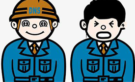
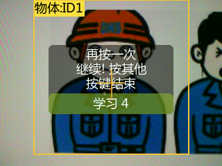
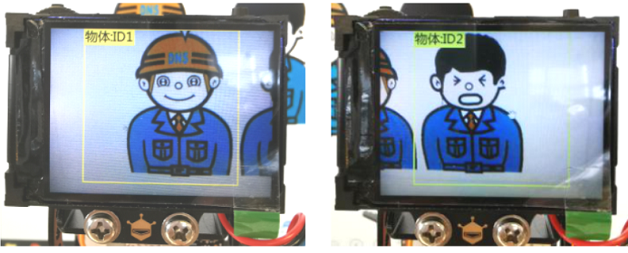
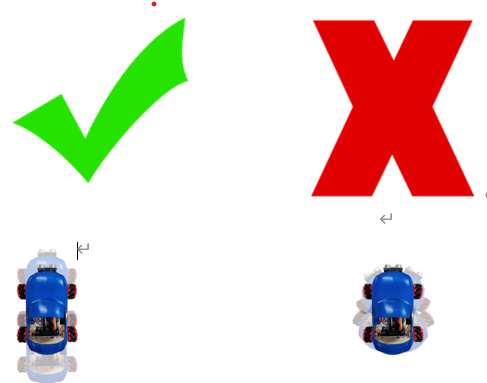
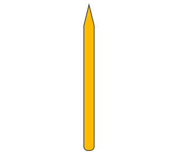
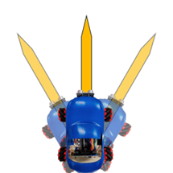
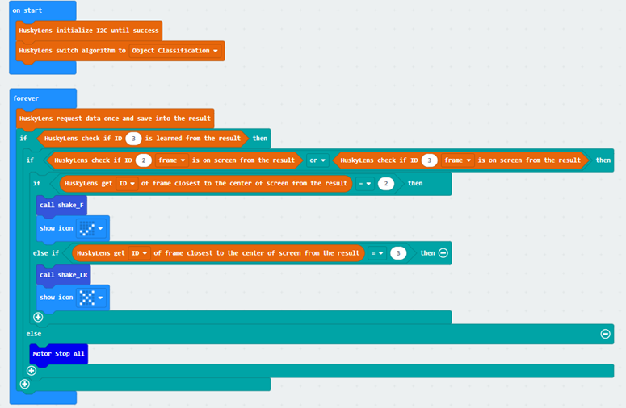
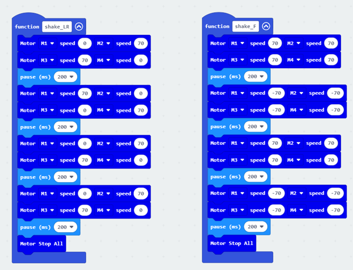
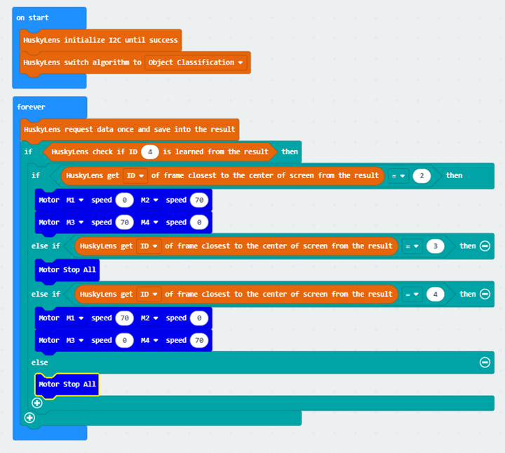
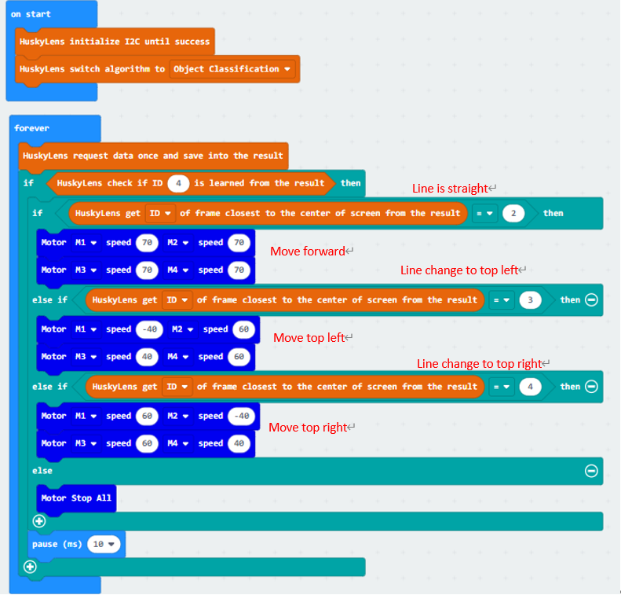

# Lesson 5

## Introduction

Welcome to Micro : bit Smart Car! In the lesson, we will explore Micro : bit, and learn how to control the Micro : bit Smart Car through programming.

## Objective

Students will fully understand the theory, and the function of the Micro : bit of the AI lens in the Smart Car. Also, they will learn how to program the AI lens for achieving more functions of the Smart Car.

## HuskyLens object classification
### what is object classification？

Huskylens' object classification function is to learn multiple photos of different objects, and then use the built-in machine learning algorithm to compare them. After training, when the learned objects appear again on HuskyLens' camera screen, HuskyLens can recognize them and display their ID numbers. The more photos of the same object are learned, the more accurate the recognition is.

### HuskyLensDifferences between object classification and other functions

Unlike other HuskyLens features, the object classification function does not have a built-in algorithm specifically designed to identify a class of objects, so it is not as accurate as other features when it comes to identifying specific classes of objects. Since objects are learned from near zero, the object classification algorithm does not derive the relative position of objects on the screen, and the position of the output box is always fixed. Because of this, the object classification function is able to learn and identify any object of any type or even irregular shape, even objects that cannot be identified by other modes.

### Huskylens' object classification

The object classification function of HuskyLens can be divided into two parts: learning objects and identifying objects. The following figure is an example to explain.

#### learning objects

Point the large orange frame in the center of the HuskyLens screen at the object that needs to be learned, and press and hold the "Learn button" to learn. After the first object is learned from different angles and distances, release the "Learn button" and the screen will prompt: "Press the button again to continue! Press another button to finish". If you want to continue learning the next object, press the "Learn button" before the countdown ends, then you can continue learning the next object. If you no longer need to learn another object, press the "Function button" before the countdown ends, or wait for the countdown to end without operating any buttons.

#### Identification of labeled objects

When HuskyLens encounters the learned object again, its ID number will be displayed on the screen. As shown below, when a worker is identified as wearing a helmet, ID1 is displayed on the screen and ID2 is displayed without a helmet.

***** Note: When learning objects in object classification mode, HuskyLens tends to treat all other irrelevant objects as ID1. So if only one object is learned, both the object being learned and other objects (i.e. all objects) will be treated as ID1. So for HuskyLens to effectively distinguish the target objects, you can learn any irrelevant object first. Then, ID2 is the target object that needs to be learned from the beginning.。

## Exercise 1：Symbol classification

Learn the following two symbols. When HuskyLen recognizes a tick, the car is moved back and forth twice and the microbit version shows the tick symbol. When HuskyLen recognizes a cross, the car is rotated left and right twice and the microbit version shows the cross symbol.

		 	

## Exercise 2：Location Recognition

Although HuskyLens cannot derive the position of the object on the screen, it can learn different positions of the object as different IDs and determine the position by the ID. Put the car on the following object first (or use any slender object, such as a pencil) to learn.

 
Aim the tip of the object in the other direction. Design the program so that when HuskyLen recognizes an object on the left side of the screen (tip to the left), the car rotates to the left. When the object is on the right side of the screen (tip to the right), the car rotates to the right. When the object is recognized as forward, the car stops moving.

Tip：

The pause block can be used to prevent the rotation is too fast. 

## Exercise 3：Line tracking

Although HuskyLens can be combined with the program through its own patrol mode to achieve line tracking. Similar effects can be achieved by learning different IDs for different angles of lines in object classification mode.

Design a program, use HuskyLens object classification to make the car move forward in a straight line till the end.

Tip: Learn lines from more different angles to make them more recognizable

## Answer
### Exercise 1
#### The main body of the program

#### The program for shaking the car to the left and right and to the front and back

### Exercise 2

### Exercise 3

