# Lesson 6

## Introduction

Welcome to Micro : bit Smart Car! In the lesson, we will explore Micro : bit, and learn how to control the Micro : bit Smart Car through programming.

## Objective

Students will fully understand the theory, and the function of the Micro : bit of the AI lens in the Smart Car. Also, they will learn how to program the AI lens for achieving more functions of the Smart Car.

## HuskyLens line tracking function
### what is line tracking function？

Remember that the Micro:bit smart car itself is equipped with a black and white sensor, allowing it to follow the line? HuskyLens' line tracking can also achieve a similar function. However, apart from black and white, HuskyLens can also identify lines of different specified colors and make path predictions.

Remember how to use the black and white sensor to achieve the line tracking function? Although there is no way to directly detect the car out of bounds using the line tracking function of HuskyLens, it is equipped with the function of recognizing lines. This allows the car to not only find the line directly outside the line range, but also to choose the correct route when there is more than one road.。

### Application of line tracking

Autonomous cars: Preventing cars from running off the road and causing accidents.

robot：

+ For navigation in public places such as shopping malls or museums
+ For industrial transportation, save a lot of space compared to traditional conveyor belts
+ For restaurants, deliver food to guests

### Huskylens’ line tracking function

The line tracking function of HuskyLens can be divided into two parts: learning and tracking.

#### learning

（It is recommended that there is only one line that needs to be learned within the HuskyLens screen and that it does not intersect with other lines）

Align the cross on the screen with the target line and keep the lens parallel to the line. HuskyLens automatically detects the lines and displays white arrows. Then click the "Learn Button". When the white arrow turns blue (or other non-white color), that means the lines have been learned.

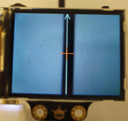

#### Line tracking

When HuskyLens detects a learned line, a blue arrow is displayed on the screen, and the direction of the arrow represents the direction of the path prediction.

## Exercise 1

After learning the following two types of lines for identification. Design the program to display the line ID closest to the center of the HuskyLens screen in the micro:bit onboard indicate light, and observe the characteristics of the HuskyLens path prediction.

Tip: After the study line, you need to end the study to avoid a large number of white arrows affect the display results

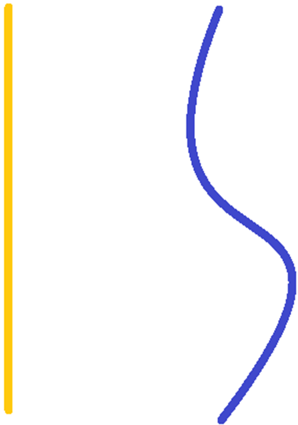

## Exercise 2

Designed the program after HuskyLens learning the straight line, placed the car on the straight line to track the line, and stopped when it reached the end. (Assuming the car doesn't go out of bounds until the HuskyLens completely loses the line)

** The performance is better when there are no other objects, which color is same as the line, in the Husky screen.

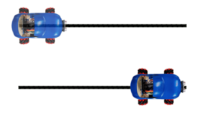

Tip：

+ Use different X beginning to decide whether the car should go forward, turn left or turn right

+ X coordinate range：0 - 320
+ Y coordinate range：0 - 240

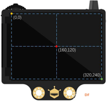

## Exercise 3

Design the program to make the car follow the route in below

** The performance is better when there are no other objects, which color is same as the line, in the Husky screen.

Tip：

Compared with walking in a straight line, the car will go less smoothly when turning. How to improve this problem?  

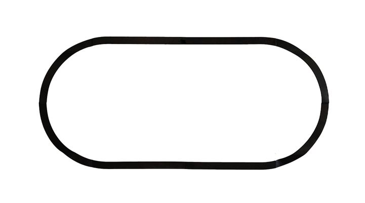

## Exercise 4：Autonomous line tracking cars:

In addition to being able to move forward automatically, autonomous car can also detect obstacles and avoid collisions.

Assemble the ultrasonic sensor and improve the program of Exercise 2. Let the car track a straight line and stop when it encounters an obstacle. When there are no obstacles, re-travel the line until reaching the end point (outside the line).

Turn on the green headlights when there are no obstacles. When encountering an obstacle, turn on the red headlights and beep once. After reaching the end, turn on the yellow headlights and play a mission completion sound effect.

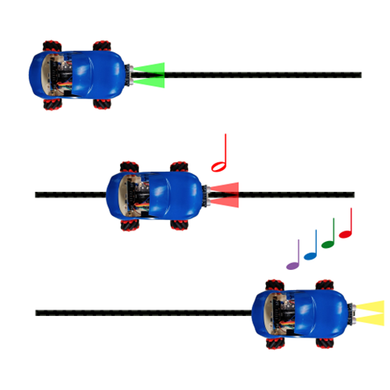

## Answer
### Exercise 1
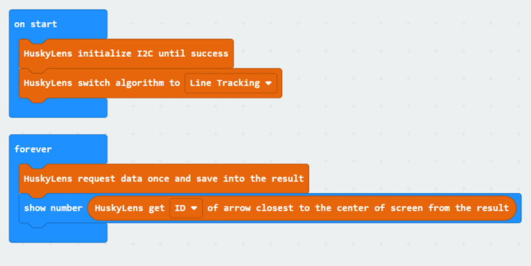

### Exercise 2

The end point of the arrow is the tip of the arrow. When the end point of arrow Y is less than 120 (half of the screen), the car stops.

Otherwise, when the X beginning is greater than 170, the car turn right; when the X  beginning is less than 150, the car turn left.

(160 is half of the screen; 170=160+10, 150=160-10)

Otherwise, when the X beginning is between 150 and 170, the car moves forward.

The arrow cannot stay in the middle of the screen, so set up a larger range of forward values.

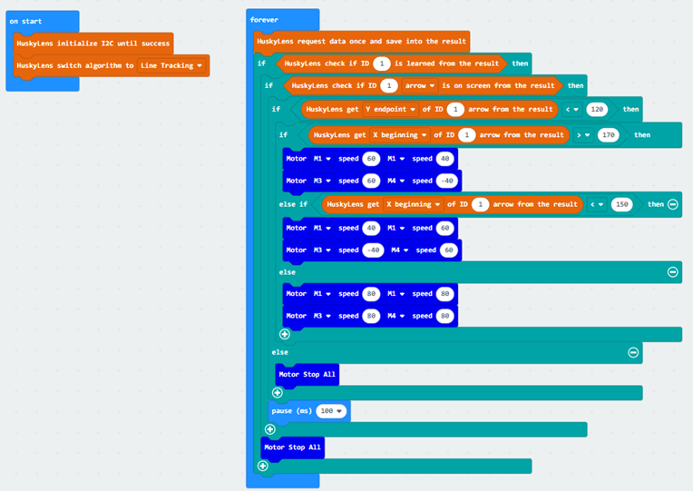

### Exercise 3

Q. Compared with walking in a straight line, the car will go less smoothly when turning. How to improve this problem?

A. Since the HuskyLens doesn't simply distinguish whether the car is out of bounds like a black-and-white sensor, the car can't adapt to all turning angles. In Exercise 2, we divided the Huskylens picture into three parts: turn left, forward and turn right. To make the car have different turning speeds according to different turning angles, we just need to divide the Huskylens screen into more areas.

Take the division into five areas as an example :

X beginning|car action
---|---
150-170|forward
130-150|light left turn
0-130|deep left turn
170-190|light right turn
190-320|Deep right turn

(More areas can be divided as needed)

#### Program
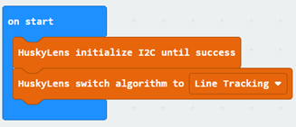
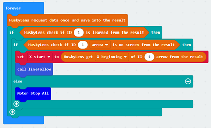
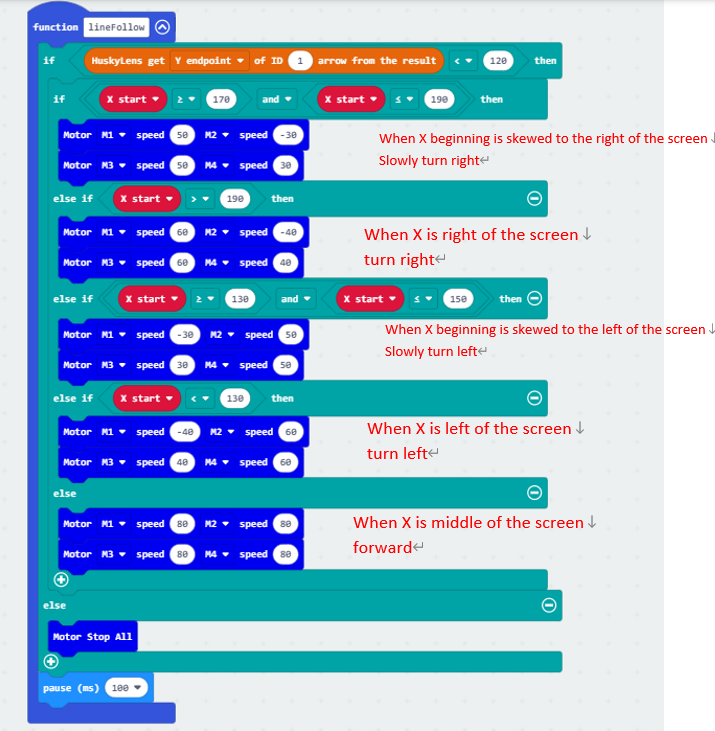

## Exercise 4

The part where the car travels in a straight line is similar to Exercise 1, except that the ultrasonic wave is greater than 5.

Create a variable to store whether the buzzer has played music once after the car hit an obstacle or reached the end.

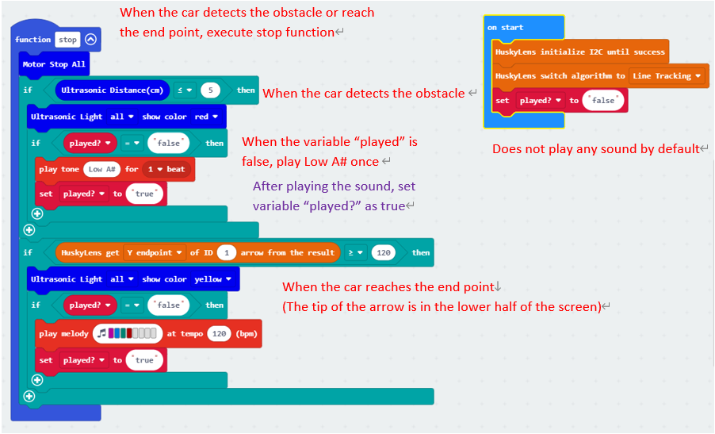
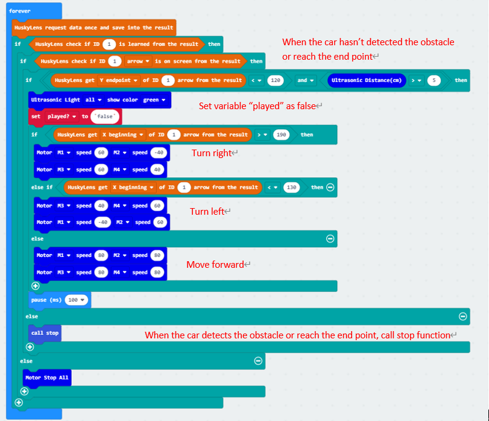
