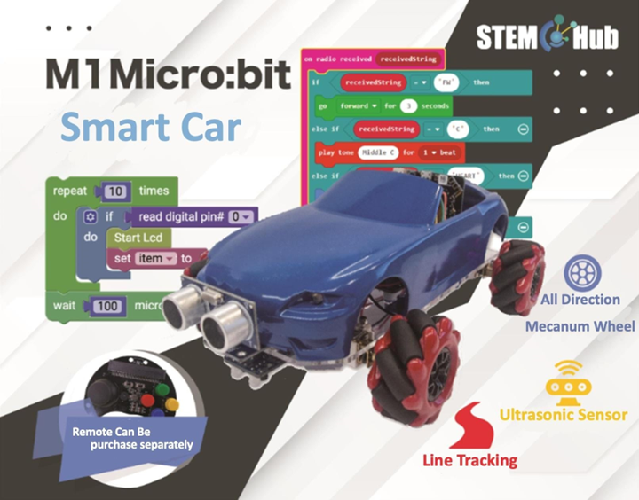

# Lesson 8

## Introduction

Welcome to Micro : bit Smart Car! In the lesson, we will explore Micro : bit, and learn how to control the Micro : bit Smart Car through programming.

## Objective

Students will fully understand the theory, and the function of the Micro : bit of the AI lens in the Smart Car. Also, they will learn how to program the AI lens for achieving more functions of the Smart Car.

## HuskyLens Object tracking function
### HuskyLens Advanced Application of Object Tracking

In Lesson 7, we learned about the basics of HuskyLens object tracking, its real-world applications, and how to operate it. In addition, you know how to use object tracking to keep the car looking in the direction of the object and moving precisely towards it. The microbit smart car is equipped with a highly flexible McNamee wheel, which can be used in conjunction with HuskyLens to develop new functions to maximize the potential of object tracking.

### Obstacle detection: HuskyLens object tracking v.s. ultrasonic sensor

After Exercises 2 and 3 in Lesson 7, you are now familiar with how to use HuskyLens object tracking to reproduce the most basic obstacle detection functions of the ultrasonic sensor. The following diagram summarizes the pros and cons of using only one of the two for obstacle detection.

HuskyLens|Ultrasonic Sensor
---|---
Distance can be detected only for learned objects|It is not possible to detect only the target object
Identification errors can easily occur, leading to errors|If the object is flat, not easy to make mistakes
Track target objects and maintain distance|Cannot track any object

if HuskyLens and ultrasound sensors are used together, they can offset each other's shortcomings.

## Exercise 1

Let's review what you learned in the previous lesson and warm up. After learning the objects, place the objects in front of the car and hold them at different distances. Design a program to get the height of the object using HuskyLens, so that the car is always at approximately the same distance from the object.

## Exercise 2

Combine the ultrasonic sensor and improve the procedure of exercise 1. After learning, place the object within the HuskyLens screen. Use HuskyLens object tracking and car rotation to keep the object in the horizontal center of the screen, and use the ultrasonic sensor to maintain the distance between the car and the object.

	 

Tip：

+ You can divide the screen into three areas by referring to Exercise 2 in Lesson 6.
+ Adjust the direction of the car first, and then continue to move forward.

## Exercise 3

Combining ultrasonic sensors and HuskyLens Object tracking. Design a program to enable the car to perform the following actions.

Tip：

According to the principle of ultrasound operation, it is difficult for the car to detect objects that are not in the center of the camera screen. Imagine the situation (what kind of object with what kind of learning process) to successfully move the car to the back right or back left. 

## Challenge

 
After completing exercise 3, now you know how to make the car track objects in different ways depending on the direction.

So, now you can do the challenge with two cars in a team of two. The first car will be placed in front, and the other car will use HuskyLens to fully learn the first car from the back.

One person designed the program to use the remote control to control the first car to move forward, turn right, turn left, backward and other actions. The other person designs and repeatedly modifies the program so that the second car follows the first car to move behind.

Tip：

If the car is moving too fast for HuskyLens to track, you can pause briefly after each movement to allow the lens to adapt

## Answer
### Exercise 1	

Determine the distance of the car from the object by the detected height.

When the height is below 60, the object is judged to be too far away and the car moves forward.

When the height is above 80, the object is judged to be too close and the car movs backward.

Otherwise, stop the car.

### Exercise 2

When the object is greater than 190 and less than 130 at the X-center of the screen, the car rotates to the right and to the left respectively.

Otherwise, the ultrasonic program is executed to detect the object distance and control the forward and backward movement.

### Exercise 3

To make the car ultrasound detection of objects that are not in the center of the HuskyLens lens screen, the following conditions are easier to achieve:

+ The object is large and only one feature of the object is learned.（Ensure that the sensor receives the bounce back signal）
+ It is important to include enough angles and distances when learning with HuskyLens.（Since the angle of the lens on the mount is fixed, and there are differences in the appearance of objects seen at different angles and distances, it is important to ensure that HuskyLens can recognize objects in different positions.）

#### Unlimited execution of the program

Move forward, move in place, and move backward using 5 and 12 distances as the dividing line.

#### forward

#### backward

#### Move in Place

