# Lesson 9

## Introduction

Welcome to Micro : bit Smart Car! In the lesson, we will explore Micro : bit, and learn how to control the Micro : bit Smart Car through programming.

## Objective

Students will fully understand the theory, and the function of the Micro : bit of the AI lens in the Smart Car. Also, they will learn how to program the AI lens for achieving more functions of the Smart Car.

## Micro:bit AI Smart Car
### HuskyLens Advanced Applications

In previous courses, students have learned six functions of HuskyLens: face recognition, color recognition, label recognition, object classification, line tracking, and object tracking, and learned that artificial intelligence learns objects from different angles and distances principles. Even so, the recognition function of HuskyLens can only operate independently in different modes, which limits the multiple functions. We need to learn how to interlock and combine the functions of different modes to achieve more complex and meaningful tasks, so as to further achieve the mechanical car with high AI intelligence. 

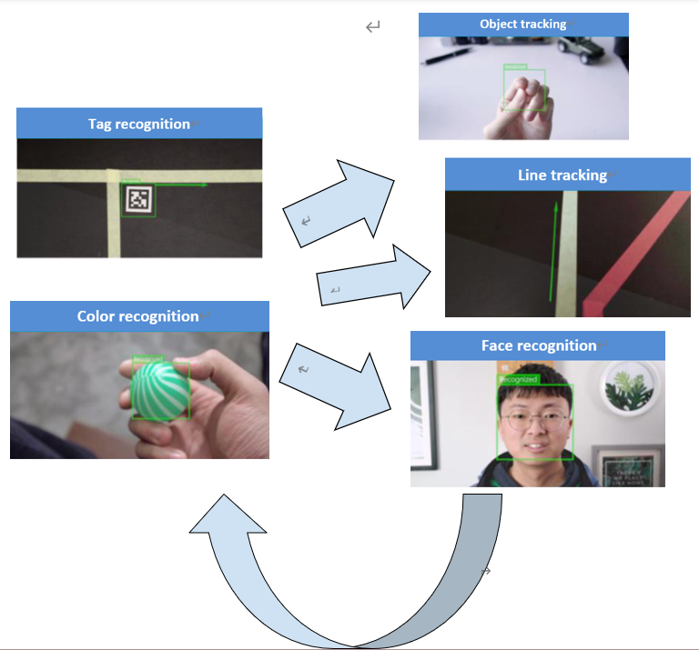

## Exercise 1：Function combination: color recognition + line tracking

Combine HuskyLens’(1) color recognition and(2) line tracking to complete the task.

Learn the following two colors in the color recognition mode first, and learn the two color lines on the next page in the line tracking mode. Design the program, when you press the button A on the microbit board, find the color with the largest number in the picture below, and automatically switch to the line tracking mode after three seconds. Then, find the line that identifies the color on the next page, walk to the line and perform line tracking to the end.

Tip：

+ If the tracking line is easy to go out of bounds, you can use the pause blocks to make the car brake after each movement.
+ After pressing the A button to switch to color recognition mode, send two requests for data storage results.
+ Initialize the data for the first time and update the data to the new learning result for the second time
+ Create a variable id to store the color ID with the highest number of squares.
+ Create variable mode to save the current mode of HuskyLens.

## Exercise 2：Use different labels to represent different HuskyLens modes

Combine HuskyLens(1) Face Recognition, (2) Color Recognition, (3)Tag Recognition, (4) Object Classification、(5)Line Tracking，Set the conditions for switching between different function modes centered on tag recognition and complete the task.

Learn the following four labels in tag recognition mode first, and learn the corresponding objects in the other four modes (see next page). When the center of the lens is aligned with different tags and the button A is pressed, HuskyLens switches to the corresponding function mode. By placing different objects in front of the car, the car performs different wheel movements when the camera recognizes the learned objects in each mode. Press the microbit board button B to return to tag recognition mode and the car stops.

Mode|Car Action 1
---|---
Color Recognition|Forward
Face Recognition|Backward
Object Classification|Horizontal movement to the left
Line Tracking|Horizontal movement to the right

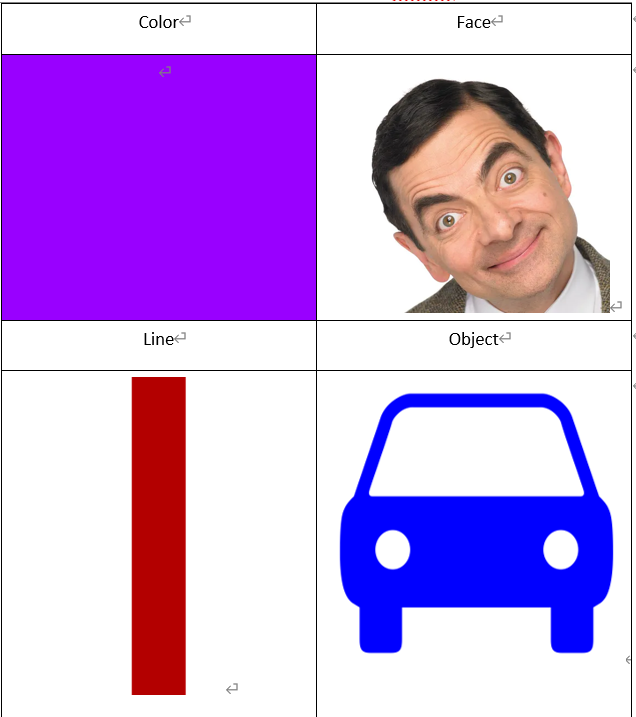

## SD  card save/load model

As more functions are learned and more complex tasks are achieved, HuskyLens may need to store more data on learned objects. If the last learning data is cleared and relearned each time HuskyLens is used for a new task, it will only take a lot of time and labor, which defeats the original purpose of AI lenses to promote work efficiency.

Therefore, HuskyLens can use multiple objects learned in the same mode as one data model and save them via SD card. Even if all the data in the current model is deleted, the model can be reloaded from the SD card again, allowing HuskyLens to learn the data in the model.

By saving models, HuskyLens can satisfy multiple scenarios in one algorithm, for example, in the object classification algorithm, learning the rock paper scissors gesture as 1 model and mask recognition as 1 model. Then, by switching between models, the desired function can be quickly implemented, avoiding HuskyLens to learn repeatedly.

HuskyLens has an SD card slot on board, insert the SD card and you can use it. 

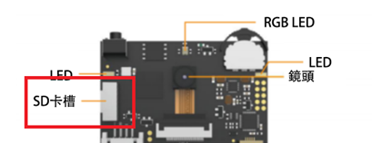
 
### Method 1 : Manual operation in the second-level menu of each algorithm function

1.	Learn new objects: Let HuskyLens learn several new objects, each with a different ID number.

2.	Export model: Press and hold the "Function button" to enter the secondary menu parameter setting interface of the object classification function, then dial the "Function button" to the right to select "Export to SD card "(i.e. save the model to SD card). Short press the "Function button", then dial the "Function button" left and right to select any one of 0~4 (it is equivalent to select the save location, which is convenient to distinguish different models, there are up to 5 models in one mode), then short press the "Function button" to save the model.

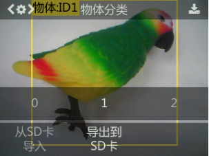

3.	After exporting the model to SD card, read the SD card with computer and you can see the model data file with .conf under the "HUSKYLENS" folder, the file name is different for different algorithms. The following figure shows:

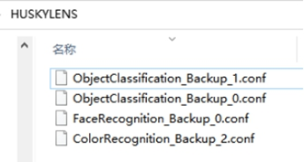

（Based on the model data file name, we can know which algorithm function the exported model data file belongs to, and the learned pictures in each model cannot be viewed.）

### Method two : use the block module operation

When loading models, only models with the same algorithm can be imported. The models with different algorithms can't be loaded.

## Take photos, take screenshots and save to SD card

HuskyLens equipped with a lens can act like a camera to take pictures or screenshots of the camera screen, and save to an SD card. HuskyLens has an SD card slot on board, insert the SD card can be used. Screenshot saved pictures contain the text, boxes and other content displayed on the screen, while the picture taken out of the picture only contains the camera head screen, no boxes and text information.

Since it takes some time to take/screenshot a picture and save it, it is recommended to use this function at least 0.5 seconds apart. 

## Exercise 3

Design a program to complete the task.

Learn one of the following sets of tags first, use the microbit board A button to save to either model, and automatically clear the learned data. Learn another set of tags using the B button to save to another model, and automatically clear the learned data when finished.

When the A+B button is pressed once, HuskyLens loads the first tab, then presses it again to load the second tab, then presses it again to load the first tab, and so on.

When HuskyLens recognized the first tag, the car move forward.

When HuskyLens recognizes the second tag, the car backs up.

Tip: Create a variable “model” to save the location of the model loaded at that time

## Exercise 4：Sort the objects first, then switch to the corresponding mode + screenshot.

Combine HuskyLens (1) tag recognition, (2) object classification, and screenshot saving to complete the task.

Learn the following tags by using object classification and tag identification respectively.

    

In the object classification mode, when HuskyLens recognizes any tag, switch to the tag recognition mode. Then, if the car fails to recognize the tag, move forward, otherwise the car stops and proceeds to recognition. When different tags are recognized, the HuskyLens screen displays different text (e.g. Hello and World) and takes a screenshot. Use computer to read the SD card to see what the screenshot looks like.

Q: In object classification mode, how to make HuskyLens efficiently switch to tag recognition automatically when any tag is recognized?

A: Use one object ID to identify all tags at once

## Answer
### Exercise 1

First create a variable id to save the color id.

Each time you press the A button, you need to send two data storage requests to save the latest learning results.

Line tracking is performed only when the number of colored squares is compared.

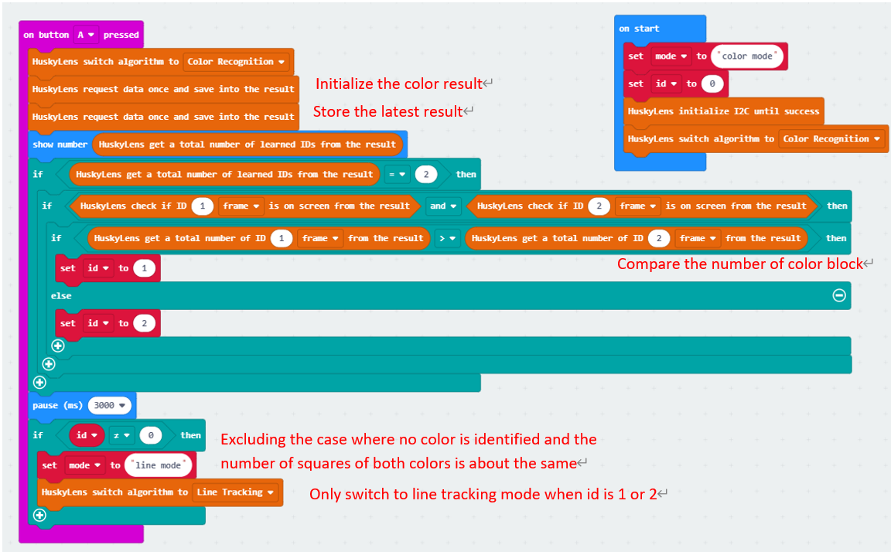
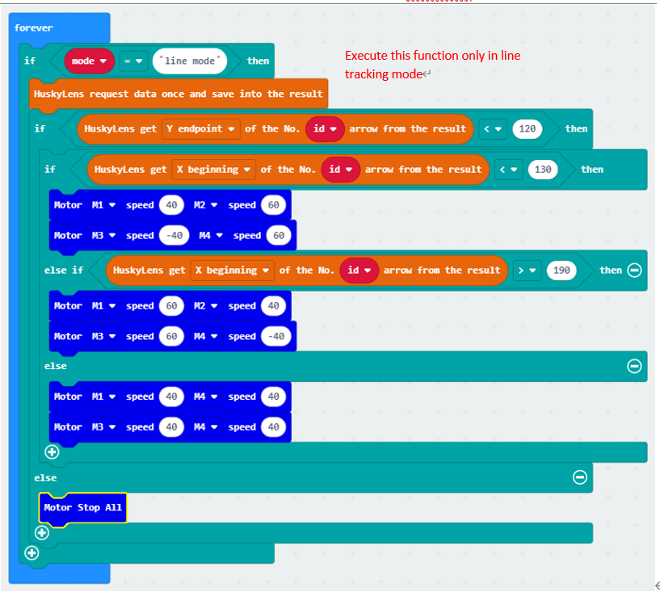

### Exercise 2

Create variable modes, and use modes 1-4 as color recognition, face recognition, label recognition, object classification, and tracing mode respectively.

When the B button is pressed, the car stops and mode is set to 0, returning to label recognition mode.

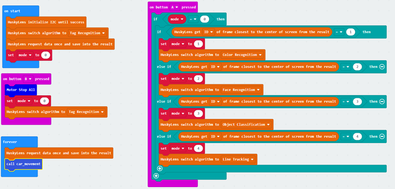

The program for moving the car in different ways in different modes:

The yellow frame circles the objects that HuskyLens recognizes in four functions.

For color and face recognition, the ID1 object frame is recognized, and the track line is the arrow.

In the object classification, there is meaningless in learning only ID1, so it is necessary to explore the boxes of ID2 objects.

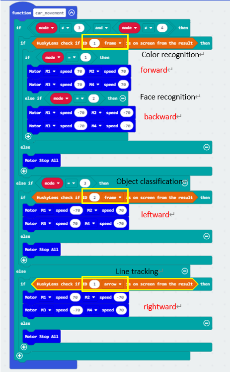

### Exercise 3

Initialize the variable "model" to -1 (without pressing any button). Press the A or B button to save the data to model 0 and 1 respectively and clear the existing data. When the A+B button is pressed, if the model is not 0, the data of model 0 is loaded and the current model is set to 0. Otherwise, the data of model 1 is loaded and the current model is set to 0. Keep switching. when the model is 0, the car moves forward, otherwise when it is 1, the car moves backward.

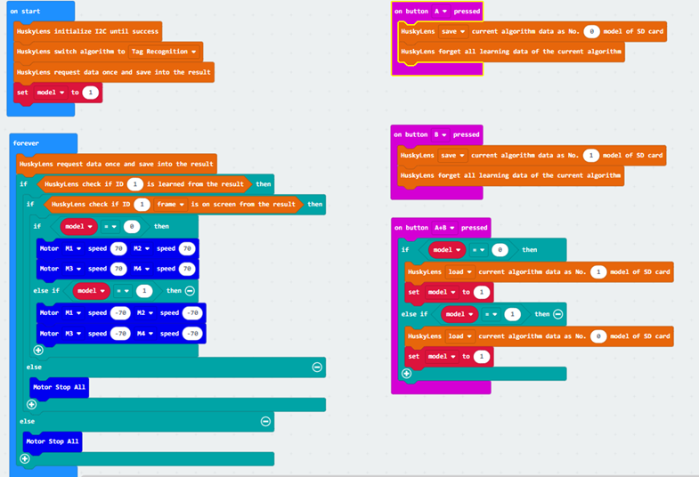

### Exercise 4

Clear the screen text once when activating, create a variable "mode" to record the current HuskyLens mode, and set it to object mode (object classification). Then create the variable "screenshot" and set it to true (you can take screenshots).

In object classification mode, HuskyLens recognizes if there is any tag (ID2) on the screen, and switches to tag mode if it is.

When it is in tag recognition mode, HuskyLens recognizes if there is any tag on the screen, if yes when screenshot is true, the text is displayed on the screen according to the tag ID and screenshot is taken, after screenshot is taken, set screenshot to false (stop taking screenshot again), otherwise the car continues to move forward until the tag is recognized.

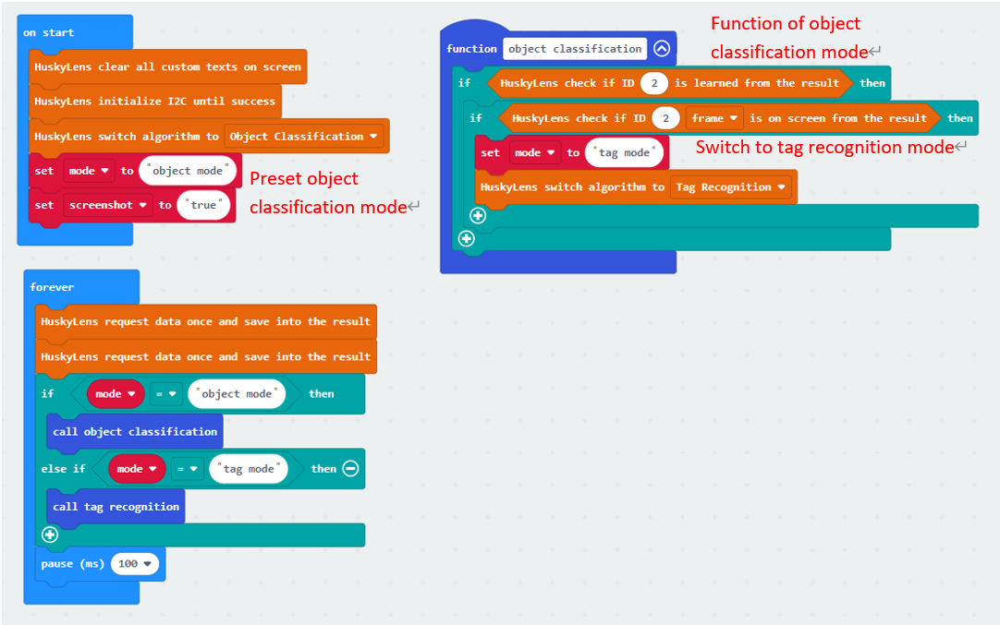
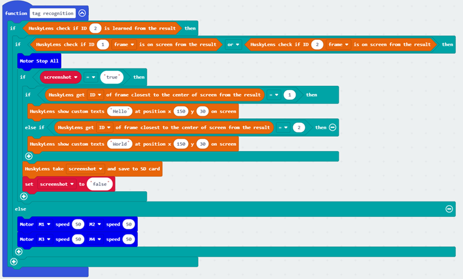
