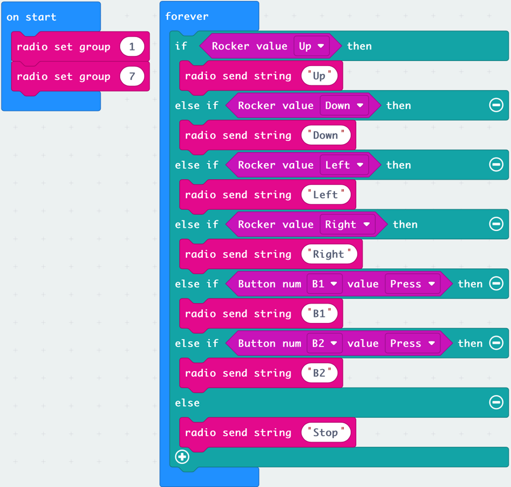

# Lesson 1

## Introduction

Welcome to Micro:bit Smart Car tutorial! In this course, we will explore Micro:bit and learn how to develop Micro:bit Smart Car by programming  

## Learning Target

Let students clearly understand Micro:bit Smart Car’s extension tools and its functions, moreover, understanding its install and block coding method

## Reviewing the structure of Mecanum Wheel Car

+ 4 Motor(M1, M2, M3, M4)
+ 4 Mecanum Wheel
+ Micro bit
+ Micro bit expanding board

 
### micro:bit expansion board

### Sensor
+ Ultrasonic Sensor

+ Infrared Receiver and Sender

## Reviewing of advanced block

Advance >> function module can tidy up complicate program and reuse them 

1.	Functions

a.	Build functions

b.	Fill in the function name in yellow box 

c.	Execute program by calling the function

## Meet the  Mechanical extension tools
### Beetle

### Loader

### Forklift

### Bulldozer with ultrasonic

### Components in extension package

## Meet the Micro:bit extension tools – beetle 

The form of Micro:bit gripper mainly  are Upper and lower jaws with gear and servo motor, usually install in front of the car 

This time we will connect the pin of servo motor to port S1(pin indicate by blue box), normally we will connecting dark  wire(Black or Red) to GND port(Black).

  
### Principle and function of Mechanical beetle

In real life, beetle is used to grip object instead of hands, to avoid injure or make dirty of hands, common example is bread clip in bakery shop and clip for hanging clothes. By applying force in both jaws, things between jaws can be stabilize

Micro:bit mechanical clip shape like the main jaw of Stag beetle, like tongs with serrate, therefore it also names as “Beetle”.

 
### Install of beetle

Components needed

1）Put three M3.5*5mm screw, upper arm and drive forearm of the metal beetle on metal gripper board, finished right arm. 

2）Use two M3.5*5mm screw, connecting the servo forearm with servo connection board.

3）Use two M3*5mm screw, place another beetle upper arm on assembled servo forearm, finish left arm.

4）Use two M2.5*5mm screw, screw the servo motor on the metal board. 

（Place right arm next to the left arm, then test the operational of servo motor by assign servo module with zero degree.（5））

5）Use one M2.5*5mm screw, combine left arm, servo conection board and servo motor together.

6）Use three M3*5mm screw, three M3*18mm copper pillars, assembly with the metal board.

7）Use three M3*5mm screws, assembly  gripper board with copper pillar  

8）Use two screws, two screw pads, install beetle on car/expanding board, As show below. (Avoid over tighten in screwing up, prevent bending of expanding board)

## Stemhub:bit - Servo Motor block module

In Stemhub:bit, there are two main modules in servo

Select port and connect with the pin of servo, then we can adjust the servo rotate angle. (The angle value in MakeCode is 0-180, but the value does not imply the rotation angle in reality)

## Exercise 1

Design a program to control the open of beetle in Micro:bit board using bottom A and B. 

Tip : Try assign different angle to servo module and observe the movement of the beetle. 

（To avoid over extend of beetle and leading broken, recommend servo degree value is 0 to 110） 

Angle value|Beetle movement 
---|---
Increase|
Decrease|

After success on beetle open/close, student can do experiment using beetle!

Beside on object provide in lesson, you can also place small things  between the beetle, and see what will happen with different shape and weight of things. 

## Exercise 2

Download the remote package: 

Type link <a href="https://github.com/lzty634158/GHBit">https://github.com/lzty634158/GHBit</a> in yellow box, Add GHBit to makecode

Design the program for Car and remote, open/close by press bottom B1 and B2, control the forward, backward, turning left and right of the car by using control rod, car will stop if pending of remote.

When the beetle is open/close, the micro:bit board of the car will indicate “open” or “close” using indicate light. 

( Delay of indicate light is normal)

+ Refer to Beginner, Lesson 10, receive text as operation condition 
+ Apply basic >> Show of indicate light using block module

After finished exercise 2, you can use your own code to control the car and beetle.

## Answer
### Exercise 1：

### Exercise 2 
#### Program of Remote

For remote of back and forth, left and right, execute bottom function and stop automatically, you can refer to Beginner, Lesson 10, Exercise 2

#### Program of the Car

For remote of back and forth, left and right, execute bottom function and stop automatically, you can refer to Beginner, Lesson 10, Exercise 2

When Car receives text ”B1”, open the beetle and show “open” indicate light.

When Car receives text ”B2”, close the beetle and show “close” indicate light.

