# Lesson 10
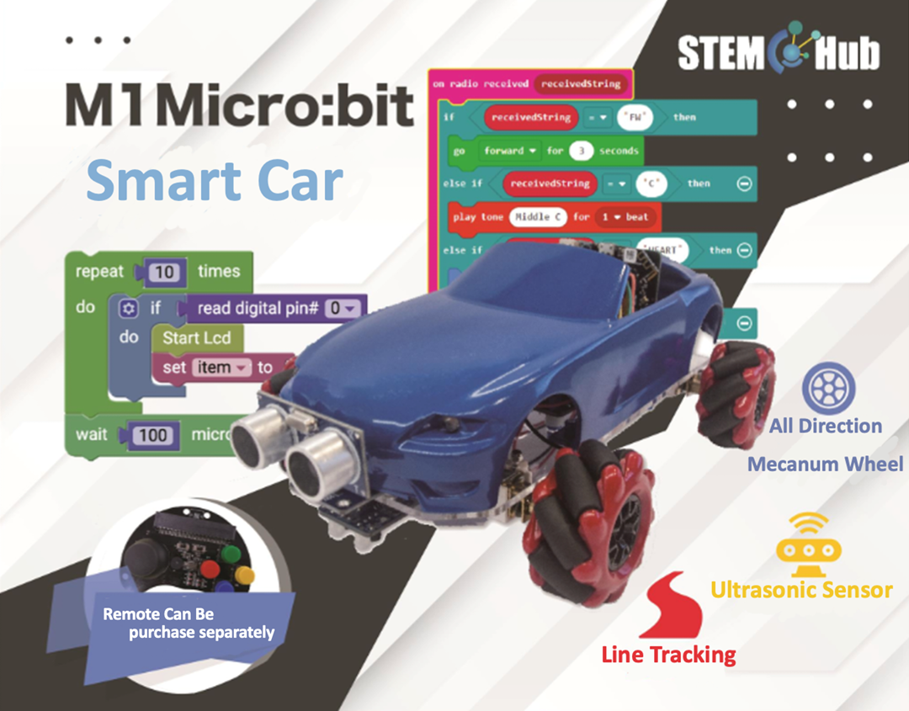

## Introduction

Welcome to Micro:bit Smart Car tutorial! In this course, we will explore Micro:bit and learn how to develop Micro:bit Smart Car by programming  

## Learning Target

Let students clearly understand Micro:bit Smart Car’s extension tools and its functions, moreover, understanding its install and block coding method

## Two-way movable fork

The original mechanical fork has only one servo to control the up and down of the lifting bracket, but with the addition of a servo, the fork can move left and right and up and down at the same time. In specific location, the goods can be moved from low to high, left to right without moving the car.

### Installation steps:

The installation of the horizontal moving servo is similar to step 2 of installing the bulldozer in Lesson 7. Use three M2.5*5mm screws to assemble the servo and install the pan-tilt-zoom mounting plate.

Then use two M3.5*5mm screws to install the fork on the servo connection board and use the copper pillars to install the tool on the car.

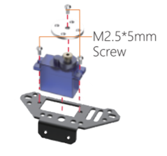
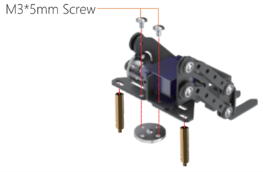

## Exercise 1

Design a program using the remote control buttons to control the fork up, down and horizontal movement, and press the A+B buttons of the micro:bit board to make the fork face back to the front, and complete the following tasks.

For the lifting part, the fork only needs two different heights.

For the horizontal moving part, the angle of the fork needs to be freely adjustable.

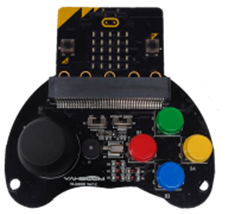

### Task
Control the car to transport the objects in the left to the middle, then transport the objects in the right to the left, and finally transport the objects in the middle to the right. 

## Car relay race
### Introduce

The car relay race is divided into two extended tool cars, a forklift and a clip tool. Both cars are controlled by the same remote and will work together to complete the race. If the button A is pressed, the remote control will control the forklift; if the button B is pressed, the remote control will control the clip, please design the program to meet the competition conditions.

### Game rules

    ① The relay race is divided into two stages, Stage 1: AB (task: transport all three objects from point A to point B), stage 2: BC (task: transport three objects from point B to point C, and Overlap these objects in the order of 1, 2, 3). After completing the second stage, only two cars reach point C (point A is the starting point, point B is the relay point, and point C is the end point) to be considered successful.
    ② During the game, players cannot touch the car.
    ③ Whoever completes all tasks in the shortest time wins.
 
 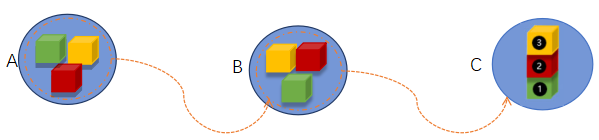
 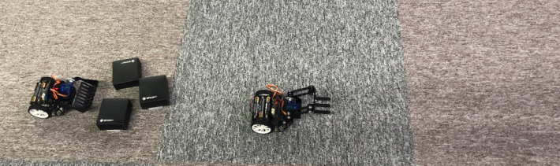

**The second vehicle can only be activated when the first vehicle has delivered all objects to the designated area B. **

Tip: There will be three programs (remote control, forklift and clip)

## Answer	
### Exercise 1 
#### Car program (the horizontal moving part of the fork)

When the angle is greater than -20°, the angle keeps decreasing by 1 to make the fork gradually turn to the left.

When the angle is less than 190°, the angle keeps increasing by 1 to make the fork gradually turn to the right.

When pressing the A+B buttons on the micro:bit board, the fork faces straight ahead (85°).

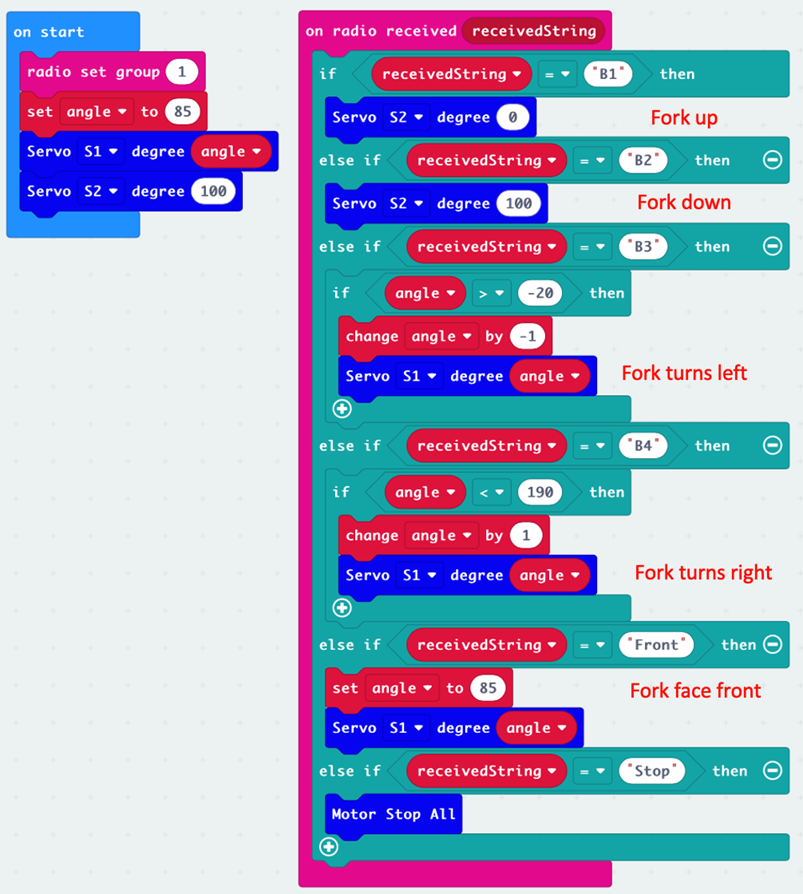

#### Remote Program
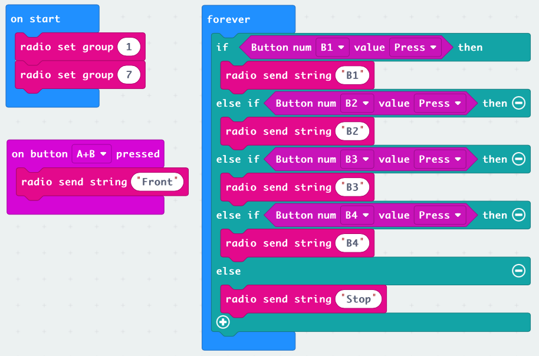
  
#### Car relay race
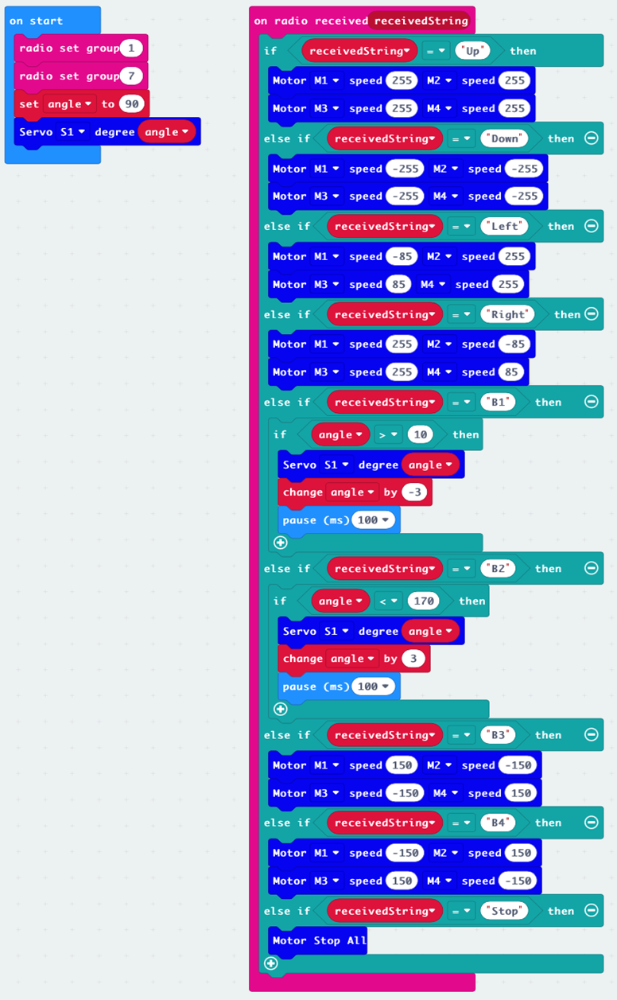
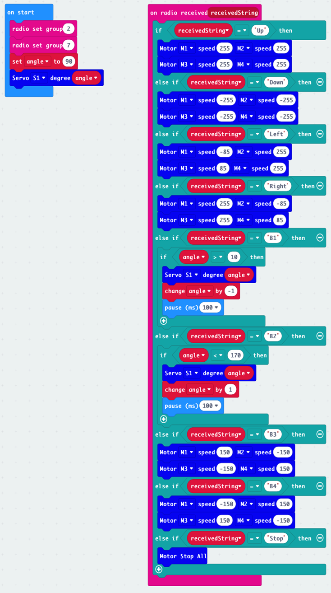
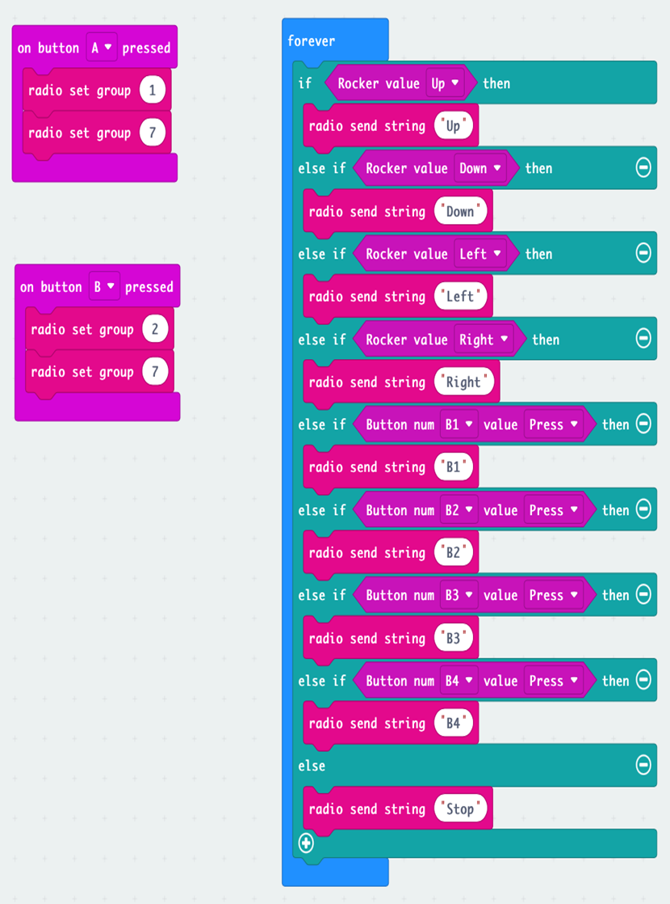
 
