# Lesson 2

## Introduction

Welcome to Micro:bit Smart Car tutorial! In this course, we will explore Micro:bit and learn how to develop Micro:bit Smart Car by programming.  

## Learning Tutorial

Let students clearly understand Micro:bit Smart Car’s extension tools and its functions, moreover, understanding its install and block coding method.

## Exercise 1

Design program of car to complete mission

1）Place car at the starting end of black line (Starting point)

2）Car operating under open state of beetle 

3）After reached terminal (Outside of black line), Car stop, close the beetle with clipped target.

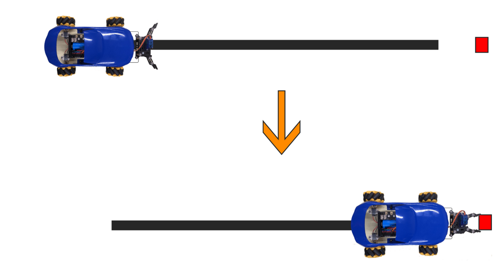

Hint : To clip target easily, place target in appropriate distance and adjust car motor with suitable speed.

## Install of Ultrasonic sensor:
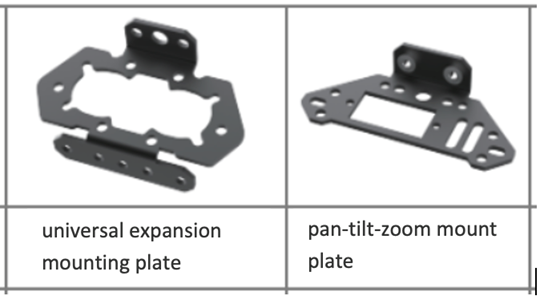

1）Use three M2.5*5mm screw to install another servo, and combine with pan-tilt-zoom mount plate.

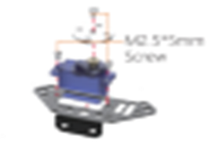

 
2）Put Ultrasonic sensor into universal expansion mounting plate, and use two M2.5*5mm screw  install pan-tilt-zoom mount plate over general expanding installation board. **Show below, correct install direction of general expanding installation board and ultrasonic sensor.

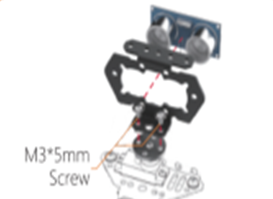

3）Use two screw, two screw cap and two copper pillar, install beetle and ultrasonic on the car. (**Caution of the direction of pan-tilt-zoom mount plate) 

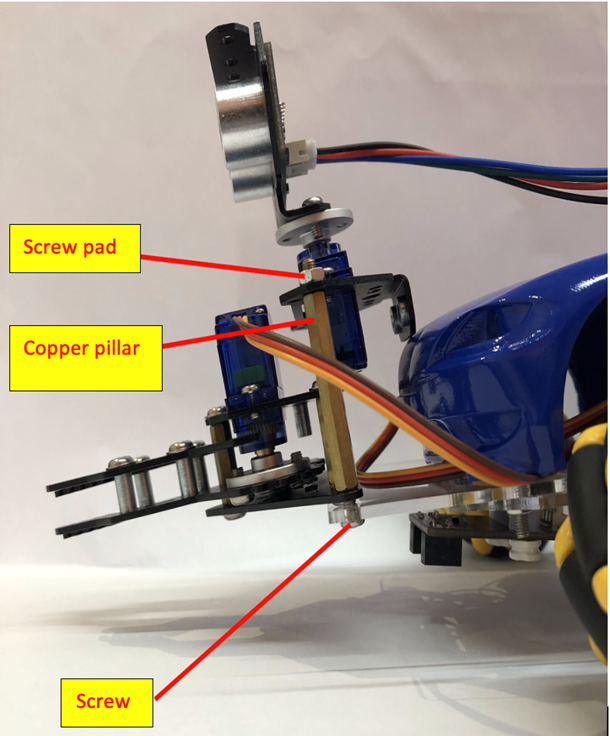

Finished diagram：

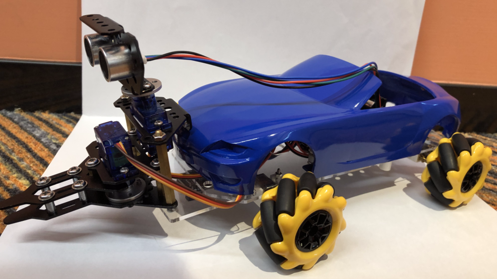

## Exercise 2

Automatic Sensor(Ultrasonic)

Using ultrasonic to detect there any object that can be transport in forward direction, then, use beetle to clip it and pause the car. (If there no object detected, car will go on until detected obstacle) 

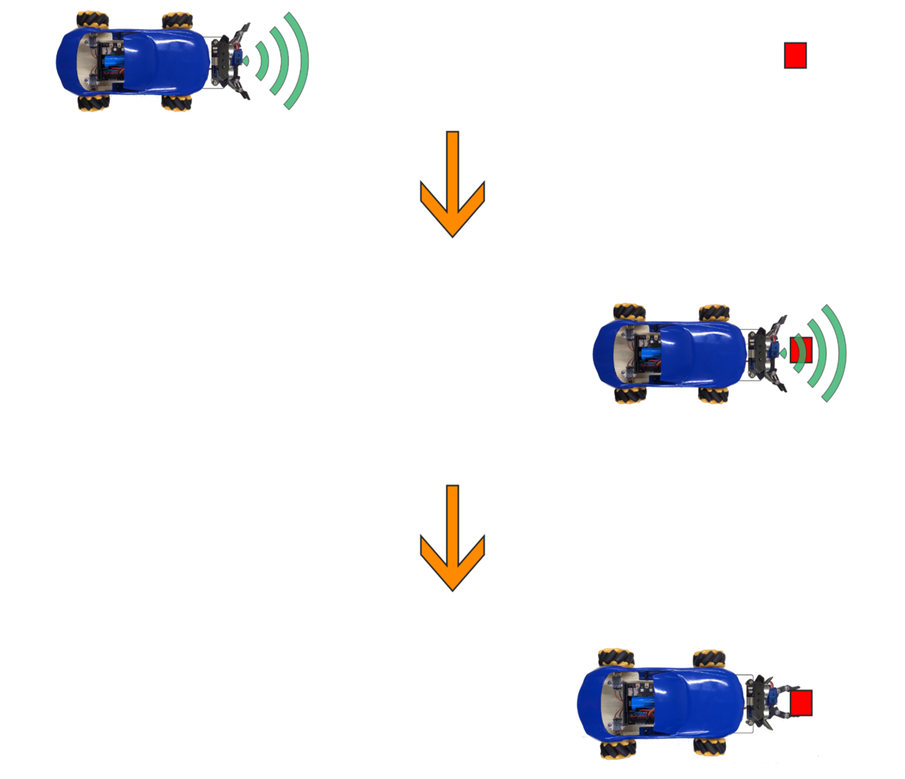

## Exercise 3

Combine Exercise 1 and 2，Using ultrasonic sensor and line tracker o complete mission.

1）Let the car follow the black line

2）When ultrasonic sensor detected first obstacle, turn 180 degree to opposite side 

3）Follow the line and back to starting point     

4）Excess the black line, car will stop and clip the object.

（Default car will only excess black line when back to starting point）

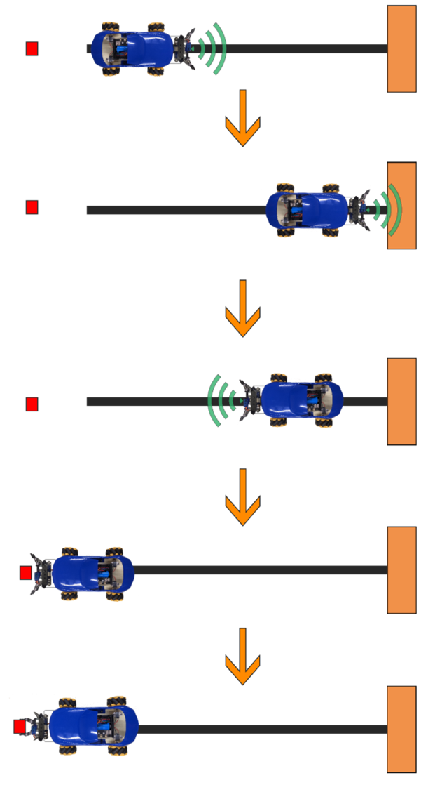

Hint：

+ Built variable “goal” to mark the destination, and use it in  Conditional block（Use text “start” and “end” indicate start point and end point）
+ Beware of the sequence of  the condition of ultrasonic, line patrol and “goal” condition

## Answer
### Exercise 1

Line tracking section can refer to Beginner, Lesson 7, 8.

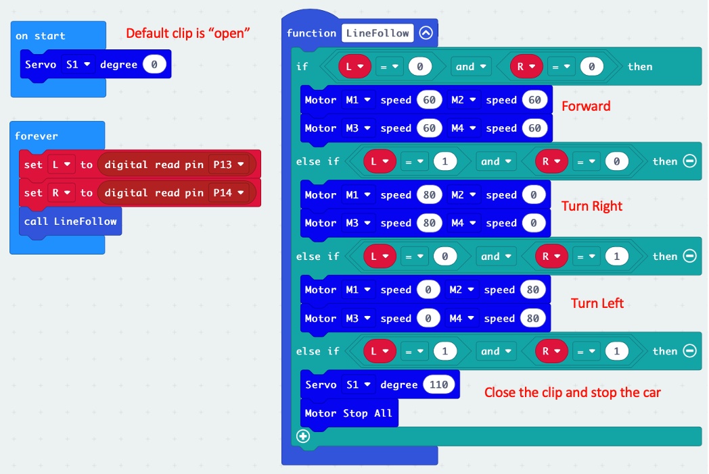

### Exercise 2

When ultrasonic distance  reading excess 4, open beetle and let the car move on.

When ultrasonic distance readings smaller or equal to 4, close the beetle and stop the car.

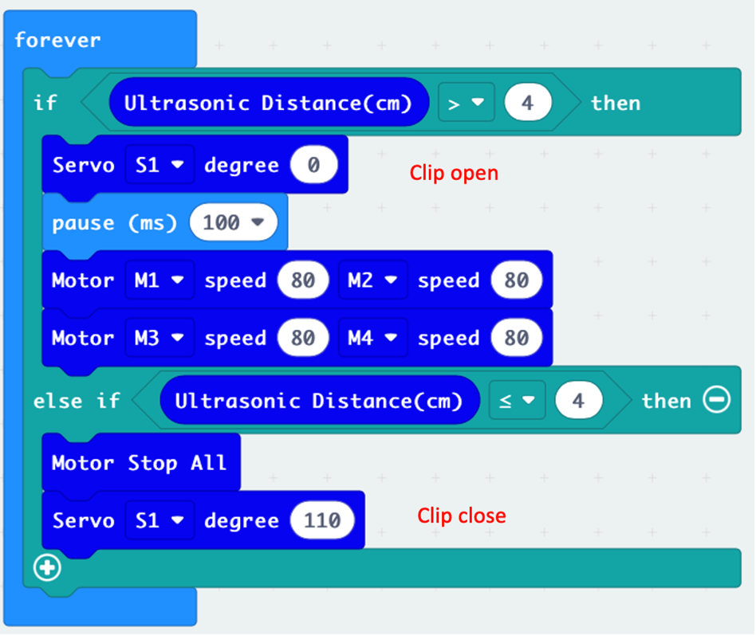

### Exercise 3

Default destination（End of Black line）

1）When reached destination, no response of ultrasonic sensor, open the beetle and follow the line .

2）When detected obstacle, turn the car and set starting point as destination(Starting end of Black point), and follow the line to move 

3）When destination is starting point and excess black line, stop the car and clip the object at start point.  

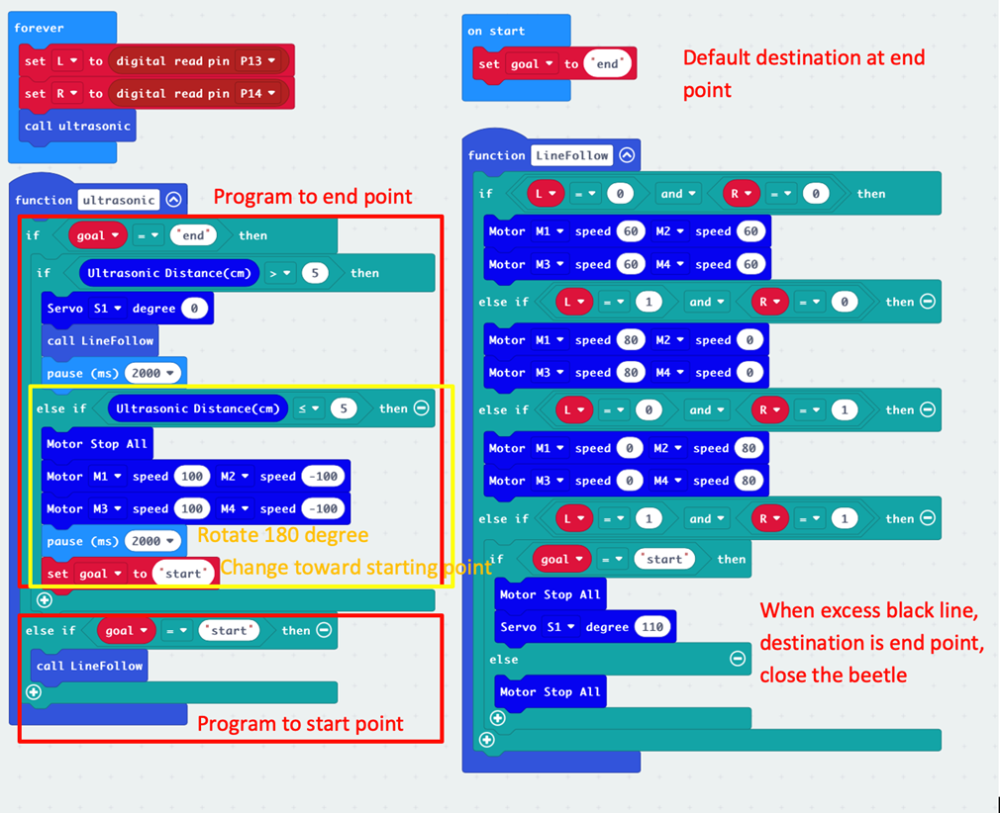
