# Lesson 5

## Introduction

Welcome to Micro:bit Smart Car tutorial! In this course, we will explore Micro:bit and learn how to develop Micro:bit Smart Car by programming. 

## Learning Target

Let students clearly understand Micro:bit Smart Car’s extension tools and its functions, moreover, understanding its install and block coding method.

## Meet the Micro:bit Expansion Tool - Forklift

Micro:bit forklift is mainly composed of three fork tines, a lifting bracket and a servo motor, which is generally installed at the front of the car. 

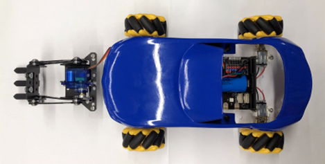

This time we mainly connect the pin of the servo to the S2 port (pin position shown in the blue box)

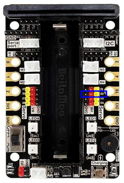

### The principle and function of forklift

Forklifts are mainly used for loading and unloading goods in warehouses, which can reduce the heavy physical labor of loading and unloading workers and improve efficiency. Its principle is very simple, first stretch the iron branch (red circle) into the shelf (red frame), and then use the mechanical force to lift the goods. Note that items need to be raised a little higher for forklifts to carry them, just like on a shelf.

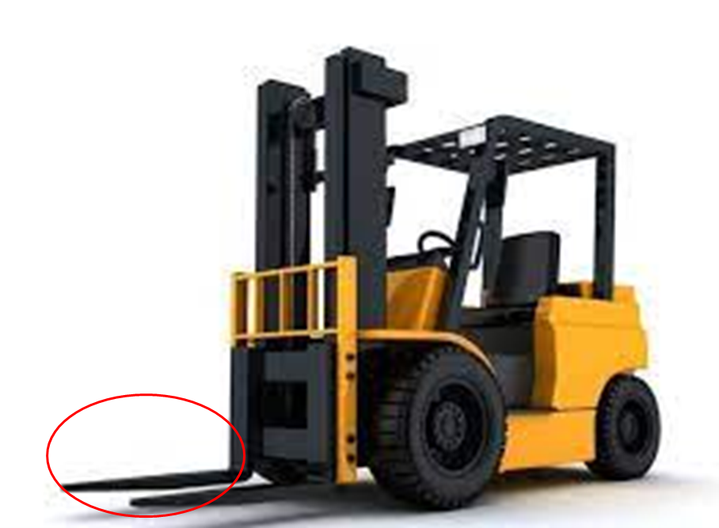

### Install the forklift

Components

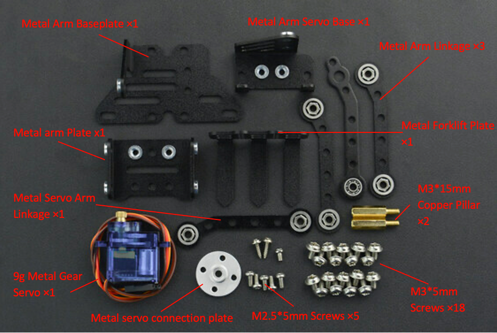

First, use two M2. 5*5mm screws to install the alloy gear servo on the servo base.

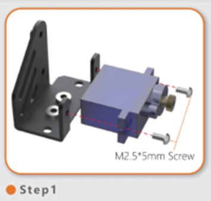

Then, turn the servo to the side, and use M3*5mm screws to install the bottom plate under the base.(The longer side of the bottom plate is backwards)

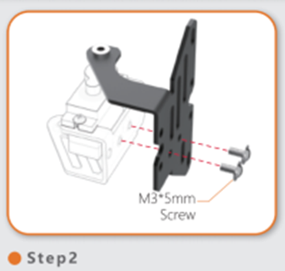

After that, use 4 M3*5mm screws to install the connecting rod on the right side of the servo, and the arm plate in front of the servo. 

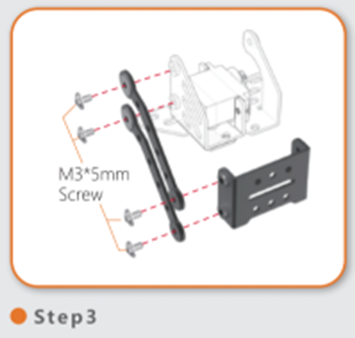

Then, use two M3*5mm screws to install the connecting rod on the left side of the servo.

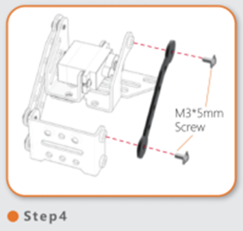

Next, connect the mounting plate, servo arm connecting rod and two M3*5mm screws.

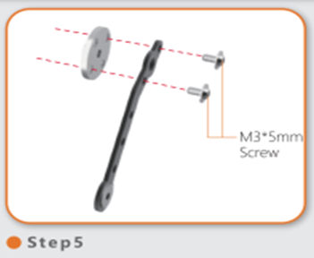

Then, connect the assembled connecting rod to the left side of the servo and the arm board (use M2.5*5mm screws beside the servo and M3*5mm screws for the arm board)

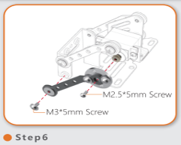

After that, install the forklift plate on the arm plate with M3*5mm. 

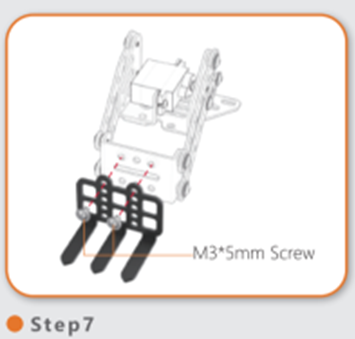

Finally, attach the clip to the car with two screws and two screw caps.

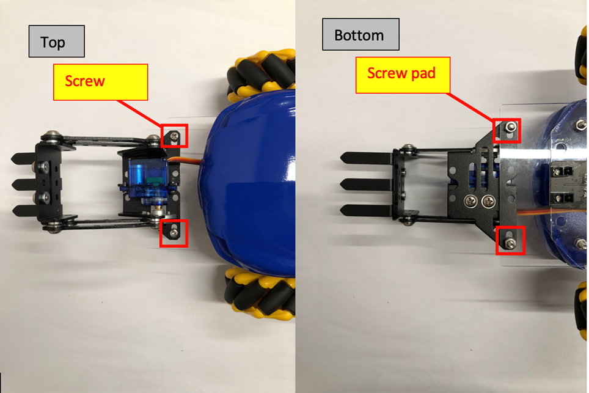

## Exercise 1

Designe a program useing the A and B buttons of the Micro:bit board to move the forklift component up or down.

Hint: the value is 0～100

Angle value|Forklift movement
---|---
Increase|
Decrease|

## Exercise 2
  
Find items suitable for forklift handling and calculate their angles
  
  
(**The highest height that the forklift can lift is 6cm, pay attention to the size of the object selected**)

Object|Angle
---|---
<T><T>|
<T><T>|
<T><T>|

Summary: The angle at which each vehicle carries objects may not be the same.

## Exercise 3

Remote control car and extension tools

Download the remote expansion package:

Enter the link in the yellow box: <a href="https://github.com/lzty634158/GHBit">https://github.com/lzty634158/GHBit</a> , add GHBit to makecode

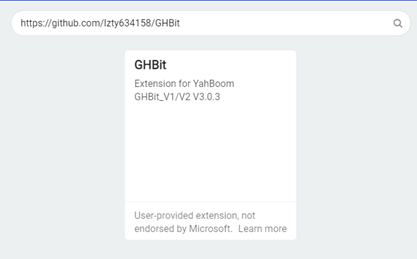

Remember the remote control car we learned about in the beginner course?

This time, the remote control not only controls the car, but also controls the lifting and lowering of the forklift.

(Hint: Control the lift with two buttons)

## Answer
### Exercise 1:

When servo angle decreases, the fork will rise. When the angle increase, the fork goes down.

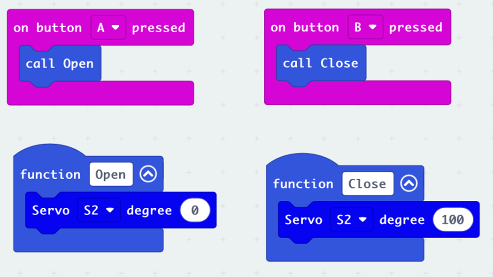

### Exercise 3:
#### Car program

The program in the red box is to control the lifting and lowering of the forklift. For other buttons, please refer to the beginner, lesson 10

#### Remote programm
 
