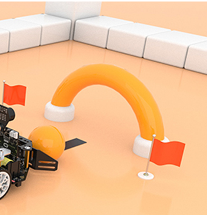
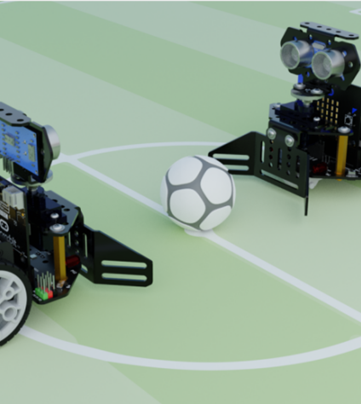
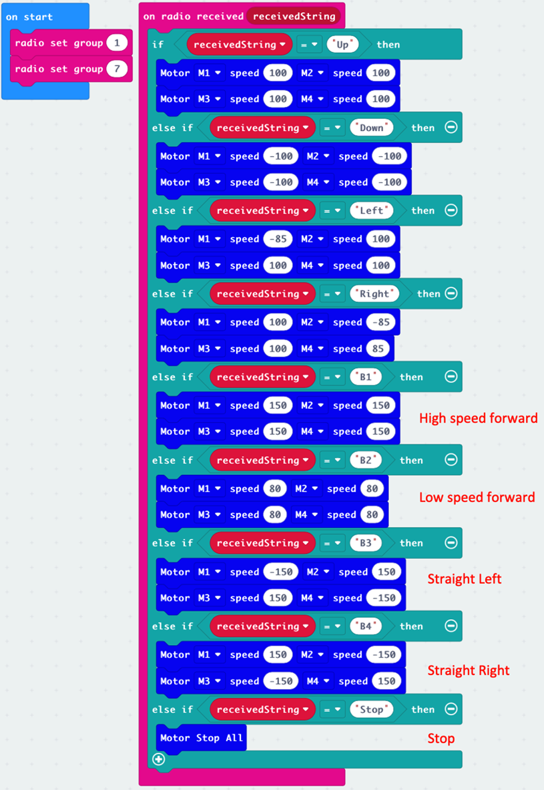
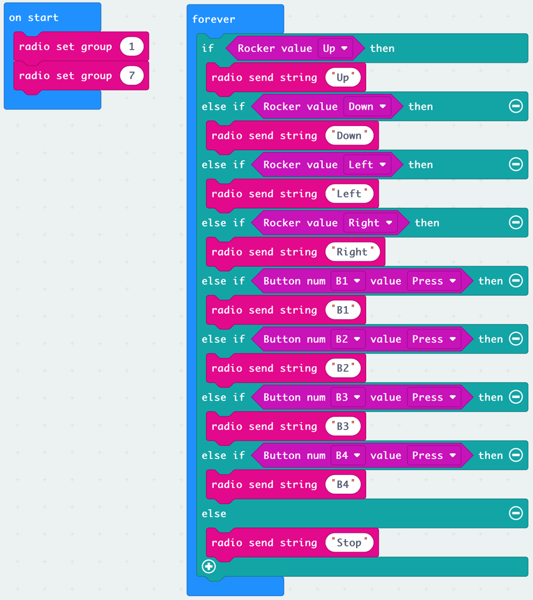
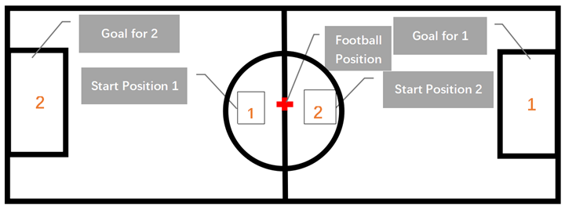

# Lesson 8

## Introduction

Welcome to Micro:bit Smart Car tutorial! In this course, we will explore Micro:bit and learn how to develop Micro:bit Smart Car by programming  

## Learning Target

Let students clearly understand Micro:bit Smart Car’s extension tools and its functions, moreover, understanding its install and block coding method

## Use of bulldozer tools

After understanding the assembly and principle of bulldozers in the previous lesson, we are now using them in various exercises and competitions.

  
## Exercise 1
### Shoot the gantry

Write a program for the remote control and the trolley,  control the trolley to send the ball to the gantry.

Tip: Use the radio module to enable the remote control to control the car

**Button custom functions** (e.g : acceleration and deceleration, left and right movement, play music, tilt, brake...)

### Football match

In the previous exercise, the students practiced how to control the car to score a goal through the remote control. Now it is a football match!

rule:

    1. The car or extension tool cannot exceed the line in front of the gantry
    2. The speed cannot exceed 150
    3. Do not touch the car during the race

## Answer
### Exercise 1:
#### Car program

#### Remote program

 
#### Appendix

Football site

