# How to build a House Model

<H3>There are 3 type of house you can build</H3>
1. Big House Model
2. Small House Model
3. Open Style Model

To build a model, the house base is model A to model C.

## Big House Model

### Assembly

Step 1 

* Insert the B2 and B4 cardboard to A, align with the hole on A

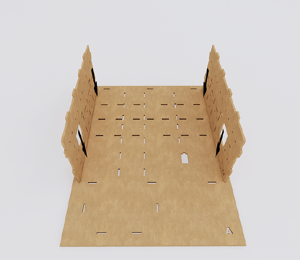

Step 2 

* Insert the B3 cardboard to A, align with the hole on both A and B2,B4 

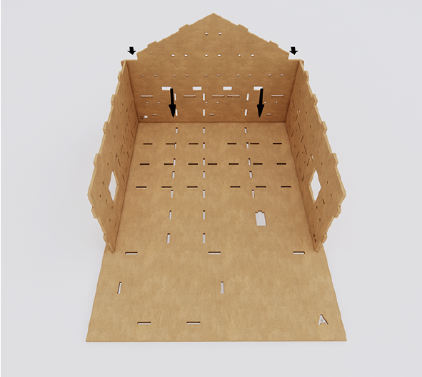

Step 3 

* Insert the B1 cardboard to A, align with the hole on both A and B2,B4 

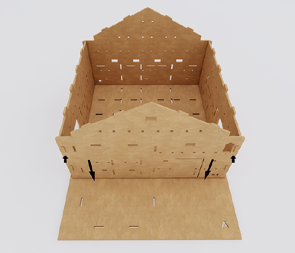

Step 4 

* Insert the C1 cardboard on B1,B2,B3,B4, align with the holes on them 

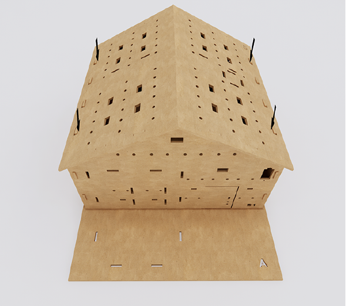

Step 5 

* Insert C2 cardboard on the C1, align with 4 holes on C1 

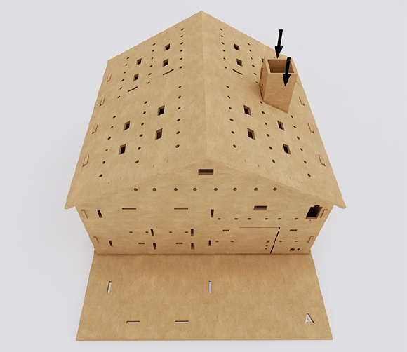

Step 6 

* Finish 

### Optional: Extra Room

Step 1 

* Insert the D1,D3 cardboard on A, align with the holes on A 

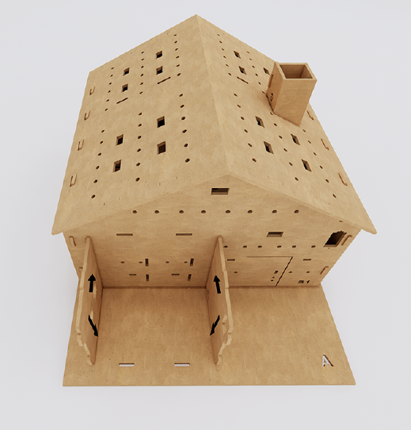

Step 2 

*  Insert the D2 cardboard on A, align with the holes on A, D1, D3 

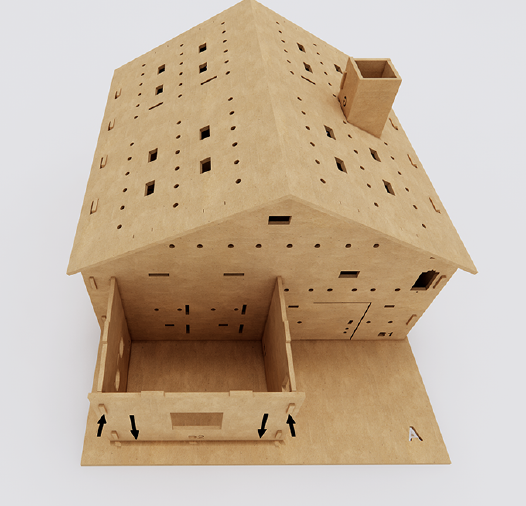

Step 3 

*  Insert the D4 cardboard on D1,D2,D3, align with D1,D2,D3,B1

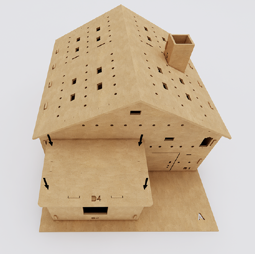

Step 4 

* Finish 

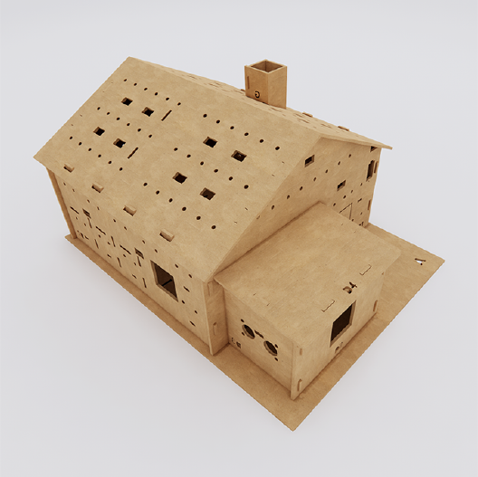

## Small House Model

Before we build a small house model, we need to cut the cardboard as instruction on cardboard

### Cut the cardboard

Step 1 

* Cutting with the dashed line on A cardboard 

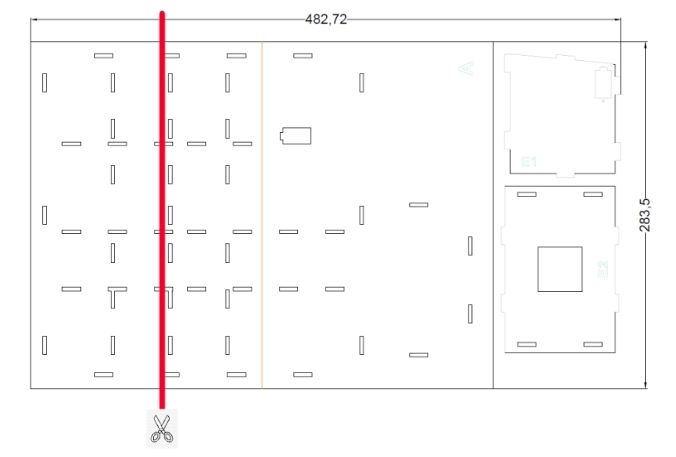

Step 2 

* Cutting with the dashed line on B2, B4 cardboard, be careful not to cut in straight line, follow the shape of dashed line 

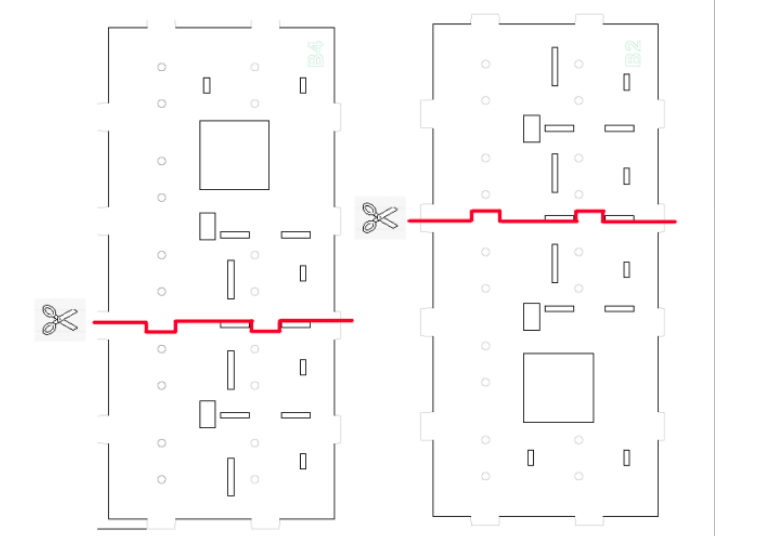

Step 3 

* Cutting with the dashed line on C1 cardboard 

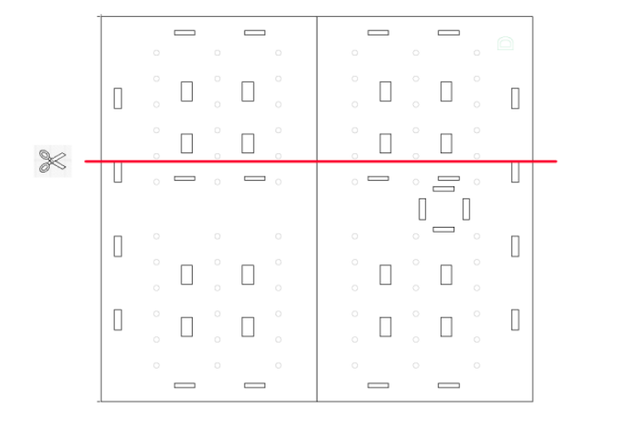

### Assembly

Step 1 

* Insert the B2,B4 cardboard on A, align with the holes on A 

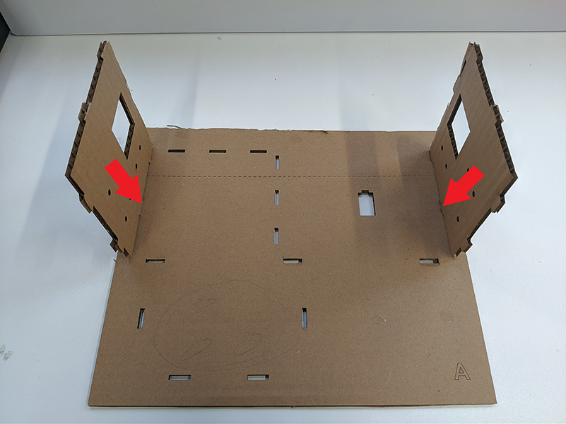
Step 2 

* Insert the B3 cardboard on A, align with the holes on A,B2,B4 

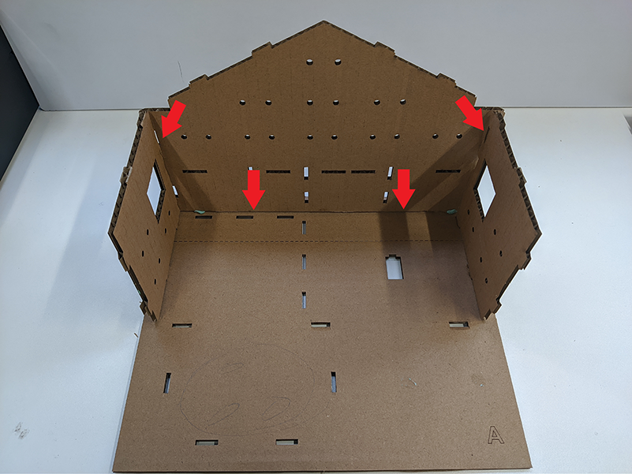

Step 3 

* Insert the B1 cardboard on A, align with the holes on A,B2,B4 

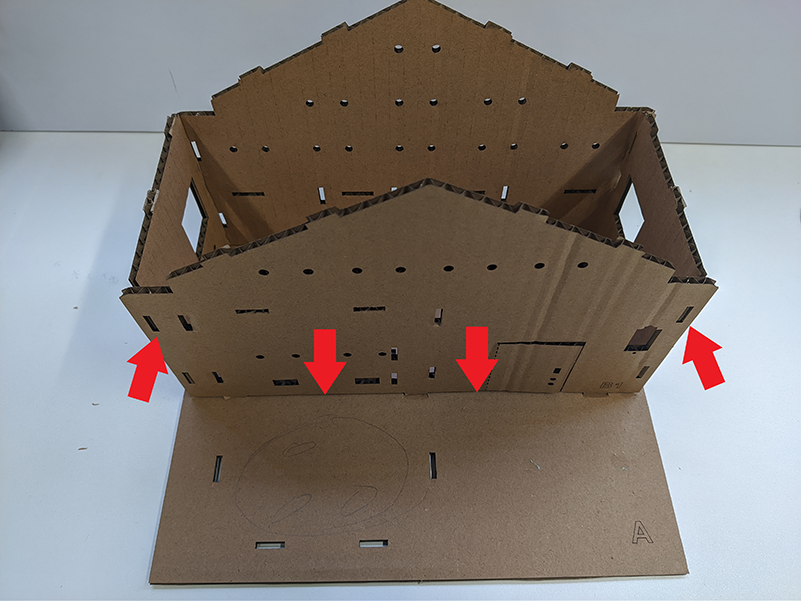

Step 4 

* Insert the C1 cardboard on B1,B2,B3,B4, align with the holes on them
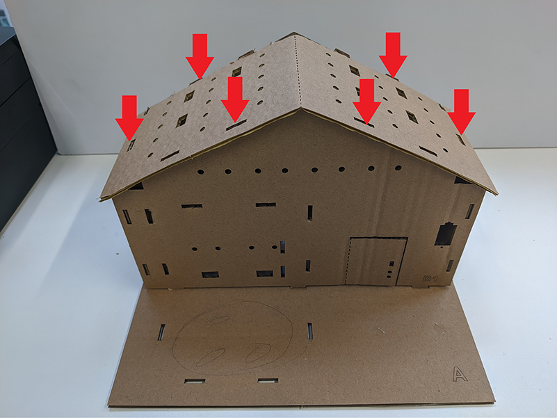

Step 5 

* Finish
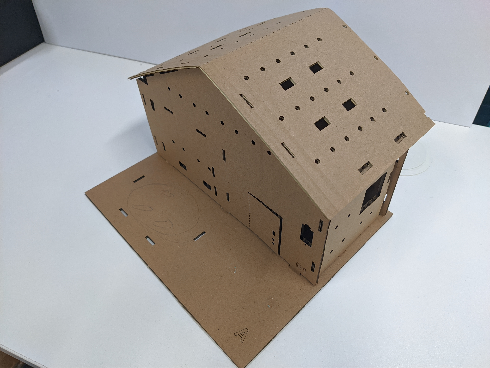

### Optional: Extra Room

Step 1 

* Insert the D1,D3 cardboard on A, align with the holes on A 

Step 2 

*  Insert the D2 cardboard on A, align with the holes on A, D1, D3 

Step 3 

*  Insert the D4 cardboard on D1,D2,D3, align with D1,D2,D3,B1

Step 4 

* Finish 

## Open Style Model

Before we build a open model, we need to cut the cardboard as instruction on cardboard

### Cut the cardboard

Step 1 

* Cutting with the dashed line on B1, B3 cardboard 

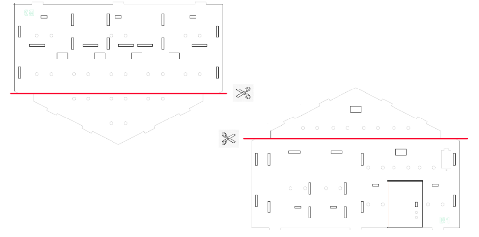

### Assembly

Step 1 

* Insert the B2,B4 on A, align with holes on A 

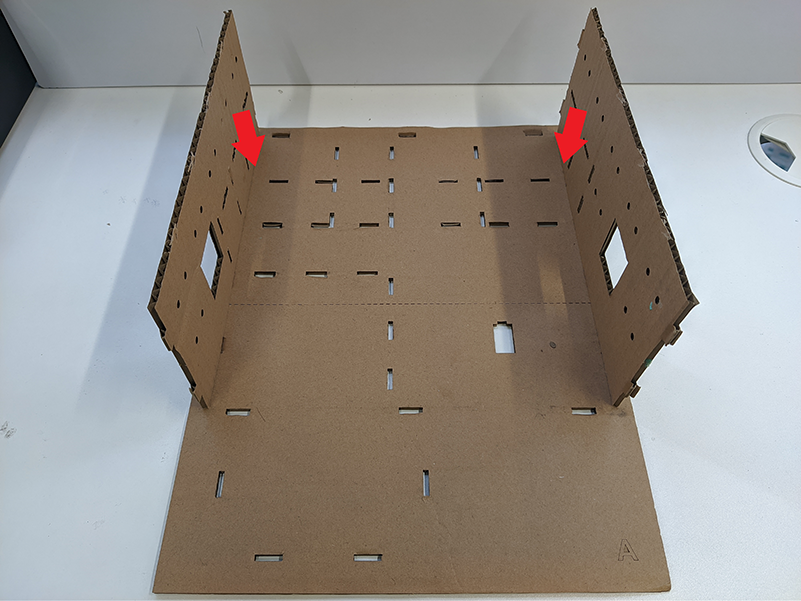

Step 2 

* Insert the B3 on A, align with holes on A, B2, B4 

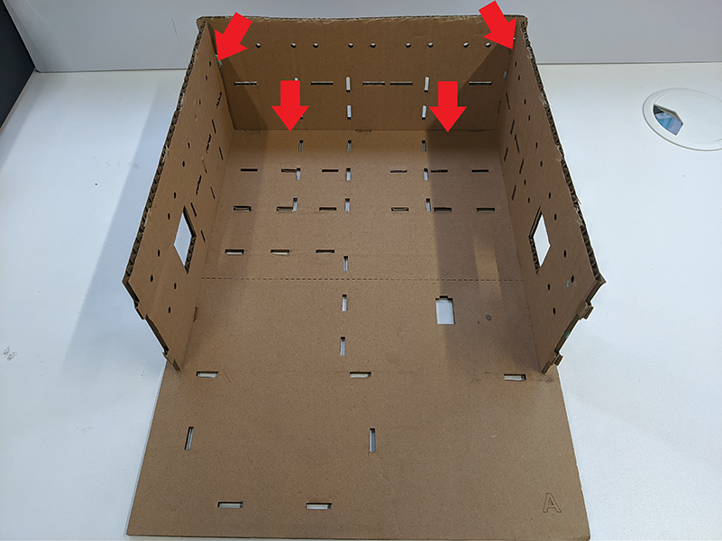

Step 3 

*  Insert the B1 on A, align with holes on A, B2, B4 

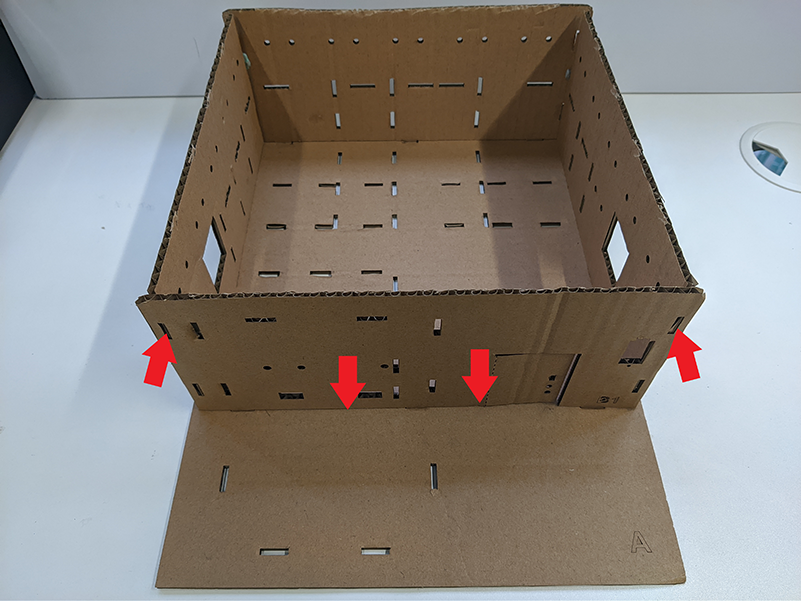

Step 4 

* Finish 

