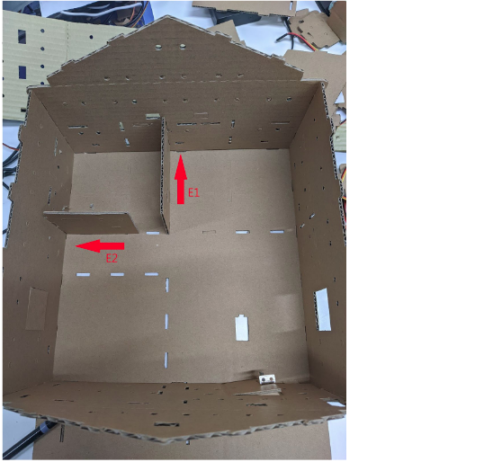
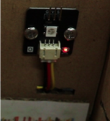
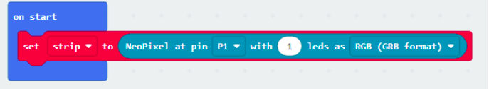
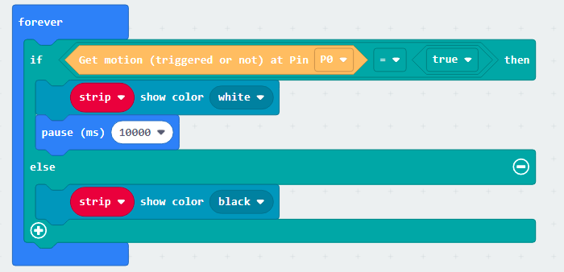
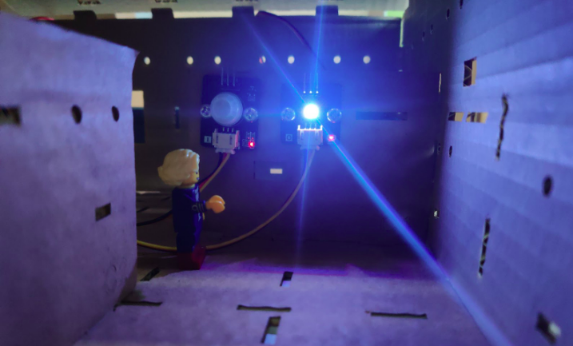

# Case 01: Smart Saving light bulb

Level: 

## Goal

Make a smart light bulb by detecting motion around the environment.

## Background

What is a smart light bulb?

Smart light bulb is a light bulb that turns on and off automatically depending on the presence of people around the environment. Deploying it in home toilets can help save electricity. When no one is inside the toilet the bulb will automatically turn off.

Smart light bulb operation

Motion sensor is used to detect the presence of human activity in the room. If there are people moving in the room, the light bulb will turn on, vice versa. 

## Part List

## Assembly step

Step 1 

Use M4 screw to Install the motion sensor on wall. 

Step 2 

Use M4 screw to install the multi-color LED on wall. 

## Hardware connect

1. Connect the motion sensor to P0 
2. Pull up the switch to avoid interference from buzzer 
3. Connect the Multi-color LED(WS2812) to P1 

 

## Programming (MakeCode)

Step 1. Initialize Multi-Color LED 

* Before using the Multi-Color LED, need to do initialize
* Pull the `set strip to NeoPixel at pin P1 with 1 leds as RGB(GRB format)` to `on start`

Step 2. Change the LED Color by motion sensor result 
 
* In `Forever`, add a `if-else` statement
* Set (`Get motion (triggered or not) at Pin P0` = `true`) as condition
* Snap `strip show color white` into the `if` segment
* Snap `pause(ms) 2000` into `if` segment to keep light up for 2 second
* Snap `strip show color black` into the `else` segment
* When the condition is correct, that’s say motion is triggered, someone passes by. The program will run the `if` segment to turn on the light
* Otherwise, the program will run the `else` segment to turn off the light

Full Solution 

MakeCode: [https://makecode.microbit.org/_hECbKo7rofEM](https://makecode.microbit.org/_hECbKo7rofEM) 

You could also download the program from the following website: 
<iframe src="https://makecode.microbit.org/#pub:_hECbKo7rofEM" width="100%" height="500" frameborder="0"></iframe>

## Result

When the people are moving in the room, the motion sensor will trigger and keep the LED turned on. When there is no one moving, the LED will turn off. 

## Think

 

Q1. Besides implementing the smart light bulb into the toilet, where other places can the light bulb also be implemented? Discuss the place and briefly explain the point on energy reservation. 

Q2. Suggest addition of any component that allows the light bulb to be even smarter.
 
