# Case 03: Environmental Motor Fan

Level: 

## Goal

Make an environmentally friendly automated motor fan by detecting the surrounding temperature. 

## Background

What is smart motor fan?

Smart motor fan is a fan that can adjust the power, turn on and off automatically to save electricity when not needed. 

Environmental motor fan principle

The temperature and humidity sensor installed in the house will scan for surrounding conditions continuously. When the temperature is too low or at average, the fan will change the intensity to off or low. When the temperature is high the fan will adjust to max power. 

## Part List

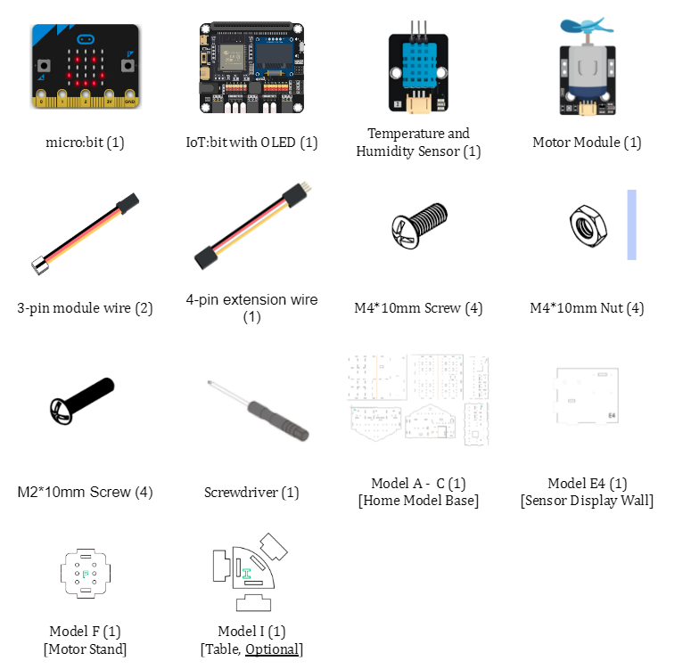

## Assembly step

Step1

Use M4 screws to install the Temperature and humidity sensor (DHT11) and use M2 screws to install OLED display to E4 cardboard 

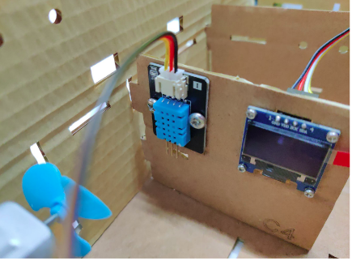

Step 2

Use M4 screws to install motor module to F cardboard
 

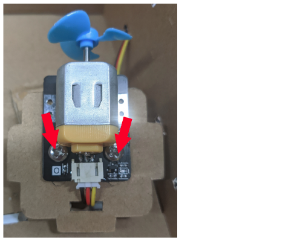

Step 3

Insert E4 cardboard to A and B3 cardboard to build a wall
 

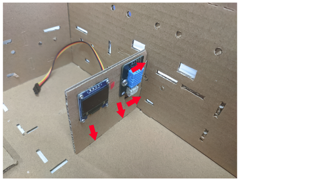

Step 4

Insert F cardboard to B2 and B3 cardboard to build a fans stand
 

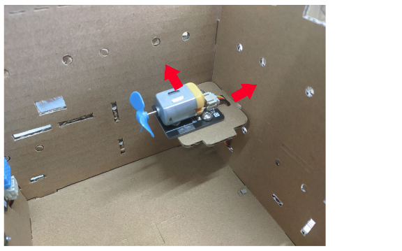

<H3>Optional:</H3>

Step 5

Build a table with I cardboard 

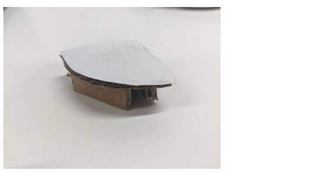

Step 6

Place at the room corner 

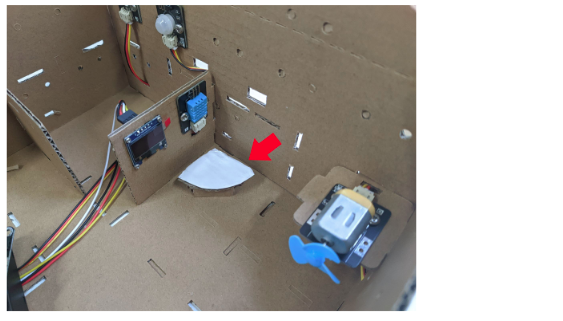

## Hardware connect

1. Connect the Temperature and Humidity sensor (DHT11) to P0
2. Connect the extended OLED display to I2C Port 
3. Connect the Motor module to P1
4. Pull up the Buzzer switch to disconnect the Buzzer

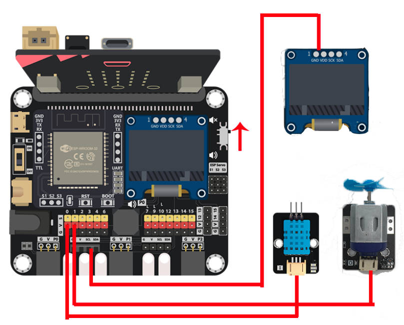

## Programming (MakeCode)

Step 1. Initialize OLED display

* In `on start`, put `initialize OLED with width 128 height 64` to initialize the OLED display
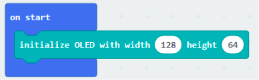

Step 2. Create variable

* Create a variable called `temperature`

Step 3. Read and show the reading from DHT11

* In `Forever`, put (set temperature to `DHT11 Read temperature at pin p0`)
* Before update the screen infomation, suggest clear up the OLED display each time
* Use `clear OLED display` to clear the display
* Then use `show string join Temperature: temperature` to show the temperature value with formatted text on display
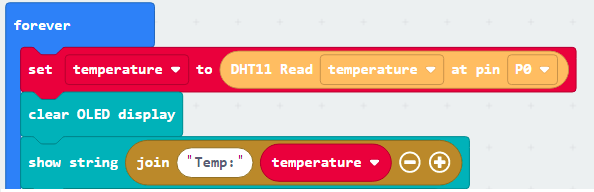

Step 4. Examine the temperature

* In `Forever`, put a nested `if-else` statement
* Use the `temperature < 22` as first condition
* In the first `if` segment, turn off the fan by `Set Motor fan with speed 0 at P1`
* Use the `temperature < 26` as second condition
* In the second `if` segment, turn on the fan with half speed by `Set Motor fan with speed 600 at P1`
* Use the `temperature >= 26` as third condition
* In the third `if` segment, turn on the fan with full speed by `Set Motor fan with speed 1023 at P1`
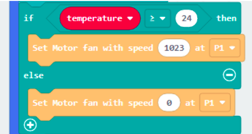

Full Solution 

MakeCode: [https://makecode.microbit.org/_J9tMLeYahD6j](https://makecode.microbit.org/_J9tMLeYahD6j) 

You could also download the program from the following website: 
<iframe src="https://makecode.microbit.org/#pub:_J9tMLeYahD6j" width="100%" height="500" frameborder="0"></iframe>

## Result

When the room temperature changing, it will match either one of the condition, and the fans will turn on or off with different speed according to the room temperature. 

## Think

Q1. Apart from open the fans, any other method to reduce the temperature? 

