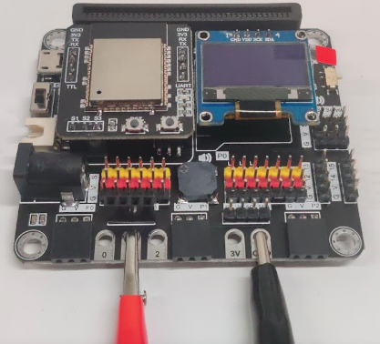
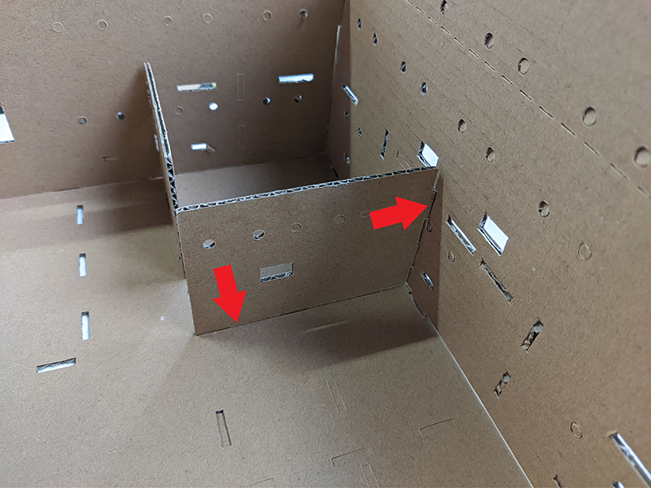
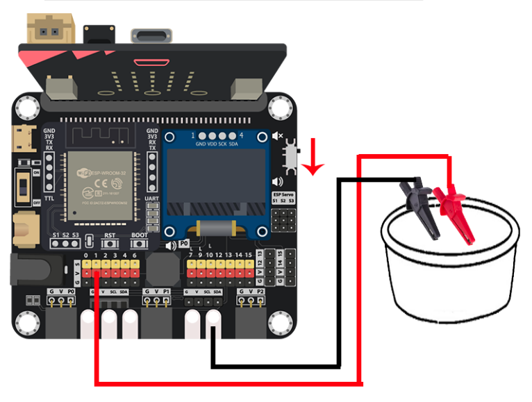
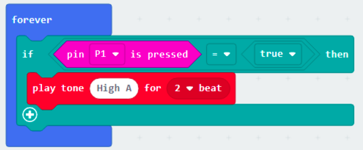
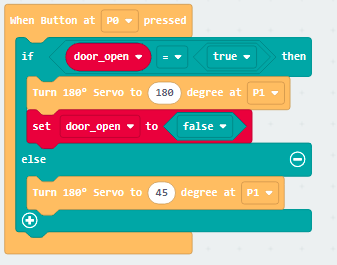
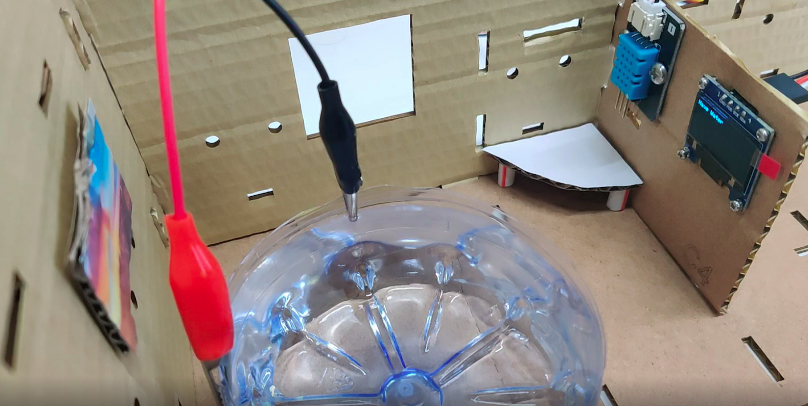

# Case 04: Mechanical Password Switch Door

Level: 

## Goal

Make a mechanical door that open upon button pressed and correct password input 

## Background

What is a mechanical password switch door?

Mechanical password switch door is a door that can open automatically to respond to some specific commands, in this case on a button pressed and password input correctly. Deploying it at home can assist users when they are carrying things, or to save time. 

## Part List

## Assembly step

Step 1

Use M4 screws and nuts to install the button on the wall 

Step 2

Install the servo on the ground and connect to the door by hook 
 

## Hardware connect

1. Connect the button module to P0
2. Connect the 180 degree servo to P1
3. Pull up the buzzer switch to disconnect from buzzer

## Programming (MakeCode)

Step 1. Create variable and initialize the servo

* Create a variable called `count_A`, `count_B`, `door_open`

* In `on Start`, initialize the state of door to closed by `set door_open to false` and `Turn 180 Servo to 45 degree at P1`, also set the count variable `count_A` and `count_B` to `0`

Step 2. Monitoring the button pressing state and take action

* Snap the `When Button at P0 pressed` block to editor
* Put a `if-else` statement in the `When Button at P0 pressed` block
* Set the condition to `door_open = true`
* In the `if` segment, that's mean the door should open, control the servo to open the door by `Turn 180 servo to 180 degree at P1`, after that, reset the variable `door_open` to `false` for close the door later
* In the `else` segment, that's mean the door should close, control the servo close the door by `Turn 180 servo to 45 degree at P1`

Step 3. password input method

* Snap `on button A pressed` to editor
* Use `change count_A by 1` to increase the count variable by 1
* Repeat the step with minor different on target to let button B also can increase `count_B`

Step 4. Examine the password

* Snap `on button A+B pressed` to editor
* Put a `if-else` statement inside
* Use `count_A = 2 and count_B = 3` as condition, you may also change it to your favourite password
* In the `if` segment, that's means the input is correct, `show icon tick`, and `set door_open to true` to allow open the door when press the extended button
* In the `else` segment, that's means the input is not correct, `show icon cross`, and `set door_open to false` to denied open the door when press the extended button
* Reset the two count variable `count_A` and `count_B` to `0` for next input

Full Solution 

MakeCode: [https://makecode.microbit.org/_4ocgihEmh6CF](https://makecode.microbit.org/_4ocgihEmh6CF) 

You could also download the program from the following website: 
<iframe src="https://makecode.microbit.org/#pub:_4ocgihEmh6CF" width="100%" height="500" frameborder="0"></iframe>

## Results

After pressing the correct number of button A and B, press A+B to do the validation. If it is the correct password, press the extended button, the door will open. Press again, the door will close. 

## Think

Apart from using a physical button, are there better ways of controlling the open and close of the door?

1. Can it make a doorbell to produce sound when the door is opening?
2. Other than the door, can the switch apply to other usage? (e.g control LED)