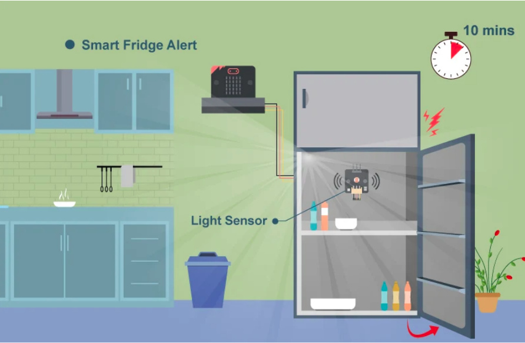
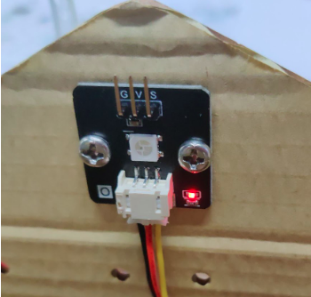
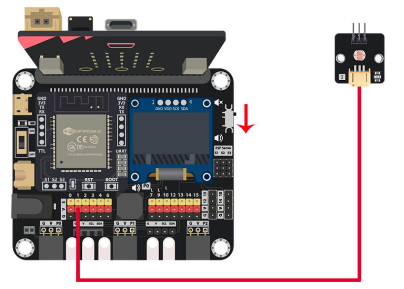
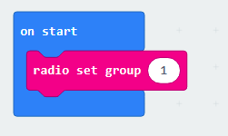
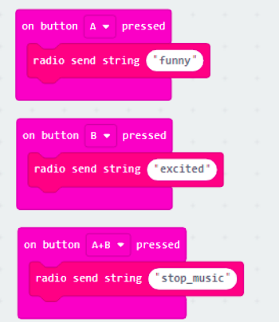
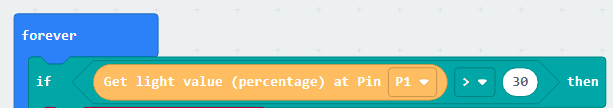
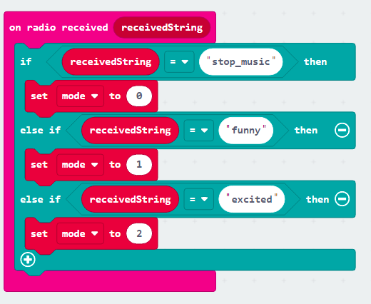
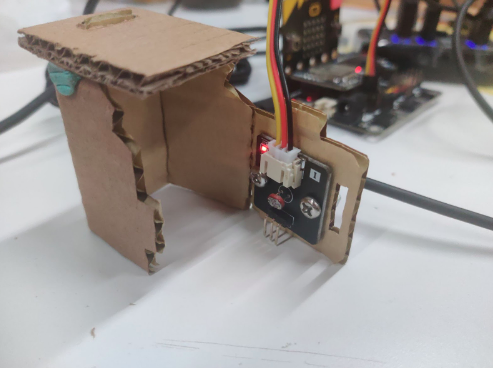

# Case 05: Smart Fridge Alert

Level: 

## Goal

Create a fridge that can detect the door state, when the door was not in close state for a long time, warning the user.
 

## Background

What is Smart Fridge Alert?

Smart Fridge is a Fridge that has an extra sensor to help it determine the door close state, when the user forgets to close the door, it will warn the user to close it to reduce waste of energy and prevent food poisoning. 

Smart Fridge Alert Principle

When the door is closed, the inside of the fridge should be dark. When the door is opened, the room light will go into the fridge. So a light sensor can easily detect the door state, then take the following action.  

## Part List

## Assembly step

Step 1

Use M4 screws and nuts to install the light sensor on the fridge door.
 

## Hardware connect

1. Connect the Light sensor to Pin P1
2. Pull down the Buzzer switch to connect buzzer

## Programming (MakeCode)

Step 1. Initialize counter variable

* On start, create a “counter” variable and set to 0

Step 2. Examine the light intensity

* In `Forever`, put a `if-else` statement
* Use `Get light value (percentage) at Pin P1 > 30` as condition

Step 3. Warning counter

* In the `if` segment, that's means the light intensity is strong, the door was opened
* Add the counter with 1 by `change counter by 1` to sum up the time of door opened
* Put the second `if` statement with `counter >= 60` condition to examine when should issue warning sound
* In the sencond `if` segment, put `start melody jump down repeating once` to issue the warning sound
* Back to the first `if-else` level, in the `else` segment, that's means light intensity is weak, door was closed, so reset the counter to 0 by `set counter to 0`
* Put a `pause (ms) 1000` to check the door each second

Full Solution 

MakeCode: [https://makecode.microbit.org/_YUbMtDiJJhWg](https://makecode.microbit.org/_YUbMtDiJJhWg) 

You could also download the program from the following website: 
<iframe src="https://makecode.microbit.org/#pub:_YUbMtDiJJhWg" width="100%" height="500" frameborder="0"></iframe>

## Results

When the door is opened for more than 1 minute, the buzzer will play some sound to warn the user.
 

## Think

1. Apart from making the sound from the buzzer, another method to warn the user?
2. Can you make use of the fridge, to make a smart box to alert users?

