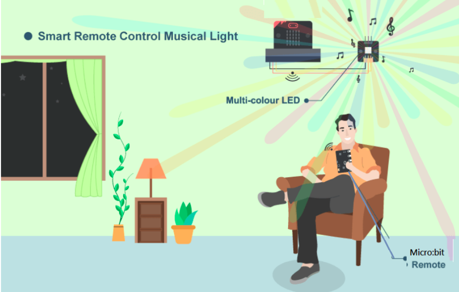
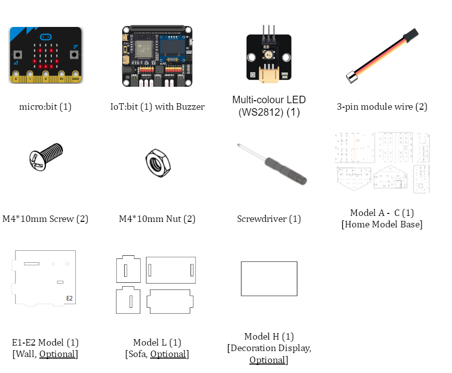
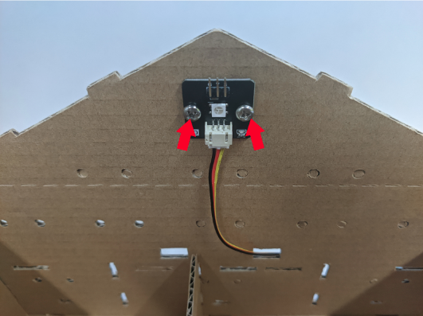
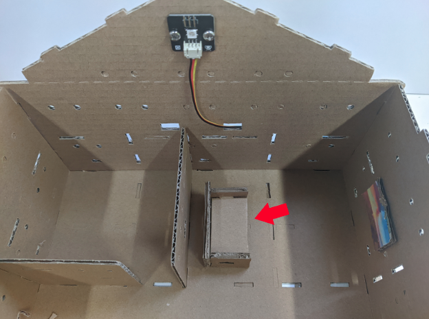
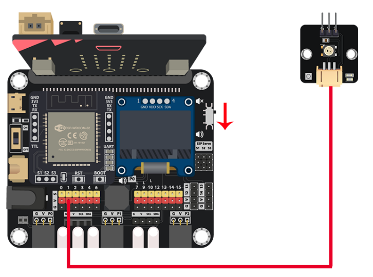
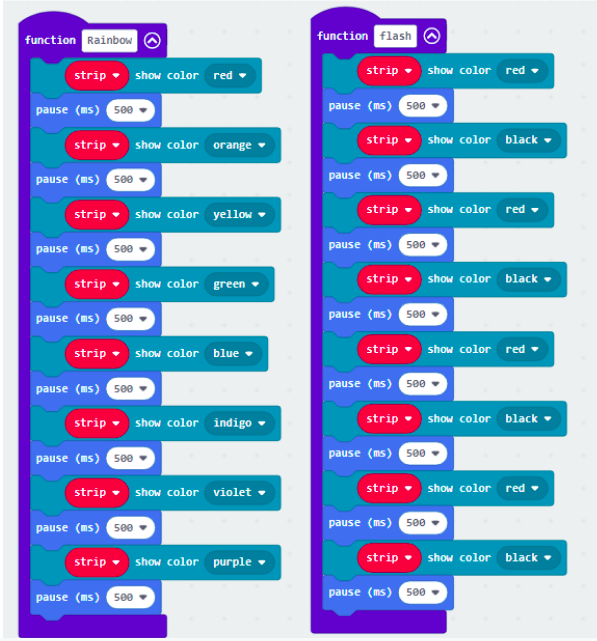
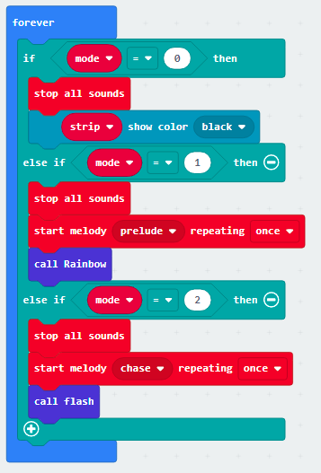

# Case 07: Smart Remote Control Musical Light

Level: 

## Goal

Create a remote control to control the living room's musical light 

## Background

What is the Smart Remote Control Musical Light?

Nowadays, different electronic furniture can also be controlled remotely. In this case, it illustrates the concept of remote control in Smart Home. In this case, the person can control the atmosphere mode (The changing of music with light) in the living room. 
 

Smart Remote Control Musical Light Principle 

Micro:bit includes the radio function, allowing two or more Micro:bit to form a group and communicate in a small area.  When one of the Micro:bit receives the message from the other Micro:bit, it will use the buzzer to play a different tone or music, at the same time, the multi-color LED can be changed to have better ambience. There are 2 modes, one is enjoyable mode, another is exciting mode.

## Part List

<H3>Receiver</H3>

<H3>Sender</H3>

## Assembly step

Step 1

Use M4 screws to install the Multi-Color LED to B3 cardboard 

<H3>Optional</H3>

Step 2

Build a sofa model with ?? cardboards 

Step 3

Place the sofa at the room 

## Hardware connect

1. Connect the Multi-Color LED to P1
2. Pull down the buzzer switch to bottom position

## Programming (MakeCode)

<H2>Sender</H2>

Step 1. Connect to radio group

* In `on Start`, put a `radio set group 1` to join the radio group 1

Step 2. Send message to group

* Snap `on button A pressed` to editor
* In `on button A pressed`, put a `radio send string funny` to send `funny` message to group 1 micro:bits
* Repeat the steps with minor changes on the trigger button and string to create other message sender for `excited` and `stop_music`

<H2>Receiver</H2>

Step 1. Connect to radio group and initialize LED and music flag

* Create a variable called `mode`
* In `on Start`, put a `radio set group 1` to join the radio group 1
* Initialize Multi-Color LED by `set strip to NeoPixel at pin P1 with 1 leds as RGB(GRB format)`
* Set the variable mode value to 0 by `set mode to 0`

Step 2. Examine the radio message and take action

* Snap `on radio received receivedstring` block to editor
* Put a nested `if-else` statement inside that block
* In the first condition, use `receivedstring = stop_music` to filter out the `stop_music` message, change the `mode` flag variable to `0`
* In the second condition, use `receivedstring = funny` to filter out the `funny` message, change the `mode` flag variable to `1`
* In the third condition, use `receivedstring = excited` to filter out the `excited` message, change the `mode` flag variable to `2`

Step 3. Make the change color function

* Create two function called `rainbow` and `flash`
* For each function, use `strip show color XXX` and `pause(ms) XXX` to fill in the pattern of color changes as you want

Step 4. Change LED color by the flag

The color of LED should be change following by the flag

Flag | Meaning
 :| :  
0|stop_music
1|funny
2|excited

* Put a nested `if-else` statement inside the `Forever`
* Use `mode = 0` as the first condition
* In the first `if` segment, that's means `stop_music`, stop the playing sound by `stop all sounds`
* Turn off the LED by `strip show color black`
* Use `mode = 1` as the second condition
* In the second `if` segment, that's means `funny`, stop the playing sound by `stop all sounds`, then play a funny music with `start melody prelude repeating once`
* Execute the function to change to rainbow pattern by `call Rainbow`
* Use `mode = 2` as the third condition
* In the third `if` segement, that's means `excited`, stop the playing sound by `stop all sounds`, then play a excited music with `start melody chase repeating once`
* Execute the function to change to flash pattern by `call flash`

Full Solution 

<H3>Sender</H3>

MakeCode: [https://makecode.microbit.org/_JF0RtbVihXDD](https://makecode.microbit.org/_JF0RtbVihXDD) 

You could also download the program from the following website: 
<iframe src="https://makecode.microbit.org/#pub:_JF0RtbVihXDD" width="100%" height="500" frameborder="0"></iframe>

<H3>Receiver</H3>

MakeCode: [https://makecode.microbit.org/_azUYbd8AuXY1](https://makecode.microbit.org/_azUYbd8AuXY1) 

You could also download the program from the following website: 
<iframe src="https://makecode.microbit.org/#pub:_azUYbd8AuXY1" width="100%" height="500" frameborder="0"></iframe>

## Results

After loaded two program to each micro:bit, 
When the sender micro:bit sends the `funny` message, receiver micro:bit will play the funny music and the light will show in rainbow mode. 
When the sender micro:bit sends the `excited` message, receiver micro:bit will play the excited music and the light will show in flash mode. 
When the sender micro:bit sends the `stop_music` message, receiver micro:bit will stop the music and turn off the light.
 

## Think

1. Apart from the built in melody, can you make your own music melody?
2. Can you control other hardware like a motor fan using radio control? 

