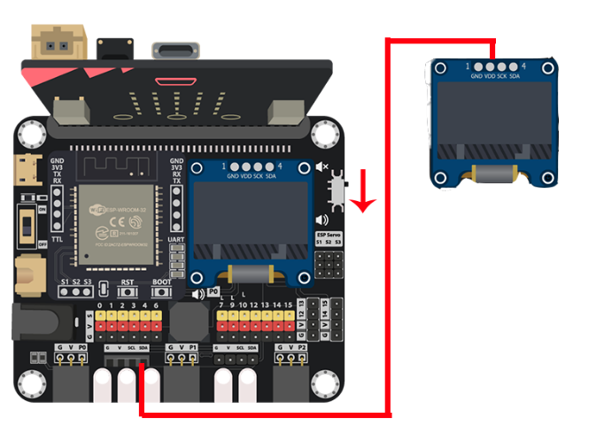
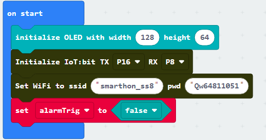
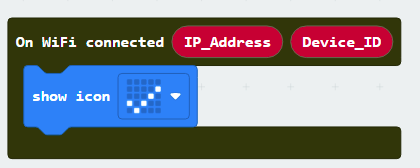
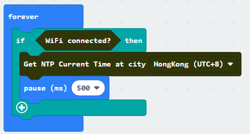
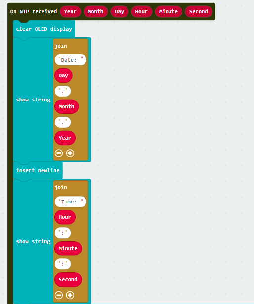
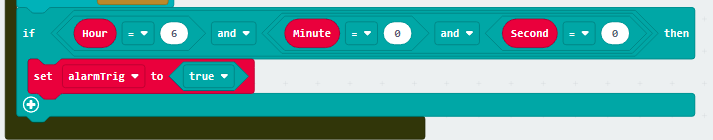
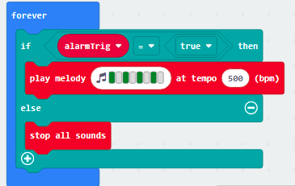
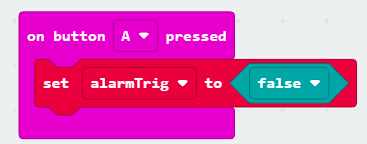
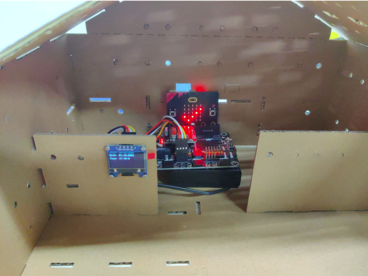

# IoT Case 09: Smart Digital Morning Clock

Level: 

## Goal

Make a digital clock that performs a normal clock function with auto-synchronizing time, and alert at specific time. 

## Background

What is smart digital clock? 

Smart digital clock is a clock that shows time as accurate as atomic clock by connecting to the Internet. 

Smart digital clock principle 

NTP protocol ensures devices synchronize their time with an accurate time provider. With connecting to the Internet the digital clock can even show the time of a performing atomic clock. 

## Part List

## Assembly step

Wait for model choose

## Hardware connect

1. Connect OLED to I2C port
2. Pull down the buzzer switch to connect the buzzer

## Programming (MakeCode)

Step 1. Initialize OLED, IoT:bit and connect to WiFi, create the variable
* Snap `Initialize OLED with width 128, height 64` to `on start`
* Snap `Initialize IoT:bit TX P16 RX P8` to `on start`
* Snap `Set Wi-Fi to ssid pwd` to `on start` and enter the SSID and password
* Create the variable `alarmTrig`
* Set the `alarmTrig` variable to `false`

Step 2. Check Wi-Fi connection state 

* Snap the `On WiFi connected` block to editor
* Put a `show icon tick` inside the block to show tick icon after connected

Step 3. Get the NTP time 

* Put a `if` statement in `Forever`
* Use `WiFi connected?` as condition
* In `if` segment, put `Get NTP Current Time at city HongKong(UTC+8)` to get NTP time
* `Pause 500ms` to get the NTP time with each 0.5 second

Step 4. Show the NTP time on display 

* Put `On NTP received` to editor
* When get the NTP time, the program in this block will running
* Clear the display before each update by `Clear OLED display`
* Show the formatted time string with `show string join Date: day.Month.Year`
*  Show the formatted time string with `show string join Time: Hour:Minute:Second`

Step 5. Set the alarm 

* Put a `if` statement with multiple conditions `Hour = 6` and `Minute = 0` and `Second = 6`
* Put `set alarmTrig to true` in `if` segment

Step 6. Set up the sound 

* Put another `Forever` to editor
* Put a `if-else` statement inside the `Forever`
* Use `alarmTrig = true` as condition
* Play the alarm by melody at tempo 500 bpm
* Otherwise, stop the alarm

Step 7. Turn off alarm 

* Put `on Button A pressed` to editor
* Put `set alarmTrig to false` into the block

Full Solution 

MakeCode: [https://makecode.microbit.org/_cpeR8e32PDzi](https://makecode.microbit.org/_cpeR8e32PDzi) 

You could also download the program from the following website: 
<iframe src="https://makecode.microbit.org/#pub:_cpeR8e32PDzi
" width="100%" height="500" frameborder="0"></iframe>

## Result
After you connected to the Internet, the tick will open an start getting NTP time. 

 

## Think

Q1. Apart from showing the time and alarm, any other tasks can be done when we know the time? 

