# IoT Case 10: Home Health Data Monitoring

Level: 
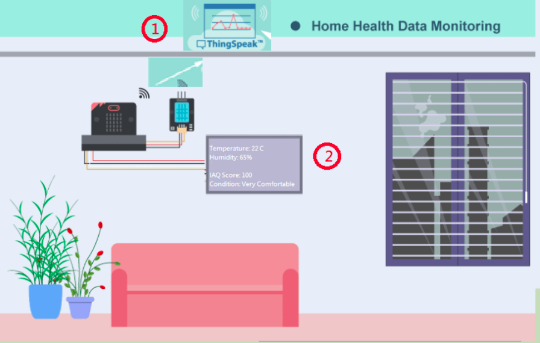

## Goal

Make a home health data monitoring system by collecting data from the sensors inside the house. Also use the temperature and humidity value to calculate the IAQ Score as reference. 

## Background

What is home health data monitoring system? 

Health monitoring is the concept of tracking the conditions of different parameters inside the user’s house. From the simplest temperature and humidity data to more advanced detection of CO2, town gas etc, having such system can help make alert for prevention of accident, like town gas leakage or short of oxygen inside the house. 

Home health monitoring system operation 

In this scenario, integrated temperature and humidity sensor DHT11 is used. It can track and send back the data collected to the main control board for further analysis, constant display and cloud server storage. Also the IAQ Score analyst can help to estimate the environment status. 

## Part List

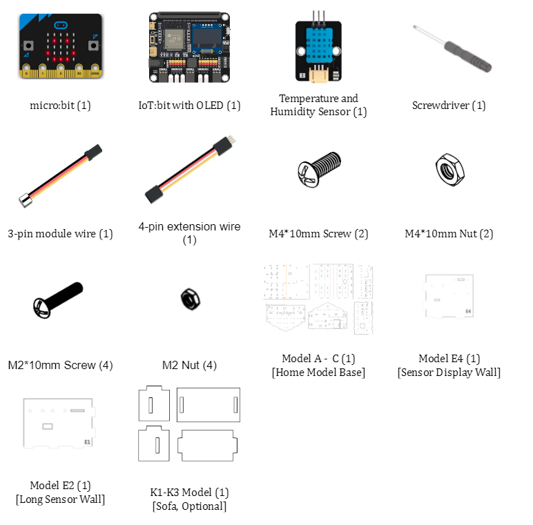

## Assembly step

Step 1 

* Use M4 screws and nuts to install the DHT11 temperature and humidity sensor to E4 cardboard
* Use M2 screws and nuts to install the OLED display to E4 cardboard

Step 2 

* Insert the E4 cardboard on A cardboard to build a sensor display wall

## Hardware connect

1. Connect the temperature and humidity sensor DHT11 to P0
2. Pull up the buzzer switch to disconnect the buzzer
3. Connect the OLED display to IoT:bit I2C port with extend cable

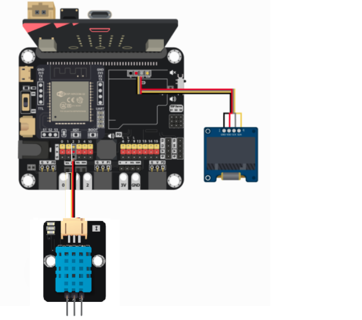

## IoT (Thingspeak)

Step 1. Create Thingspeak channel 

* Go the [Thingspeak](https://thingspeak.com) create an account and create a channel

Step 2. Get channel API 

* After created a new channel, get the write in API
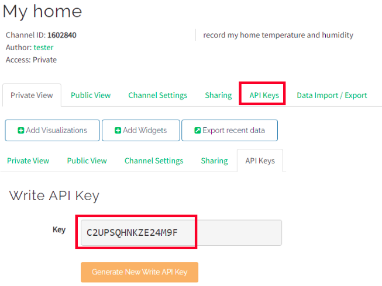

## Programming (MakeCode)

Step 1. Initialize OLED, IoT:bit and connect to WiFi, create and initialize variables 

* Snap `Initialize OLED with width:128, height: 64` to `on start`
* Snap `Initialize IoT:bit TX P16 RX P8` from `IoT:bit` to `on start`
* Snap `Set WiFi to ssid smarthon pwd 12345678` to `on start`
* Create and initialize the variables `temperature`, `humidity` and `iaq_score` to `0`
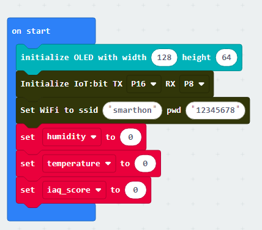

Step 2. Show icon “tick” after WiFi connection 

* In `On WiFi connected`, put a `show icon tick` get notice after WiFi is connected.
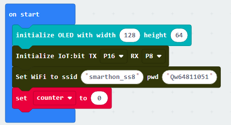

Step 3. Create the function `check_condtion` 

* Create a new function `check_condition`
* Put nested `if-else` statement inside the function
* The first condition is `iaq_score < 20`, then `show string Very uncomfortable` in the segment
* The second condition is `iaq_score < 40`, then `show string Uncomfortable` in the segment
* The third condition is `iaq_score < 60`, then `show string Discomfortable` in the segment
* The fourth condition is `iaq_score < 80`, then `show string Comfortable` in the segment
* The fifth condition is `iaq_score <= 100`, then `show string Very comfortable` in the segment

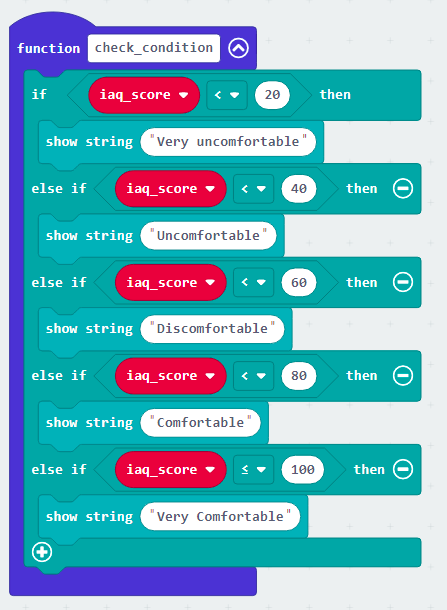

Step 4. Read the Temperature and Humidity sensor data 

* In `Forever`, put a `if` statement with condition `WiFi connected?` to make sure connected to interent before uploading to thingspeak
* Use `Read Temperature & Humidity sensor at pin P0` to read the data from DHT11 Temperature and Humidity Sensor
* After read the DHT11 data, use the three functions to get the result and set to the variable
1. `Set temperature to Get Temperature °C` for temperature
2. `Set humidity to Get Humidity ` for humidity
3. `Set iaq_score to Get IAQ Score` for iaq_score
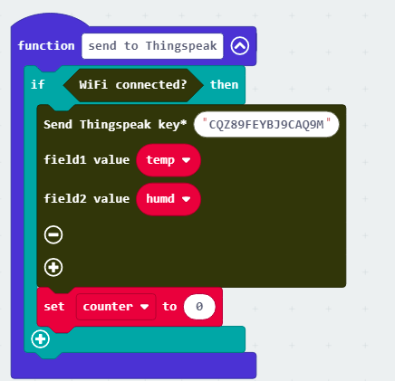

Step 4. Show the data on display 

* Clear the display before each times update by `clear OLED display`
* Show the three variables respectively, with some text explanation 
1. `show string join Temperature: temperature` for temperature
2. `show string join Humidity: humidity %` for humidity
3. `show string Join IAQ Score: iaq_score` for iaq_score
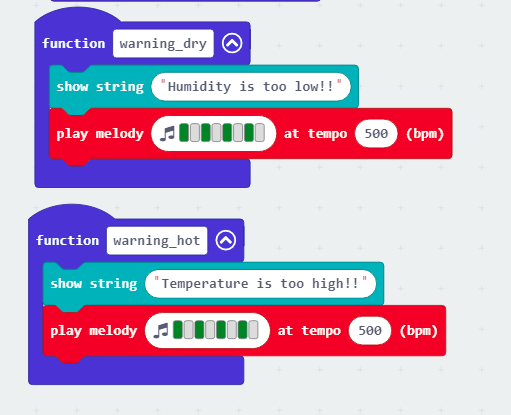

Step 5. Analyst the environment status 

* Run the `check_condition` function to summarize the IAQ Score result

Step 6. Upload to Thingspeak 

* Send the data to Thingspeak by `Send Thingspeak key XXXX field1 value XXX ...`, fill in the `write API key` from the Thingspeak channel and the `values` need to be upload
* After uploading the data to Thingspeak, wait for 15 second to avoid upload too frequently by `pause(ms) 15000`, then start another Reading and uploading.

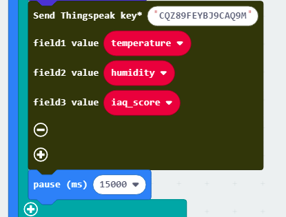

Step 7. Check Thingspeak upload status 

* To check the uploading status, use `On thingspeak Uploaded` to get the uploading result
* `Insert newline` for better visual effect
* Use the `Status` and `Error_code` from block placeholder respectively to showing some text explanation
1. `show string join Thingseak: Status` for Upload status
2. `show string join Error: Error_code` for Error code if upload failed

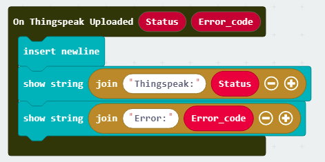

Full Solution 

MakeCode: [https://makecode.microbit.org/_4eieTk2TUda1](https://makecode.microbit.org/_4eieTk2TUda1) 

You could also download the program from the following website: 
<iframe src="https://makecode.microbit.org/#pub:_4eieTk2TUda1" width="100%" height="500" frameborder="0"></iframe>

## Result

The OLED show the temperature, humidity, IAQ Score and the environment condition based on IAQ Score
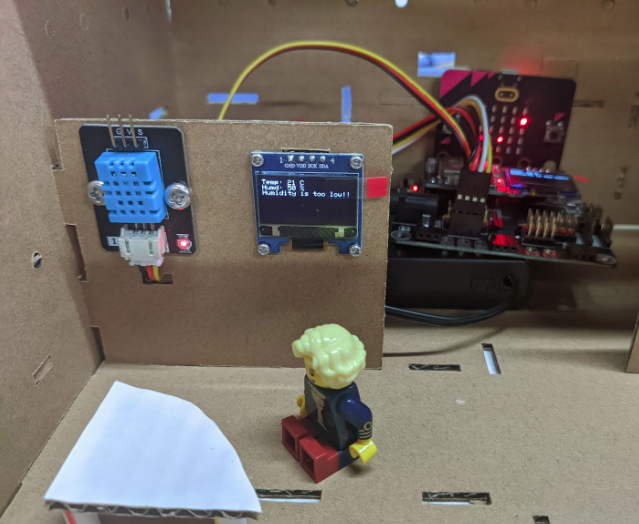

After upload, show the uploading information

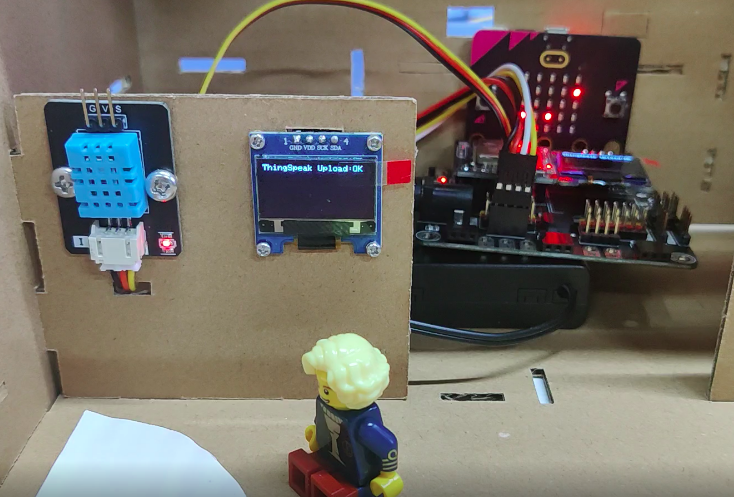

## Think

1. Apart from temperature and humidity, what elements do you think are essential to be included in a home health monitoring system? (E.G CO2 level? PM2.5 value?)
2. What function do you think the system can also include if it is to be used in a real home? (E.G Alert when the condition is too bad for health?)
