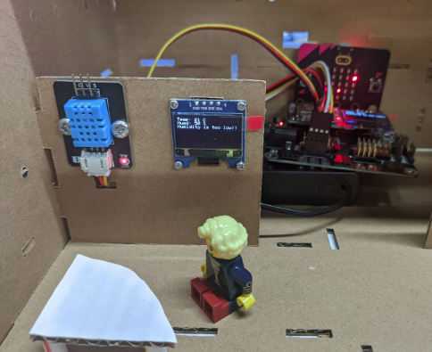

# IoT Case 10: Home Health Data Monitoring

Level: 

## Goal

Make a home health data monitoring system by collecting data from the sensors inside the house. 

## Background

What is home health data monitoring system? 

Health monitoring is the concept of tracking the conditions of different parameters inside the user’s house. From the simplest temperature and humidity data to more advanced detection of CO2, town gas etc, having such system can help make alert for prevention of accident, like town gas leakage or short of oxygen inside the house. 

Home health monitoring system operation 

In this scenario, integrated temperature and humidity sensor DTH11 is used. It can track and send back the data collected to the main control board for further analysis, constant display and cloud server storage. If the conditions breach certain limits, warnings will be made, else the system will keep silent. 

## Part List

## Assembly step

Step 1 

* Use M4 screws to install the DHT11 temperature and humidity sensor to C4 cardboard
* Use M2 screws to install the OLED display to C4 cardboard

Step 2 

Insert the C4 cardboard on A cardboard, align with holes at A and B2 

## Hardware connect

1. Connect the temperature and humidity sensor DHT11 to P2
2. Pull down the buzzer switch to connect the buzzer
3. Connect the OLED display to IoT:bit I2C port with extend cable

## IoT (Thingspeak)

Step 1. Create Thingspeak channel 

* Go the https://thingspeak.com/ create an account and create a channel

Step 2. Get channel API 

* After created a new channel, get the write in API

## Programming (MakeCode)

Step 1. Initialize OLED, IoT:bit and connect to WiFi, create and initialize variable 

* Create variable `counter`

* Snap `Initialize OLED with width:128, height: 64` to `on start`
* Snap `Initialize IoT:bit TX P16 RX P8` from `IoT:bit` to `on start`
* Snap `Set WiFi to ssid smarthon_ss8 pwd Qw64811051` to `on start`
* Initialize the variable `counter` to 0

Step 2. Show icon “tick” after WiFi connection 

* In `On WiFi connected`, put a `show icon tick` get notice after WiFi is connected.

Step 3. Sending data to Thingspeak 

* Create a new function `send to Thingspeak`
* Put a `if` statement inside
* In the condition, use `WiFI connect?` to make sure the internet was connected
* Sending data to thingspeak by using `Send Thingspeak key* XXXXX field1 value xxx field2 xxx ....`, fill in the write API of your channel and the value that want to upload
* reset the `counter` variable to `0`

Step 4. Create two warning function 

* Create a function called `warning_dry`
* Show string `Humidity is too low!` 
* play the warning sound by `play melody xxx at tempo 500 bpm`
* Create another function called `warning_hot`
* Repeat again the steps.

Step 4. Read and show the data 

* In `Forever`, put `set humd to DHT11 Read humidity at pin P2` to read humidity
* Put `set temp to DHT11 Read temperature at pin P2` to read temperature
* add up the counter by `change counter by 1`
* Clear the display before each update by `clear OLED display`
* Show the temperature with formatted text by `show string join Temperature: temp C`
* Show the humidity with formatted text by `show string join humidity: humd %`
* 

Step 5. Examine and send the data 

* Add a `if` statement with condition `counter >= 15`
* Put `call send to Thingspeak` function to start the upload process
* Add a `if` statement with condition `temp > 28`
* Put `call warning_hot` function to play the alert sound
* Add a `if statement` with condition `humd <= 50`
* Put `call warning_dry` function to play the alert sound
* Add `pause(ms) 1000` to read and check data for each second

Full Solution 

MakeCode: [https://makecode.microbit.org/_01h9FpcbVicW](https://makecode.microbit.org/_01h9FpcbVicW) 

You could also download the program from the following website: 
<iframe src="https://makecode.microbit.org/#pub:_01h9FpcbVicW" width="100%" height="500" frameborder="0"></iframe>

## Result

After turn on, sensors will start collecting temperature and humidity data for each second.  For every 15 times data collection, it will upload to Thingspeak. 
When the temperature or humidity value is over the range, it will trigger the warning alert.

## Think

Q1. How to make use of the data to analyst the home environment? (for example, checking the time period that mostly trigger alert?)
