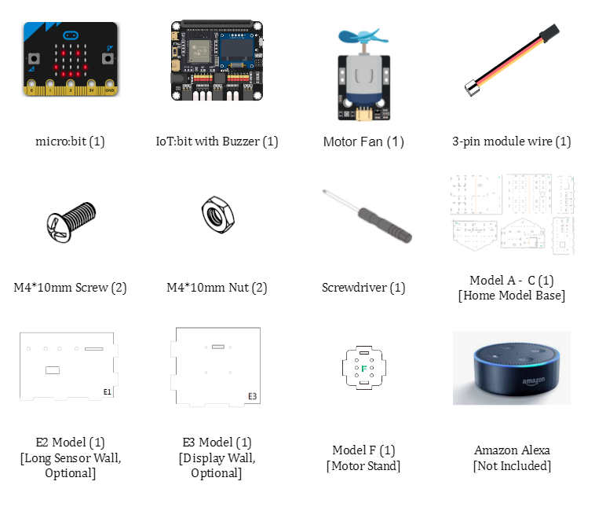
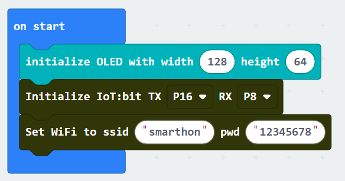
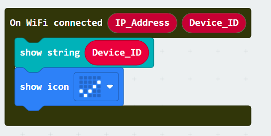
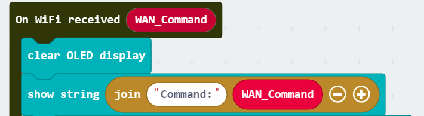
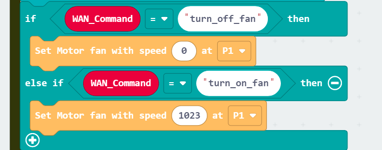

# IoT Case 13: Alexa Voice Control Fan

Level: 

## Goal

Make a remotely controlled by using Amazon Alexa service.

## Background

What is Alexa voice control fan? 

Alexa voice control fan is a fan that is connected to internet and can be woken up by voice command. 

Alexa voice control fan principle
 

By using Smarthon IoT:bit extension on IFTTT platform, commands can be pre-set such that when a specific phrase is said to Alexa it will send the commands automatically through the internet to the fan and trigger on or off actions. 

## Part List

 
## Assembly step

Step 1 

Use M4 screw and nuts to install the Multi-color LED to B4 cardboard 

## Hardware connect

1. Connect the motor module to P1

## Programming (MakeCode)

Step 1. Initialize OLED, IoT:bit and connect to WiFi 

* Snap `Initialize OLED with width:128, height: 64` to `on start`
* Snap `Initialize IoT:bit TX P16 RX P8` from `IoT:bit` to `on start`
* Snap `Set Wi-Fi to ssid pwd` from `IoT:bit`
* Enter your Wi-Fi name and password. Here we set `smarthon` as `SSID` and `12345678` as `password`

Step 2. Show icon “tick” and Device ID after WiFi connection 

* Snap `show icon` from `basic` to `On WiFi connected` and select icon `tick`
* Draw the `Device ID` variable from `On WiFi connected` to the `show string` block placeholder

Step 3. Receive Command 

* Inside the `On WiFi Received`, show the command on OLED display
* Clear the display before each update by `Clear OLED display`
* Show the `WAN_Command` with text explanation by `show string join Command: WAN_Command`

Step 4. Action with command 

* put a nested `if-else` statement with different conditions
* Set the first condition as `WAN_Command = turn_off_fan`
* In the `if` segment, turn off the fan by `set Motor fan with speed 0 at P1`
* In the second `if` condition, use `WAN_Command = turn_on_fan`
* In the second `if` segment, turn on the fan by `set Motor fan with speed 1023 at P1`

Full Solution 

MakeCode: [https://makecode.microbit.org/_eW2fDXbpAFU3](https://makecode.microbit.org/_eW2fDXbpAFU3) 

You could also download the program from the following website: 
<iframe src="https://makecode.microbit.org/#pub:_eW2fDXbpAFU3" width="100%" height="500" frameborder="0"></iframe>

## IoT (Alexa, Cloud Control, IFTTT)

Step 1. Create Amazon Account (if not have amazon account) 

* Go to [Amazon](https://www.amazon.com) and create a new account
* If you have exist amazon account, skip this step

Step 2. Get the Amazon alexa apps 

* Depend on your mobile device, you may get the Amazon Alexa Apps from different places: 
1. Android:[google play store](https://play.google.com/store/apps/details?id=com.amazon.dee.app&hl=zh_HK&gl=US)
2. IOS: [App store](https://apps.apple.com/us/app/amazon-alexa/id944011620)

* Download and install it
* Follow the App instruction to setup your Alexa device and connect to your amazon account

Step 3. Setup IFTTT Alexa 

* In the IFTTT application explore page, choose Amazon Alexa in the if segment
* 

* Click the `Connect` button, then login into the amazon that connected to Alexa

Step 4. Setup IFTTT Applet 

* Create a new applet, at the `IF` segment,search and choose `Amazon Alexa`
* In `Amazon Alexa` , choose `Say a specific phrase` to custom the speech command

* Input the word of speech as `command`
* Press `Create trigger`

* At the create applet's `THEN` segment, search and choose `Smarthon IoT (micro:bit)`

* In `Smarthon IoT (micro:bit)`, choose `Control Command` to send specific command to IoT:bit

* Input the `Device ID` for your IoT:Bit, and the `Command` need to send to IoT:bit

* Finish the setup of applet

## Result

When say “Alexa trigger turn on the fan”, the fan will be turn on 

When say “ Alexa trigger turn off the fan”, the fan will be turn off
 

## Think

1. Apart from "Say a specific phrase” Alexa IFTTT trigger, any other Alexa trigger can use in case?  
