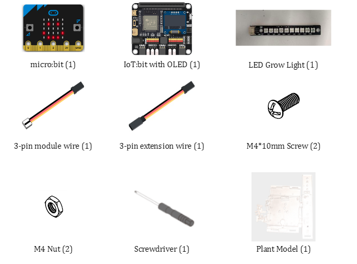
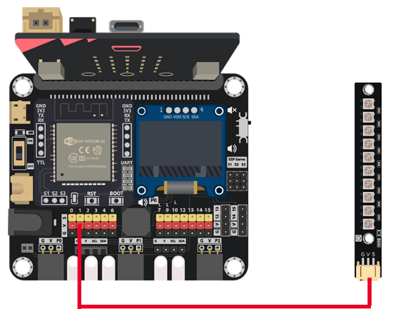
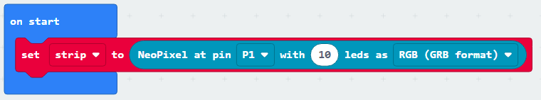
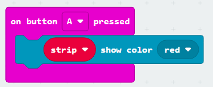
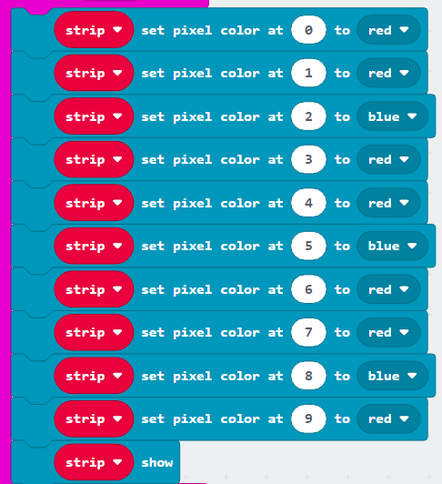
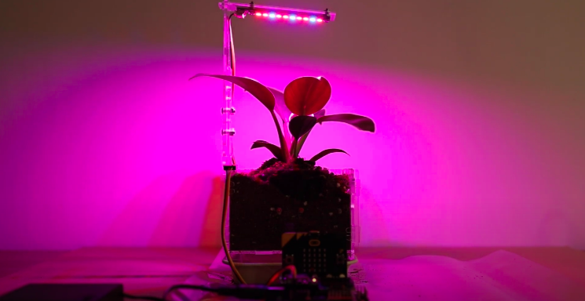

# Case 01: Grow LED Light Color Control

Level: 

## Goal

Create a grow light that can be turned to different colors using the buttons on micro:bit board.

## Background

What is a Grow LED Light Color Control?

Light is one of the most important aspects of plant growth. The use of supplemental grow lights is essential when you are considering cultivating plants at home. However, what many do not realise is that different colors of light have different effects on the growth of the plant.
Using this setup you can experiment and observe the effects of different colors of light on plant growth. Thanks to our multicolor LED you can choose out of many different colors. But by way of experimentation, you can determine a combination of blue and red lights which make purple, is the most efficient light for the plant. 

Grow LED light control operation

The light can assume one of three colors, blue, red or purple. By pressing button “A” the color will turn red. By pressing button “B”, the color will turn blue.  By pressing both of the buttons the color will turn purple due to the combination of blue and red.  

## Part List

## Assembly step

Step 1 

Wait for later 

## Hardware connect

1. Connect Grow Light to P1

## Programming (MakeCode)

Step 1. Initial the Multi-Color LED 

* Snap `set strip to NeoPixel at pin P1 with 10 leds as RGB(GRB format)` to `on start` 

Step 2. Change all LEDs in red color 
 
* Drag `on button A pressed` to editor
* Use `strip show color red` to change all LEDs to red

Step 3. Change all LEDs in purple color 
 
* Drag `on button B pressed` to editor
* Use `strip show color purple` to change all LEDs to purple

Step 4. Change LEDs in mixed color 
 
* Drag `on button A+B pressed` to editor
* Use `strip set pixel color at X to XXX` and `strip show` to build the combination of mixed color
* Each `strip set pixel at X to XXX` need to fill in the number order and color respectively
* After set the pixel, must need to use `strip show` to make it change color

Full Solution 

MakeCode: [https://makecode.microbit.org/_UpXT4vL6qHrh](https://makecode.microbit.org/_UpXT4vL6qHrh) 

You could also download the program from the following website: 
<iframe src="https://makecode.microbit.org/#pub:_UpXT4vL6qHrh" width="100%" height="500" frameborder="0"></iframe>

## Result

When pressed the A button, the Grow light change to Red 
When pressed the B button, the Grow light change to Purple 
When pressed the A+B buttons, the Grow light change to a mix of red and blue color

## Think

 

Q1. How do you mix the color to get the best effect for plant growth? 

