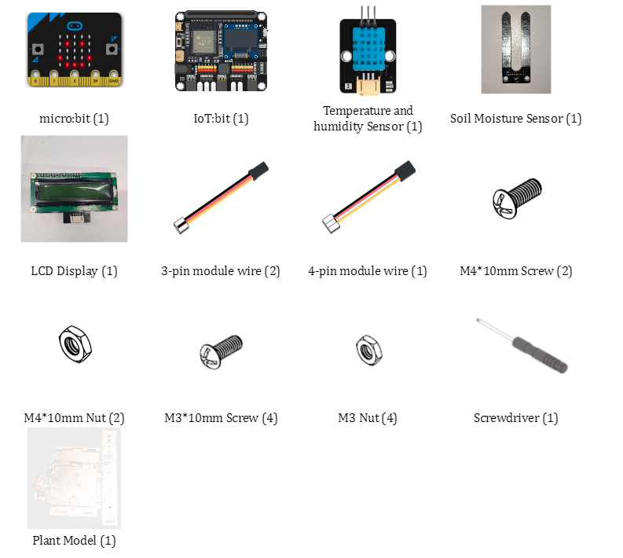
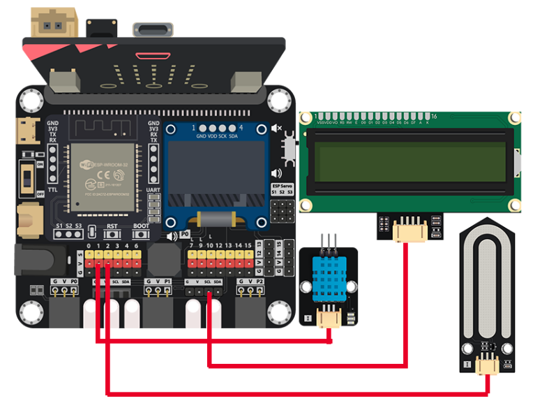
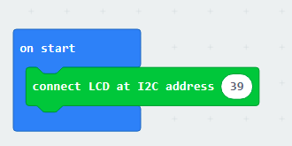
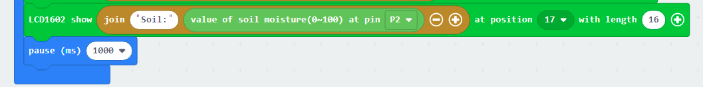
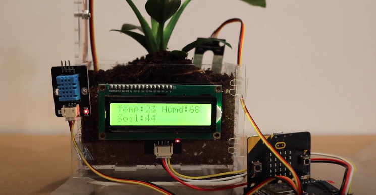

# Case 02: Environment Monitoring Display

Level: 

## Goal

Mount and LCD display that will show the real time plant data such as the environment temperature, humidity and the soil moisture.  

## Background

What is an Environment Monitoring Display?

In the days of old determining the environmental factors for suitable plant growth was either extremely difficult, or extremely expensive. The analogue methods might have worked for meatsureing temperature, but determining air humidity and soil moisture accurately was possible after the advent of electronics.
Nowadays we can accurately measure the environmental factors for optimal plant growth. And of course combining all of the relevant data and showing it in one central screen is the next logical step in making the process more convenient.  

Environment monitoring display operation

The plant pot is mounted with two modules, temperature and humidity sensors as well as soil moisture sensor. Additionally we mount the LCD display which will show the real time temperature, humidity and soil moisture.  

When there are no vacancies (detected by light sensor), then the gate will keep closed. 

## Part List

## Assembly step

Wait for asm

## Hardware connect

1. Connect the LCD1602 module to I2C socket.
2. Connect the Temperature and Humidity sensor(DHT11) to P1.
3. Connect the soil moisture sensor to P2.

## Programming (MakeCode)

Step 1. Initialize the LCD1602 

* Put `connect LCD at I2C address 39` into `on start`

Step 2. Show the result of temperature and humidity 

* Put `LCD1602 show MakerBit at position 1 with length 16`inside `Forever`
* Replace the `MakerBit` with a formatted text and reading result, also adjust the start position and the length, such as `LCD1602 show join Temp: DHT Read temperature at pin P1 at position 1 with length 8`
* Repeat it again with little adjustment for humidity

Step 3. Show the result of soil moisture 

* Put `LCD1602 show join Soil: value of soil moisture(0~100) at pin P2 at position 17 with length 16`
* Pause for 1000ms to read the sensor each second

Full Solution 

MakeCode: [https://makecode.microbit.org/_gc66LtY7pRMd](https://makecode.microbit.org/_gc66LtY7pRMd) 

You could also download the program from the following website: 
<iframe src="https://makecode.microbit.org/#pub:_gc66LtY7pRMd" width="100%" height="500" frameborder="0"></iframe>

## Result

From turn on, micro:bit will collect the information from different sensors. After that, the information will show on the LCD display 

## Think

1. Can you make the display format become more readable?
2. Try to turn off the backlight to save energy?
