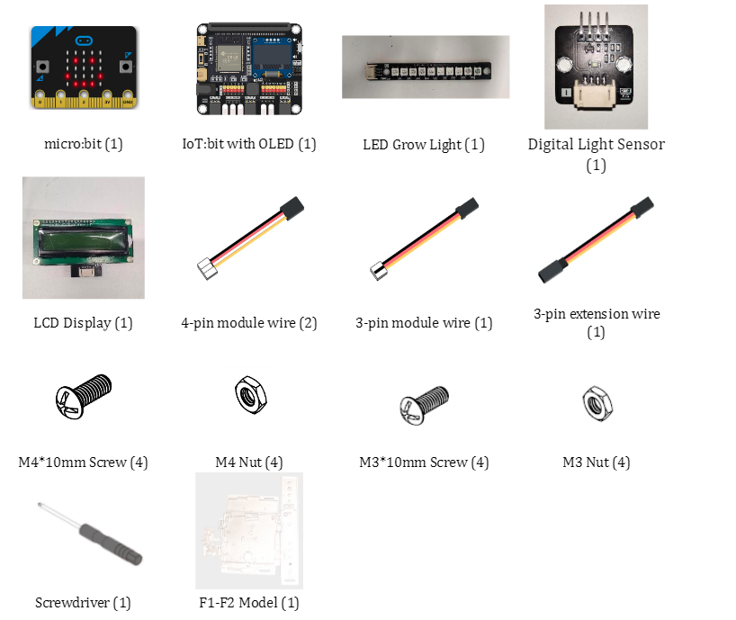
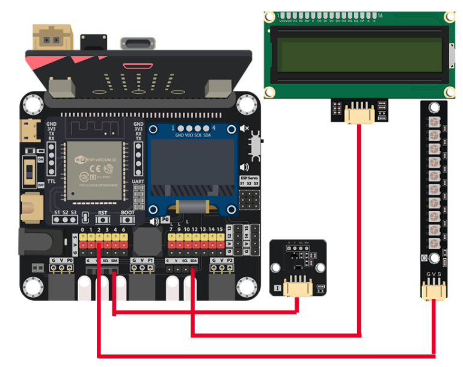
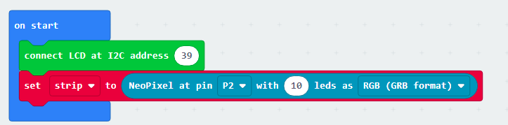
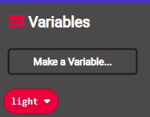
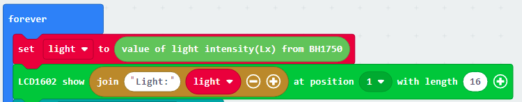
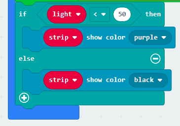
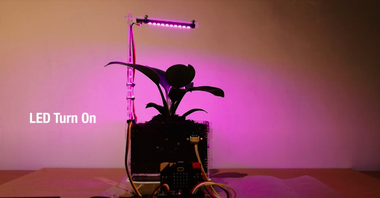

# Case 03: Smart LED Grow light

Level: 

## Goal

Create an automatic grow light that will turn on when the light sensor detects the lack of appropriate amount of light. 

## Background

What is Smart LED grow light?

Whenever we grow a plant, we replicate the conditions encountered in nature, with a certain amount of light present during the day. However, when we are indoors, it is hard to replicate those conditions. Under poor lighting, a plant might survive, but it will not thrive. Our smart LED grow light will help the plant as it will track the lighting conditions and turn on whenever the plant needs more light. This type of system is incredibly useful in growing a plant in indoor conditions.  

Smart LED grow light operation

We will use a light sensor to track the light intensity near the plant. Whenever the light intensity falls under a specific number, the board enables the LED to grow light that will shine on the plant. When we have enough light in the system, the LED will turn off.  

## Part List

## Assembly step

Wait for asm

## Hardware connect

1. Connect the LCD1602 Display to I2C port
2. Connect the digital light sensor to I2C ports.
3. Connect the LED Grow Light to P2

## Programming (MakeCode)

Step 1. Initialize Grow LED light and LCD1602 display

* Put `connect LCD at I2C address 39` in `on start`
* Put `set strip to NeoPixel at pin P2 with 10 leds as RGB(GRB format)`

Step 2. create the light variable

* Create a new variable `light`

Step 3. Read the light value and show on display

* In `Forever`, put `set light to value of light intensity(Lx) from BH1750` to read the value
* Show the value with formatted text on display by `LCD1602 show join Light: light at position 1 with length 16`

Step 4. Examine the light value to turn on/off the light

* Put a `if-else` statement with condition `light < 50`
* In `if` segment, put `strip show color purple`
* In `else` segment, put `strip show color black`

Full Solution 

MakeCode: [https://makecode.microbit.org/_hFtg3YH9mW16](https://makecode.microbit.org/_hFtg3YH9mW16) 

You could also download the program from the following website: 
<iframe src="https://makecode.microbit.org/#pub:_hFtg3YH9mW16" width="100%" height="500" frameborder="0"></iframe>

## Result

When the environment is blight, the Grow LED Light will not turn on. 

When the environment is dark, the reading of light intensity will lower than threshold, then turn on the Grow LED Light. 

## Think

1. Try to adjust the threshold of light intensity to get better performance on turn on/off the Light.  

