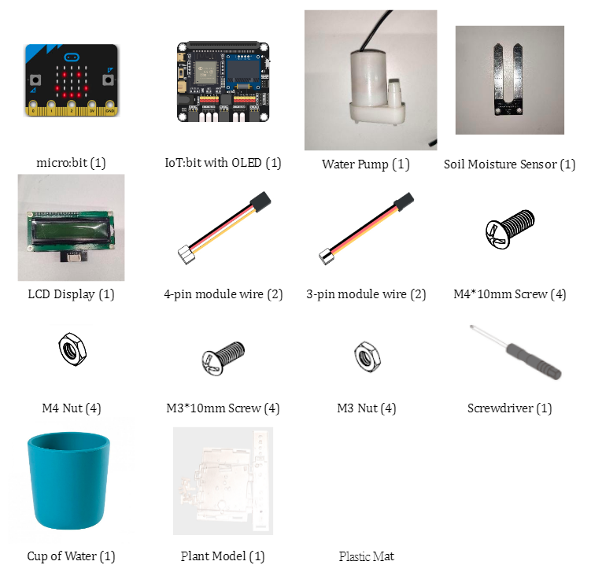
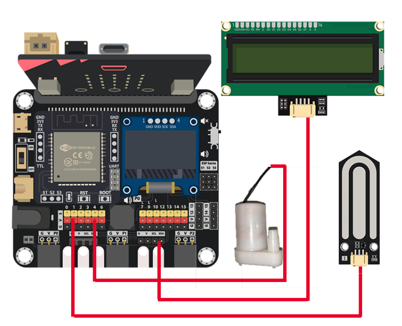
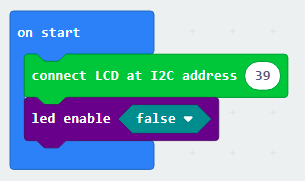
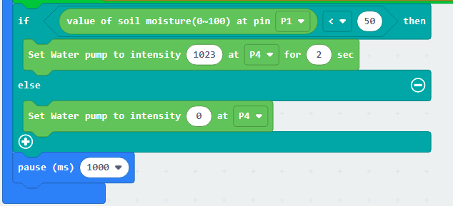
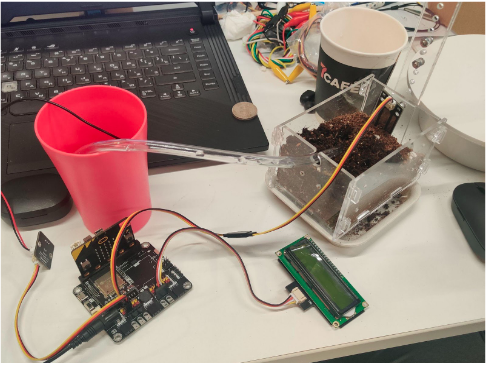

# Case 04: Automatic Irrigation

Level: 

## Goal

Create an automatic irrigation system that will water the plant whenever the soil moisture sensor senses the lack of water in the soil. 

## Background

What is an automatic irrigation system?

Irrigation (watering) is the single most important aspect of plant care. Without water no plant survives, and on the contrary, too much water will also kill the plant. 
The main benefit of smart irrigation systems is that we can track the soil moisture real time using a sensor without having to rely on our guesses. Furthermore, you might not remember to water the plant, but the automatic irrigation system will do it for you whenever the soil moisture gets dangerously low.
These types of systems are used in modern farming and increase the crop yield and consequently reduces the unnecessary use of water.  

Smart irrigation system operation

The soil moisture sensor is embedded in the plant pot. Whenever the soil moisture gets low, the water pump is triggered, and pumps water through a tube that water the  plant until the soil moisture level is satisfactory, upon which the pump stops.  

## Part List

## Assembly step

## Hardware connect

1. Connect LCD1602 Display to I2C port
2. Connect the soil moisture sensor to P1.
3. Connect the water pump to P4.

## Programming (MakeCode)

Step 1. Initialize LCD display and disable the LEDs Array
* Drag `connect LCD at I2C address 39` to `on start`
* Put `led enable false` to `on start`

Step 2. Show soil moisture value on LCD display

* In block `forever`. Put `LCD1602 show MakerBit at position 1 with 16 length`
* Use Text function `join` to make a formatted text syntax
* Put `value of soil moisture(0~100) at pin P1` into `join`, add a description before it
* Use that formatted text to replace `MakerBit` in LCD1602 show function

Step 3. Examine the soil moisture and irrigate

* Put a `if-else` statement, use `value of soil moisture(0~1--) at pin P1 < 50` as condition
* In `if` segment, that's means the soil moisture is less than 50, turn on the water pump by `Set Water pump to intensity 1023 at P4 for 2 sec`
* In `else` segment, that's means the soil moisture is equal or larger than 50, no need to add water, turn off the water pump by `Set Water pump to intensity 0 at P4`
* Add `pause (ms) 1000` to check the soil moisture in each second.

Full Solution 

MakeCode: [https://makecode.microbit.org/_9CiD8jFUjT0o](https://makecode.microbit.org/_9CiD8jFUjT0o) 

You could also download the program from the following website: 
<iframe src="https://makecode.microbit.org/#pub:_9CiD8jFUjT0o" width="100%" height="500" frameborder="0"></iframe>

## Results

When the soil getting dry, the soil moisture sensor detect it and let water pump ture on to irrigate

## Think

Q1. Why do you think we need to set a pause for the water pump function? Is it because of the plant or programming?  

