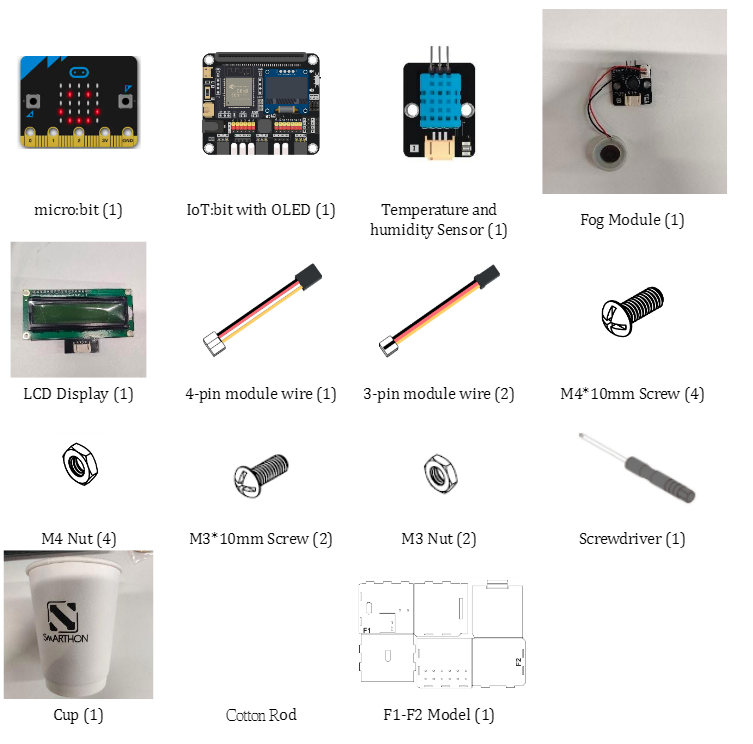
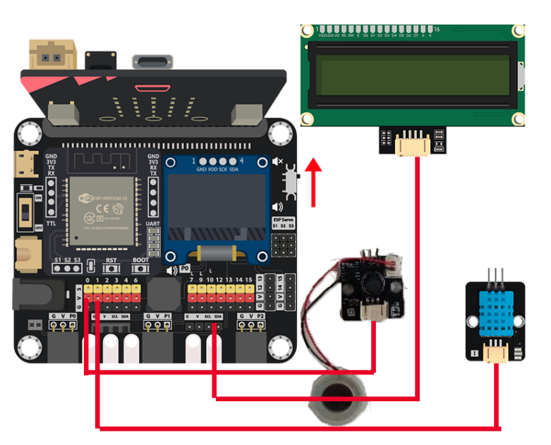
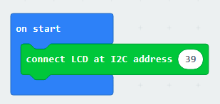
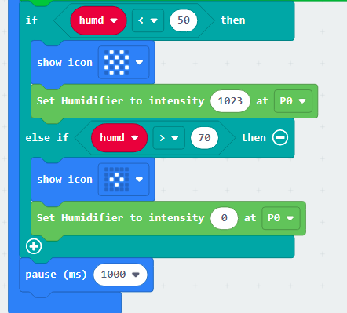
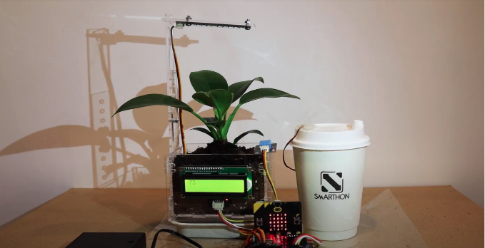

# Case 05: Automatic humidity control

Level: 

## Goal

Create an automatic system that humidifies the air whenever there is lack of it in the environment. 

## Background

What is an automatic humidity control?

You might ask yourself, if I am already watering the plant, why is humidity control important? The simple answer is that proper humidity will ensure that the plant can conduct photosynthesis effectively. Humidity is hard to measure and control manually. Automatic humidity control systems solve these issues by utilizing accurate sensors and fog modules to accurately monitor and efficiently change the environment.  

Automatic humidity control operation

The LCD screen displays the humidity in the room. Whenever the humidity sensor detects the lack of humidity in the room the fog modules turn on. The led lights on microbit correspond to the operation of the fog module, starlike pattern when module is on, a single dot when the module is off. Whenever the humidity in the room rises to the appropriate level, the fog module turns off. 

## Part List

## Assembly step

wait for asm

## Hardware connect

1. Connect the LCD 
2. Connect the Fog module to P0 
3. Connect Humidity sensor to P1
4. Pull up the buzzer switch to disconnect the buzzer

## Programming (MakeCode)

Step 1. Initialize the LCD display

* Drag `connect LCD at I2C address 39` to `on start`

Step 2. Create variable, save and show the reading

* Create the variable `humd`
* Use `set humd to DHT11 Read humidity at pin P1` to save the humidity value
* Show the value with formatted style by `LCD1602 show join Humidtiy:humd at position 1 with length 16`

Step 3. Examine the humidity and humidify

* Put a nested `if-else`, the first condition use `humd < 50`
* In the `if` segment, that's means the humidity is lower than 50, need to start humidify by `Set Humidifier to intensity 1023 at P0`, show a icon during that running to notice user
* In the `else-if` segment, that's means the humidity already higher than 70, need to stop humidify. Use `Set Humidifier to intensity to 0 at P0` to stop it. Show a icon to notice user humidify was done. 
* Wait 1 second before doing next humidity check

Full Solution 

MakeCode: [https://makecode.microbit.org/_C16LDUJEU2EL](https://makecode.microbit.org/_C16LDUJEU2EL) 

You could also download the program from the following website: 
<iframe src="https://makecode.microbit.org/#pub:_C16LDUJEU2EL" width="100%" height="500" frameborder="0"></iframe>

## Results

When the room humidity go down to below 50, the fog module start humidify. When the humidify to over 70, the fog module will stop work. So the room is keeping between 50 to 70 humidity for plant growth. 

## Think

Which humidity range is best for your plant? 

