# IoT Case 06: Plant health data monitoring

Level: 

## Goal

Create a plant health monitoring system that will track the environment's humidity, temperature, light intensity and the plant’s soil moisture. The data is then sent and stored in thingspeak where it can be remotely monitored and analyzed over long periods of time.  

## Background

What is plant health data monitoring? 

Monitoring plant data is immensely important. However, if you will only monitor the immediate data you risk not seeing the bigger picture.  If you have the habit of measuring and recording plant data over long periods of time it can show you patterns that you could have easily missed. Maybe there is a consistent overtime degradation of the plant health that is not noticable in day-to-day life. Or there is a sudden growth spurt and you want to study what caused it. Moreover, if you implement a system that will categorize and sort the data automatically into easy to analyze graphs, it can greatly increase your efficiency as a botanist as well as save you enormous amounts of time. 
  

Plant health data monitoring operation 

The pot is mounted with three module temperature and humidity sensor, soil moisture sensor, light intensity sensor. The board attempts to connect to the internet, and if it is connected successfully the sensor readings are sent to thingspeak. Afterwards there is a 15 second break. After the break, the cycle repeats.  

## Part List

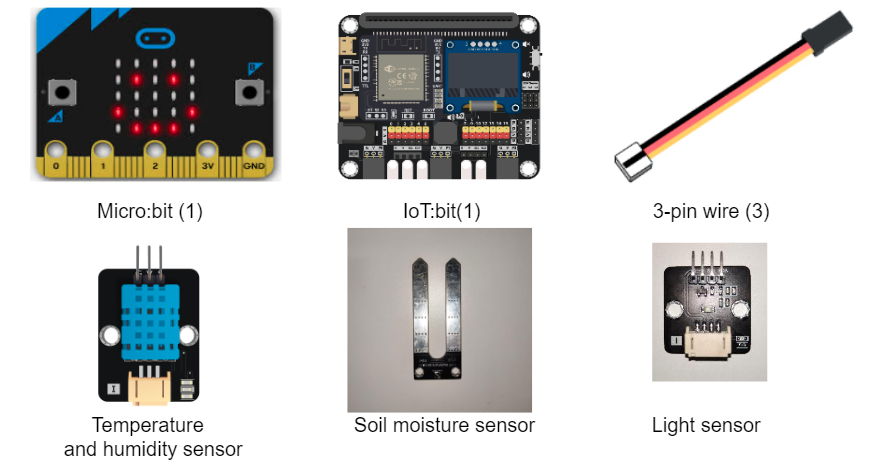

## Assembly step

wait for asm

## Hardware connect

1. Connect Temperature and humidity sensor to P1
2. Connect Soil moisture sensor to P2
3. Connect BH1750 Light sensor to I2C

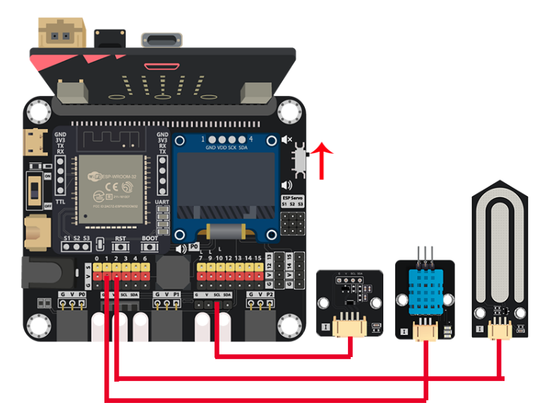

## IoT (ThingSpeak)

 Step 1. Login and create channel 

* Go to [https://thingspeak.com](https://thingspeak.com/), Choose Channels -> My Channels -> New Channel 

* Input Channel name, Field1, Field2, Field3 and Field4 name, then click “Save Channel”
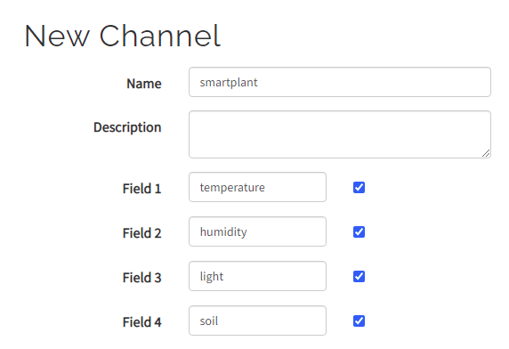

 Step 2. Get the API key 

* Select your channel > “API Keys” ，copy the API key
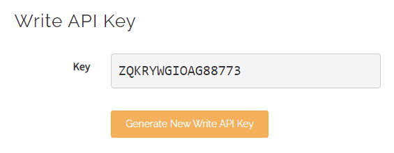

## Programming (MakeCode)

Step 1. Create variables, initialize OLED, IoT:bit and connect to WiFi 

* Snap `Initialize OLED with width:128, height: 64` to `on start`
* Snap `Initialize IoT:bit TX P16 RX P8` from `IoT:bit` to `on start`
* Snap `Set Wi-Fi to ssid pwd` to `on start` and fill in the SSID and password
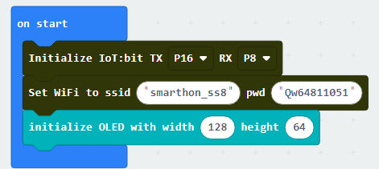

* Set variable `temp`, `humd`, `soil` and `light`
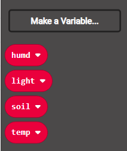

Step 2. Show icon "tick" after WiFi connection 

* Snap `show icon` from `basic` to `On WiFi connected` and select icon `tick`
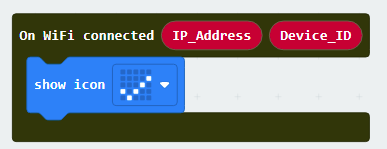

Step 3. Get temperature, humidity, soil moisture and light values 

* In `Forever`, put a `if` statement, use `WiFi connected?` as condition
* In the `if` segment, start to read data
* Use `set temp to DHT11 Read temperature at pin P1` read temperature
* Use `set humd to DHT11 Read humidity at pin P1` read humidity
* Use `set soil to value of soil moisture(0~100) at pin P2` to read soil moisture
* Use `set light to value of light intensity(Lx) from BH1750` to read light intensity

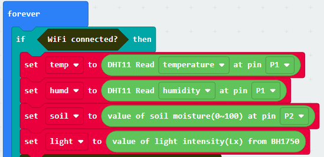

Step 4. Upload data to thingspeak 

* Put `Send Thingspeak key* XXXXXXX field1 xxxx .....` in the `if` segement
* In the `Send Thingspeak key....` block, fill in the required infromation, such as API key, field1,2,3,4 value
* Add `pause(ms) 15000` to wait 15 second between each uploading
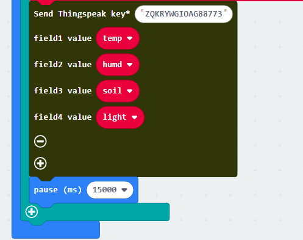

Step 5. Show ThingSpeak upload status 

* Put `On Thingspeak Uploaded` to editor
* Clear the display before each update
* Show the upload status and error_code by `show string Status` and `show string Error_code`
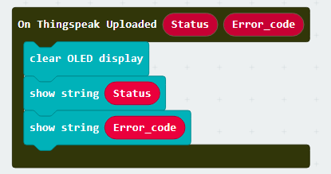

Full Solution 

MakeCode: [https://makecode.microbit.org/_4pmd65cHVDTo](https://makecode.microbit.org/_4pmd65cHVDTo) 

You could also download the program from the following website: 
<iframe src="https://makecode.microbit.org/#pub:_4pmd65cHVDTo" width="100%" height="500" frameborder="0"></iframe>

## Result

When the IoT:bit was connected to WiFi, the tick will be show. 
Then collect data from each sensor, and upload to thingspeak through Internet. The upload will be every 15 second because the free account of thingspeak limited the frequency.

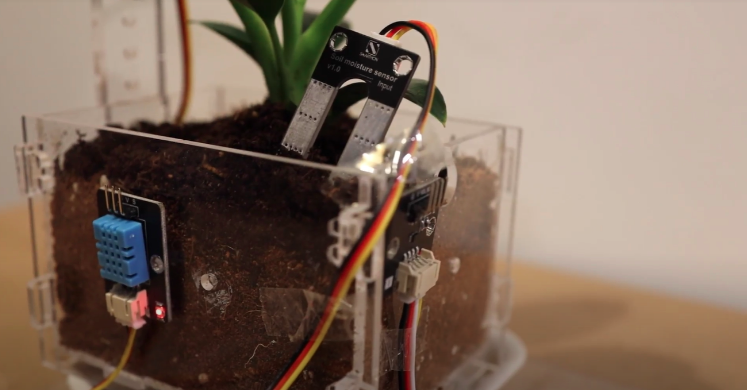

After uploaded, the data will be shown in the chart on the website.

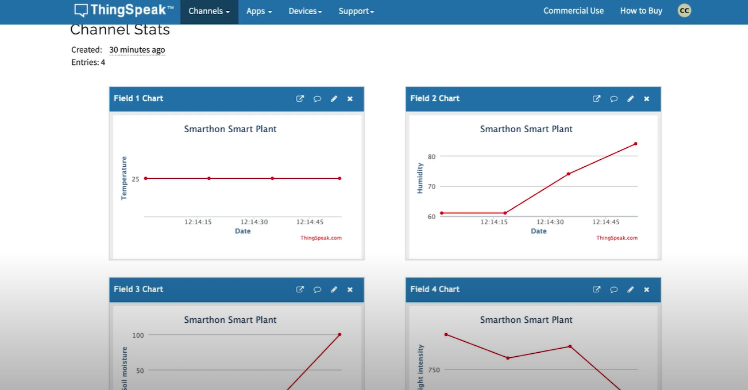

## Think

1. How do you use the data after you collected? (hints: analyst the time period? Relationship between temperature, humidity and soil moisture?)