# Intelligent Road Signs

## Goal

Make an intelligent road sign to displays appropriate traffic signs at different times of the day.

## Background
### What is intelligent road sign?

Intelligent electronic signage is a revolutionary product that combines mechanical engineering and the Internet. Intelligent electronic signage combines navigation, big data collection and analysis of many modern information functions in one place. Based on intelligent navigation, it becomes a one-stop solution for modern public space information service! The vehicle realizes automatic steering, which improves the mobility, urban efficiency and productivity of the vehicle and delivers passengers to their destinations as soon as possible.

### Intelligent road sign operation

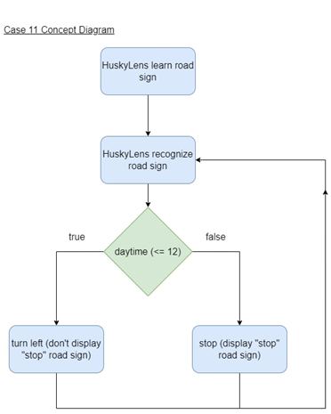

## Part List

MicroBit (1) 
Expansion board (1) 
SG90 Servo (1) 
M2*8 screw (2)  
M2*8 nut (2) 
M3*12 screw (2)  
M3*12 nut (2)  
Screwdriver  
Module J (5) 

## Assembly step

### Step 1 

Put the J1 model onto the J2 model.

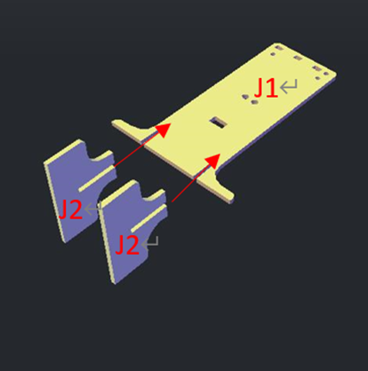

### Step 2 

Put the J3 model onto the J1 model.

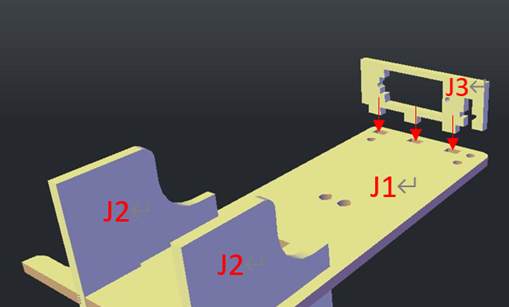

### Step 3

Attach the SG90 Servo to the J3 model by using M2*8mm screw and nut. After that, place the M3 nut in the gap to the right of the J3 model.

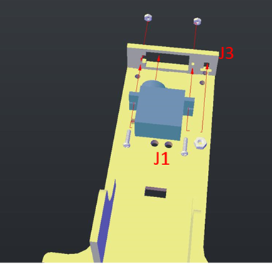

### Step 4

Attach the J3 model to the J1 model by using M3*8mm screw.

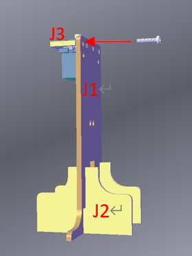

### Step 5

Use the screws provided by SG90 Servo to connect to the J4 model and SG90 Servo.

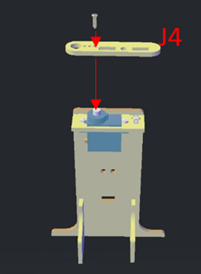

### Step 6

Place the M3 screw cap in the gap of the J5 model. 

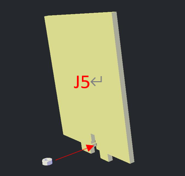

### Step 7

Put the J5 model onto the J4 model

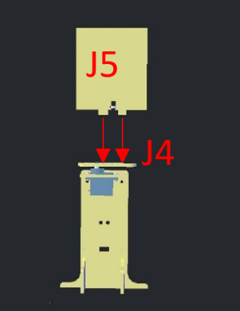

### Step 8

Use M3*8mm screws to connect the J4 model and the J5 model, and then paste the paper with the “STOP”on it onto the J5 model.

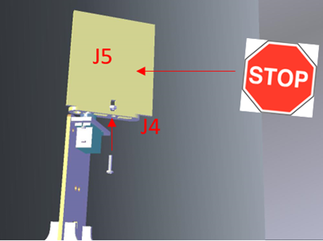

### Step 9 

Assembly completed!

## Hardware connect

Connect the servo to the P3 port

## Programming (MakeCode)
### Install library

+ Click extensions
+ Enter StemhubCity

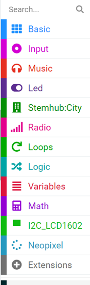
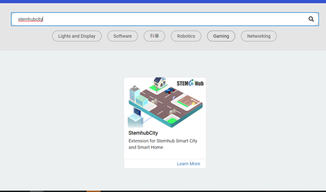

### Update Time

+ Pause 1 second
+ Then increase time by 1
+ Set time to 0 when time is equal to 25

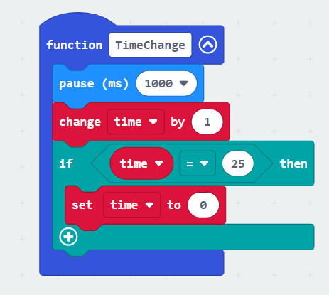

### Initialize Time

+ set time to 0

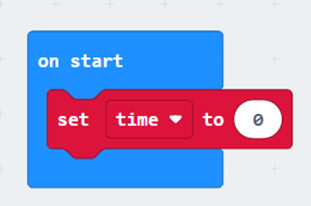

### Checking time and changing road signs

+ Call function TimeChange to update the time
+ Drag out two turn servo to 0 degree at P0 from the stemhubcity library
+ Then place them inside the if condition and else condition
+ Change turn servo to 0 degree at P0 as turn servo to 0 degree at P3 and turn servo to 180 degree at P3

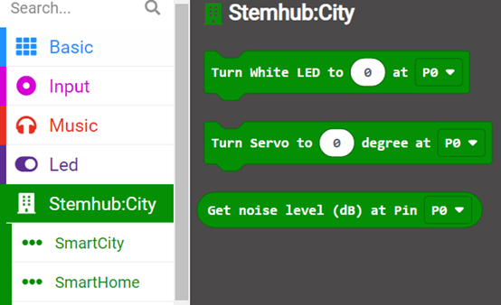
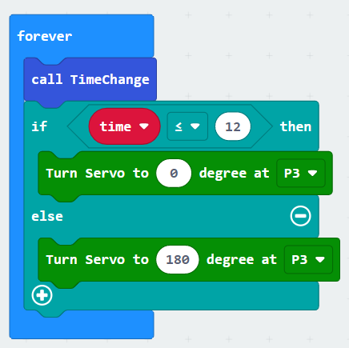

## Result

The traffic sign transition is controlled by the tiller. The traffic signs are switched every twelve seconds.

## Think 

Challenge:

Can you design street signs for intersections?

