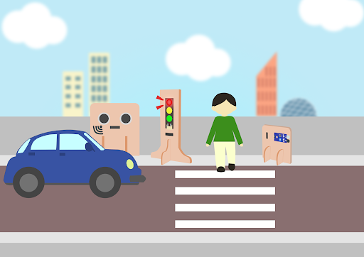
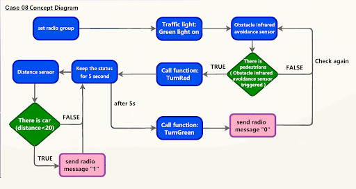
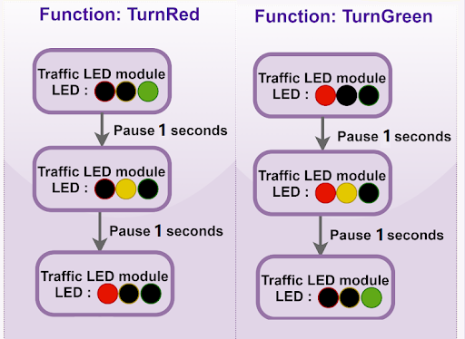
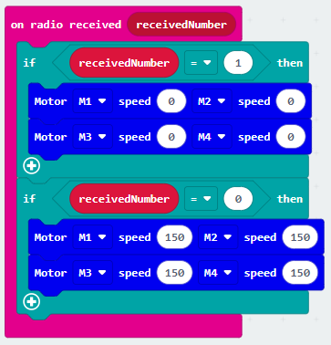

# Smart Traffic Lights

## Goal

On the basis of the previous lesson, make a smart traffic light. It will control the light switch of the traffic lights before braking and before resuming normal driving, so that drivers can easily understand the status of the road.

## Background

### What is a smart traffic light? 

A smart traffic light will automatically switch to red when it senses the approach of the human. After 5 seconds, switch back to the green light and let the car return to normal driving.

### Smart traffic light operation 
 

## Part List 

Microbit （1） 
Expansion board （1） 
Distance sensor(1) 
Obstacle Infrared avoidance sensor  (1) 
Traffic light  (1) 
4-pin module wire （1） 
Female To Female Dupont Cable Jumper Wire Dupont Line  （7） 
M3*8mm screw (1) 
M2*8mm screw (4) 
M3 nut （1） 
M2 nut （4） 
Screwdriver（1） 
Module B (1) 
Module E (1) 
Module I（1） 

## Assembly step 

### Step 1 

On the basis of lesson7, attach the Traffic light Module to I1 model using M3*8 screw and nut. 

 

### Step 2 

Put the I1 model onto the I2 model. 

 

### Step 3 

Assembly completed! 

 

## Hardware connect 

Microbit 1：

Connect the Traffic light LED Module to P1 P2 P3 port 
Connect obstacle Infrared avoidance sensor to P4 port 
Connect the Distance Sensor to P15 (trig)/ P16 (echo) port 

 

 

Microbit2： 
Car

## Programming (MakeCode) 
### Sender：
### Step 1. Set up a new function (TurnRed) 
+ Snap pause to wait 1 second 
+ Control traffic light yellow on 
+ Snap pause to wait 1 second 
+ Control traffic light red on
 

### Step 2. Set up a new function (TurnGreen) 
+ Snap pause to wait 1 second 
+ Control traffic light yellow on 
+ Snap pause to wait 1 second 
+ Control traffic light green on
 

### Step 3. Disable micro:bit LED. 
+ Snap led enable false to on start  
+ Note that P3 is used as LED in default setting, LED need to be disable 
 

### Step 4. Initialize the program  similar as last lesson
+ Drag set variable trafficLight to Traffic light pin setting Red P0 Yellow P1 Green P2 to on start 
+ Control traffic light green on 
+ Drag radio set group 6 to on start   
 

### Step 5. Call function 
+ Snap function TurnRed into if get motion (triggered or not) at pin P4 case 
+ Drag function TurnGreen after the while loop 
  

Full solution 
<a href="https://makecode.microbit.org/_XEKU87ijgFY2">https://makecode.microbit.org/_XEKU87ijgFY2</a>

 
### Receiver：
### Step 1. Set radio set group at start position 
+ Drag radio set group 6 to on start  
+ Initially, the car  moves forward by default
 

### Step 2. Control car by receiving different number 
+ Snap if statement into on radio received receivedNumber 
+ Set receivedNumber =1 and make the car stop 
+ Set receivedNumber=0 and make the car move forward 

Full solution： 
<a href="https://makecode.microbit.org/_4hW5yAXg8f5T">https://makecode.microbit.org/_4hW5yAXg8f5T</a> 
<a href="https://makecode.microbit.org/_1o1iRhg3qfRF">https://makecode.microbit.org/_1o1iRhg3qfRF</a>

## Result 總結

On the basis of the last lesson, a traffic light module is added in this lesson. 

 
## Think 

Q1. How can we add sound effects to the traffic LED Module according to the corresponding color?

