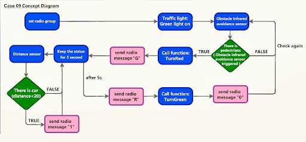
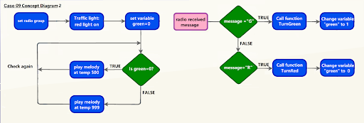
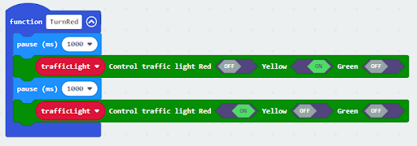
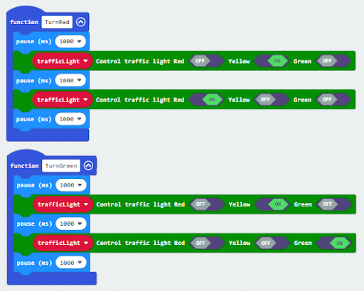
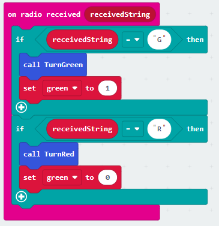

# Smart Pedestrian Lights 2 

## Goal 

Make a smart pedestrian light system with an alerting sound on the basis of the last lesson. 

## Background 
### What is a smart pedestrian light? 

Smart pedestrian light systems are designed to maintain normal operation of the intersection. They automatically switch between red and green lights among different intersection traffic lights according to the road traffic situation.    

### Smart traffic light operation 

Traffic light 1:

 

 

Traffic light 2

 

## Part List 

Microbit （1） 
Expansion board  （1） 
Distance sensor (1) 
Obstacle Infrared avoidance sensor  (1) 
Traffic light (2) 
Buzzer（1） 
3-pin module wire （1） 
4-pin module wire （2） 
Female To Female Dupont Cable Jumper Wire Dupont Line （7） 
M2*8mm screw (4) 
M3*8mm screw (5) 
M2 nut（4） 
M3 nut （5） 
Screwdriver 
Module B(1) 
Module C (1) 
Module E (1)  
Module I（2） 

## Assembly step 
### Step 1 第一步

On the basis of lesson 8, attach the Traffic light Module to G1 model using M3*8 screw and nut. Put together all the cardboard parts (I1-I2)

 

### Step 2 

Put the I1 model onto the I2 model. 

 

### Step 3 

Assembly completed! 

 

### Step 4 

Attach the buzzer to C1 model using M3 * 8mm screw and nut. 

 

### Step 5 

Put the C1 model onto the D2 model. 

 

### Step 6 

Assembly completed! 

 

## Hardware connect 

Microbit 1：

Connect the Traffic light LED Module to P0 P1 P2 port 
Connect obstacle Infrared avoidance sensor to P4 port 
Connect the Distance Sensor to P15 (trig)/ P16 (echo) port 

Microbit2:

Connect buzzer to P0 port  
Connect the Traffic light LED Module to P0 P1 P2 port 

Microbit 3:

car

## Programming (MakeCode) 
### Traffic light 1：
### Step 1. Set up a new function (TurnRed) 
+ Snap pause to wait 1 second 
+ Control traffic light yellow on 
+ Snap pause to wait 1 second 
+ Control traffic light red on 
 

### Step 2. Set up a new function (TurnGreen) 
+ Snap pause to wait 1 second 
+ Control traffic light yellow on 
+ Snap pause to wait 1 second 
+ Control traffic light green on 
 

### Step 3. Initialize the program 
+ Drag set variable trafficLight to Traffic light pin setting Red P0 Yellow P1 Green P2 to on start 
+ Control traffic light green on 
+ Drag radio set group 6 to on start   
+ In forever, snap function TurnRed into if get motion (triggered or not) at pin P4 case 
+ Drag function TurnGreen after the while loop 
 

### Step 4. Control traffic light 2 by sending radio string
+ Drag radio send string “R”  before TurnGreen 
+ Drag radio send string “G” after TurnRed 
 

Full solution 
<a href="https://makecode.microbit.org/_AwV0wo0bcc8j">https://makecode.microbit.org/_AwV0wo0bcc8j</a>

 

### Traffic light 2：
### Step 1. Set up new functions  
 

### Step 2. Initialize the program
+ Drag set variable trafficLight to Traffic light pin setting Red P0 Yellow P1 Green P2 to on start 
+ Drag radio set group 6 to on start   
+ Control traffic light green on 
+ Set a variable green=0 
 

### Step 3. Control traffic light by receiving different number 
+ Snap if statement into on radio received receivedString 
+ Set receivedString =“R” and call TurnRed 
+ Set receivedString =“G” and call TurnGreen 
+ Change variable green depend on the light 
 

### Step 4. Play sound effect depend on the light status 
+ Snap if statement into forever 
+ Play melody with different tempo
 

Ful solution: 
<a href="https://makecode.microbit.org/_LmUhPRb0L0pE">https://makecode.microbit.org/_LmUhPRb0L0pE</a>

 

### Receiver：
### Step 1. Set radio set group at start position 
+ Drag radio set group 6 to on start  
+ Initially, the car  moves forward by default
 

### Step 2. Control car by receiving different number 
+ Snap if statement into on radio received receivedNumber 
+ Set receivedNumber =1 and make the car stop 
+ Set receivedNumber=0 and make the car move forward 

Full solution： 
<a href="https://makecode.microbit.org/_4hW5yAXg8f5T">https://makecode.microbit.org/_4hW5yAXg8f5T</a> 
<a href="https://makecode.microbit.org/_1o1iRhg3qfRF">https://makecode.microbit.org/_1o1iRhg3qfRF</a>

## Result 

On the basis of the last lesson, a smart pedestrian light system with an alerting sound is added in this lesson. 

## Think 

Try to let the green light blink before turning green, and match with a suitable sound effect.

