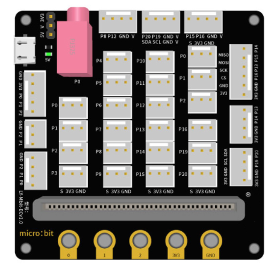
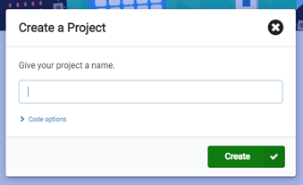
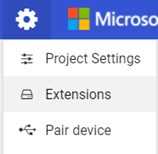
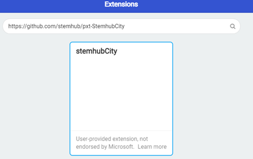
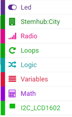

# Chapter 1 Know More About Smart Home

## What is Smart Home

Smart home uses the home as a platform, adopts integrated wiring technology, network communication technology, security prevention technology, automatic control technology and audio & video technology in the home-life related equipment, and constructs an efficient residential facilities and family schedule management system so as to enhance home security and convenience. It also achieves environmental protection and energy saving living conditions. 

## Advantages of Smart Home

Intelligence: Evolve from a static home structure to a home with dynamic intelligence. 

Informatization: Provide an all-round information exchange to help families to maintain information communication from the outside.

Humanization: Emphasize the coordination between people and the living environment, and that users can control the indoor living environment as they like.  

Energy-saving: Switch off the power completely with just one click, thus saving electricity. 

This smart home course focuses on using Micro:bit open source hardware, sensor modules, programming and laser cutting technology. It is designed to let the readers build a house model on their own, understand the characteristics and principles of sensors, learn to program makecode, and use sensors to achieve the intelligent automation of home equipment. 

  
## Steps of Building Smart Home Model

1. Assemble the front and left boards together, as figure 1.1 shows:

.jpg) 
.jpg) 
.jpg) 

2. Assemble the right board, as figure 1.2 shows:

  
.jpg) 
.jpg)   

3. Assemble the behind, as figure 1.3 shows:

  
.jpg) 
.jpg) 

4. Insert the assembled house on all sides on the base board, as figure 1.4 shows:

  
.jpg) 
.jpg) 

5. Assemble the M3 nut in house beam and assemble with M3*12 screw on module, as figure 1.5 shows:

  
.jpg) 
.jpg) 

6. Finally, cover the half-assembled house with the roof, as figure 1.6 shows: 

  
.jpg) 
.jpg) 

Note: The assembly of hardware such as sensors is shown in later chapters of this course.

## Learn About Micro:bit Expansion Board

  
 

  
## Prepare Micro:bit Programming MakeCode: Add Extensions

1.	Add a new project in MakeCode. 

 

2.	Create a name for the project.  

  
 

3.	Select extensions in the settings.  

  
 

4.	Enter https://github.com/stemhub/pxt-StemhubCity and choose stemhubCity 

  
 

5.	Extend stemhub：city和I2C__LCD1602 

  
 

