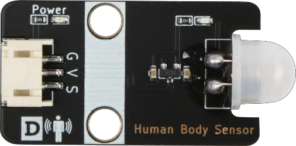

# Chapter 2 Smart Human Body Induction Lamp
## Background 

In ordinary homes, lighting is controlled by manual switches, and they are generally installed at a certain height from the ground. If there are elderly people and children in the home, it will be very inconvenient for them to use. If the lighting becomes automatic sensor control, it will be more intelligent and convenient. This is our task in this lesson - to make an intelligent human sensor lamp.

 
    
## Preparation

Micro:bit motherboard, expansion board, battery box, AAA batteries, human sensor module, white LED module, connection cables, USB data cable.

    
## Learn About Smart Body Induction Lamp

The human body induction lamp is a new technology to detect and sense human body activity information by using infrared and pyroelectric principles. When a person or a temperature object enters the sensing area of the module, the sensor module will output a high level pulse signal or a high level delay signal, and the output sensing pulse or delay signal can directly operate the LED lamp indicator, LED lighting. 

The human body induction lamp in this course is achieved by the human body induction lamp module. The principle is that when the human body sensor module detects someone approaching, it turns on the light; otherwise, the light turns off automatically.

## Learn About Human Sensor Module and the Red and Green Light Module

### Human Body Sensor Module

The human body sensor module used is HC-SR505 small human body sensor module, which is an infrared-technology-based automatic control product with high sensitivity, reliability, ultra-small size and ultra-low voltage operation mode. It is widely used in all kinds of automatic sensor electrical equipment, especially in automatic control products of dry cell batteries. The module has the following two functions: 

    
 
Fully automatic sensing: high level is output when a person enters its sensing range, and low level is output when the person leaves the sensing range with automatic delay to turn off high level.
 
Repeatable triggering method: After the induction output is in high level, if a person is sensed in the induction area during the delay time period, the output will remain high level until the person leaves and then the high level will be changed to low level (the induction module will automatically delay a delay time period after detecting each human activity, and the time of the last activity will be the starting point of the delay time HC-SR505). The small human body sensor module has three pins, G for GND ground, V for VCC high level or 5v, S is the signal pin.

### White LED light module

White LED module consists of 1 color LED. The module has three pins , namely G, V, S. G is the negative ground GND, V is the positive connected to the high level VCC or 5 v, and S is the signal pin.

    
.jpg) 

## Installation of Human Body Sensor Light     

Install the HC-SR505 small human body sensor module on the left side of the door with M3*8 screws, and the white LED on the house beam, as Figure 2.1 shows:  

    
.jpg) 

    
## Program Design 

### Algorithm Design

    The algorithm design is as follows: 

 

    
.png) 

    
### Hardware Connection

    HC-SR505 human body sensor module is connected to pin P1 and white LED module is connected to pin P2 of Micro:bit expansion board.

Sensors and Actuators             Main Control Board 
HC-SR505 Human Body Sensor Module      P1 
White LED Light Module              P2 

    
.jpg) 

### Sample Program 
Makecode program

    
.png) 

https://makecode.microbit.org/_RkmbfDhPPHto 

    
## Conclusion

    In this lesson, we learn the principle of intelligent human sensor light, understand the characteristics of human sensor and LED module and its use, and program the function of human light on and human light off. 

