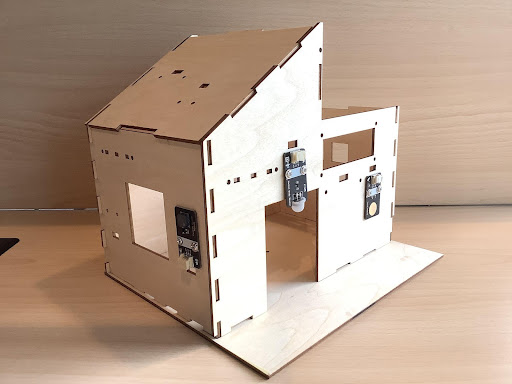
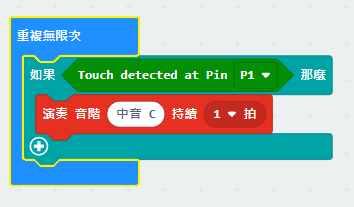

# Chapter 3 Music Doorbell

## Background  

The doorbell is a signaling device placed near a door, its role is to send a sound to remind the owner of a visitor. Nowadays, the common doorbells at home are wireless doorbells, wireless doorbells without batteries and wired doorbells, the bell sound is also very common. In this lesson, we will make a musical doorbell, which is achieved by using touch sensors and a passive buzzer, allowing guests to enjoy the beauty of music while waiting.

## Preparation  

Micro:bit motherboard, expansion board, battery box, AAA batteries, passive buzzer, touch sensor module, connection cable, USB data cable. 

## 1. Learn AboutTouch Sensors and Passive Buzzers 

### 1.1 Touch Sensor 

The touch module is a capacitive point-action touch module based on the touch detection IC (TTP223B), similar to the diagram below, when the metal contact of the module is being touched, it is equivalent to a button being pressed. We can mount the module on the surface of non-metallic materials such as plastic or glass, or cover the surface of the module with a thin sheet of paper (non-metallic) to make a keypad that can be hidden on walls, desktops, etc. as long as the touch position is correct. The modules output high level when touched, otherwise they output low level. 

   
    
 

   
    
 

 
### 1.2 Passive buzzer module 

Passive buzzer is a buzzer without an internal oscillator. When energized, the internal oscillator does not emit a buzzing sound, it needs to be driven by a square wave of 2-5 kHz, and then the waveform of different frequencies will drive the buzzer to emit the corresponding frequency of sound. Some of our common greeting cards come with a music box, which will play tunes such as Happy Birthday and Christmas songs after being opened, which is achieved through a passive buzzer.  

   
    
 

The passive buzzer module used in this course has three pins: G, V, S. G means GND ground, V stands for VCC, which can be connected to the motherboard's 5.5V and 3.3V, S is the signal interface.  

   
    
 

 
## 2. Installation of Doorbell  

    
Install the touch sensor on the left side of the right door with M3*8 screws and the passive buzzer on the left side of the right window, as Figure shows:

   
    
 

   
    
 

 
## 3. Program Design  

### 3.1 Algorithm Design 

The principle of music doorbell is that when the touch sensor is being touched, the passive buzzer sounds; otherwise, the passive buzzer does not sound. According to the principle, the program flow is as follows:   

   
    
 

### 3.2 Hardware Connection  

Sensors and Actuators | Main Control Board 
:-- | :--
Touch Sensors |P1
Passive buzzer |P0

   
    
 

    
### 3.3 Sample Program 

Makecode program 

 

   
    
 

 
https://makecode.microbit.org/_TPLMj6KzkVXb 

 
## 4. Conclusion  

In this lesson, we learn the features and principles of passive buzzer and touch sensor modules, and master the programming control of passive buzzer and touch sensor by making music doorbells, so as to deepen the application of passive buzzer and touch sensor. 

