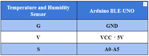

# Chapter 4 Smart Temperature Control Fan  

## Background  

With the condition of global warming keeps worsening and worsening, fans and air conditioners have become essential for our daily life, but air conditioners consume a lot of energy. Thus, people will choose fans as a lower energy consumption cooling appliance. Nowadays, the fans used in people's daily life are adjusted by buttons or knobs to adjust the speed and wind power, but is it possible to adjust the wind power according to the temperature and humidity information of the indoor environment? If the fan can change the fan speed according to the indoor temperature, it will undoubtedly be more beneficial to our health and save energy. In this lesson, we will make an intelligent temperature-controlled fan to see how it achieves the function of temperature-controlled wind.

 
## Preparation  

Micro:bit motherboard, expansion board, battery box, AAA batteries, DC motor fan module, temperature and humidity sensor, connection cable, USB data cable.  

 
## 1. Learn About Temperature And Humidity Sensors And DC Motor Fan Modules 

### 1.1 Temperature and Humidity Sensor Module 

The temperature and humidity sensor module is a temperature and humidity overlay sensor with calibrated digital signal output. It applies dedicated digital module acquisition technology and temperature and humidity sensing technology to ensure high reliability and excellent long-term stability. 

    
 

Temperature and humidity sensor module is through the DHT11 to detect the temperature and humidity of the surrounding environment, the DHT11 includes a resistive moisture sensor and an NTC temperature measurement element, and a high-performance 8-bit microcontroller connected, only a wire can be completed with the Micro:bit data transmission. 

Temperature and humidity sensor module has three pins, G for GND to ground, V for VCC to high level or 5V, S indicates the signal line.

    
 

### 1.2 DC Electric Motor Wind Fan Model  

A DC motor is an electric motor that converts DC electrical energy into mechanical energy. It is widely used in electric traction because of its good speed control performance. DC motors are divided into three categories: permanent magnet, other-actuated and self-actuated, of which self-actuated is divided into parallel-actuated, series-actuated and over-actuated.  

When the armature winding is powered by the DC power supply through the brushes, the conductor under the N-pole of the armature surface can flow the same direction of current and the conductor will be subjected to counterclockwise torque according to the left-hand rule; the conductor under the S-pole of the armature surface will also flow the same direction of current and the conductor will be subjected to counterclockwise torque according to the left-hand rule. In this way, the entire armature winding, i.e., the rotor, will rotate counterclockwise and the input DC electrical energy will be converted into mechanical energy output from the rotor shaft. The stator: base, main pole, commutation pole, brush device, etc.; the rotor: armature core, armature winding, commutator, shaft and fan, etc. 

    

    
 

    
 

    
 

 

The motor fan module has four pin connections, G for GND to ground, V for VCC to high level, INA and INB for input pins, which can be connected to the digital port of the Micro:bit control board. If the Micro:bit board outputs different voltage signals at the INA and INB pins of the motor, the motor can be rotated forward and reverse; the current can also be controlled to control the amount of force on the conductor in the magnetic field. 

 
## 2. Installation of Temperature-Controlled Fan 

    
First, remove the roof boards and install the motor fan module on the roof beam with M3*8 screws, and install the temperature and humidity sensor on the inner right side of the right window, as Figure 4.1 shows:

    
 

 
## 3. Program Design

### 3.1 Algorithm Design 

The principle of a temperature-controlled fan is to use temperature and humidity sensors to detect changes in heat around the fan in order to change the fan's own speed and the air flow (exhaust volume) of the wind. The program principle is that when the temperature is greater than the threshold, the fan will start; when the temperature is less than the threshold, the fan will shut down. The procedure flow is shown in the figure below:  

    
 

    
### 3.2 Hardware Connections 

The temperature and humidity sensor is connected to pin P1 of the Micro:bit expansion board, and the DC motor fan module is connected to pins P15 and P16 of the Micro:bit expansion board. 

    
Sensors and Actuators | Main Control Board 
:-- | :--
Temperature and Humidity Sensor  | P1 
DC Motor Fan Module  | P15、P16 

    
 

### 3.3 Sample Program 

Makecode program 

    
 

https://makecode.microbit.org/_2hoHEgYyW4og 

## 4. Conclusion 

In this lesson, we learn the principle and use of temperature-controlled fan, temperature and humidity sensor and DC motor, and master the programming control of temperature and humidity sensor and DC motor by making a temperature-controlled fan to control the fan to start and shut down automatically. 

 
