# Chapter 5 Smart Access Control 

## Background 

In order to protect our properties, locks were invented. In ancient times, people locked their doors with a rope or wooden latch, and then developed into the use of key locks. However, people often forget or lose their keys at home, which causes inconvenience. Therefore, fingerprint locks, combination locks, and other intelligent and secure door locks came into existence. The task of this lesson is to make an intelligent password automatic door, and let us understand the principle and operation of this access control operation. 

## Preparation 

Micro:bit motherboard, expansion board, battery box, AAA batteries, S90 servo, matrix keyboard sensor module, connection cable, data cable. 

## Learn About Smart Locks  

Smart locks are locks that are improved on the basis of traditional mechanical locks. They are more intelligent and convenient in terms of user security, identification, and manageability. Smart door lock is the executive component of the access control system. It uses non-mechanical keys as a mature technology for user identification, such as code lock, fingerprint lock, iris recognition access control, etc. It is mainly used in smart homes, smart hotels, smart buildings and other systems. 

The intelligent coded automatic door access control made in this course is a coded electronic lock realized by using matrix keypad sensor module and S90 servo, whose function is to enter the correct code on the matrix keypad sensor module in order to open the door.  

 
## Learn About the Matrix Keyboard Sensor Module  

The matrix keyboard contains 16 keys in total, 4 rows and 4 columns. Each of the original 4 keys is connected together to form a line, and so is each column, so that there are 8 rows, i.e. 4 rows and 4 columns. Each key is equivalent to a touch module; our module uses the IIC communication mode of the capacitive inductive touch chip TTP229, which simplifies our wiring.

 
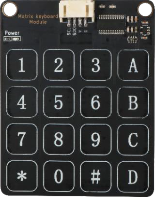 

When the corresponding key of the keyboard is touched, the module will output the corresponding value, as shown in the matrix keyboard key value mapping table:  

 
Keyboard Value | Hexadecimal value  | Keyboard Value | Hexadecimal value  | Keyboard Value | Hexadecimal value 
:-- | :-- | :-- | :-- | :-- | :--
1|0xFFFE|7|0xFEFF|D|0x7FFF 
2|0xFFFD|8|0xFDFF|C|0xF7FF 
3|0xFFFB|9|0xFBFF|B|0xFF7F 
4|0xFFEF|*|0xEFFF|A|0xFFF7 
5|0xFFDF|0|0xDFFF|
6|0xFFBF|#|0xBFFF|
 

Matrix keyboard sensor module has four pins G, V, SDO, SCL, which can be connected to digital and analog interfaces; we generally connect to the IIC interface to use.  

 
## Installation of Smart Access Control 

The course uses the S90 servo as the power mechanism of the door opening and closing, so before installing the servo, the servo should be zeroed to clarify the swing angle range of the servo, and then installed on the house, the installation steps are as follows:  

1）Zeroing the rudder to determine the direction of oscillation of the rudder arm  

2）Use M2 self-tapping screws to fix the door bar and rudder arm assembly, as Figure shows: 

 
 

 
 

3）Use M2 screws to connect the servo and servo bracket assembly, as Figure shows: 

 
 

4）Install the door lever on the servo with M2 self-tapping screws, as Figure shows: 

 
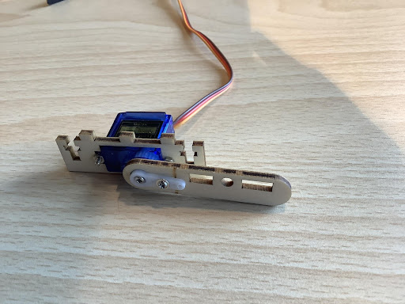 

5）Install the nut in the door body first, then install the door body on the door bar and fix it with M3*12 screws, as Figure shows: 

 
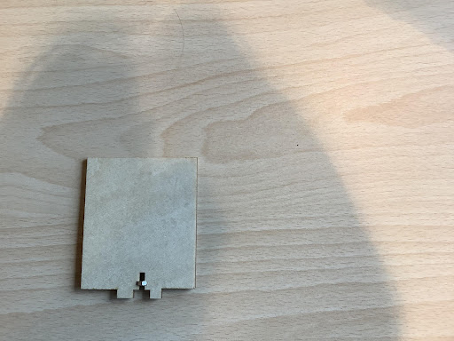 

 
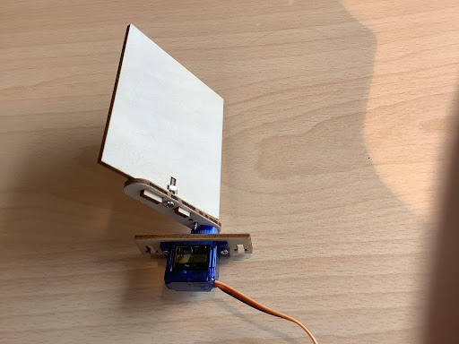 

6）Install the assembled servo bracket and door body together on the left side door with M3*12 screws, as Figure shows:

 
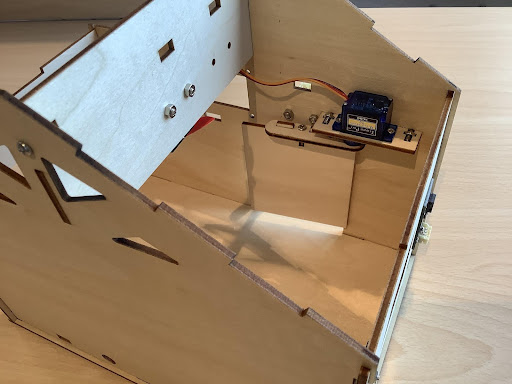 

7）Install the matrix touchpad next to the door with M3*8 screws, as Figure shows: 

 
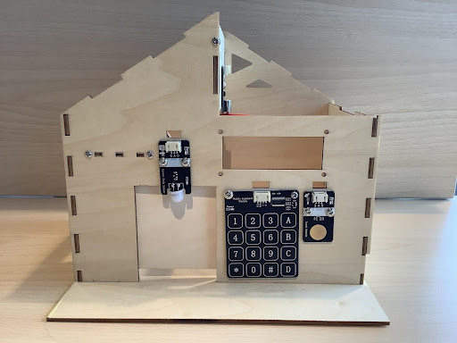 

## Program Design

### Algorithm Design 

The principle of smart coded automatic doors is that when the correct code is entered into the matrix keypad sensor module, the servo oscillates to open the door; otherwise, the door remains closed. The algorithm design is as follows: 

Step 1: Create an array, set the password to open the door, for example, 123, and then put it in the array. 

Step 2: Read the input value of the matrix keypad and determine, if the password is correct, the servo swings to open the door; otherwise, the door is closed. 

Step 3: End the algorithm.

### Hardware Connections 

The matrix keypad is connected to pins P15 and P16 on the Micro:bit expansion board, and the servo that holds the door is connected to pin P2 on the Micro:bit expansion board.  

 
Sensors and Actuators | Main Control Board 
 :-- | :--
Matrix Keyboard Sensor Module |P15(SCL)、P16(SDO) 
Servo |P2 

 
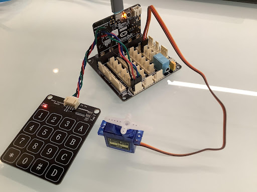 

### Sample Program  

Makecode program  

 
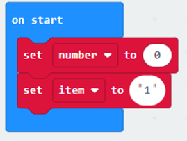 

 
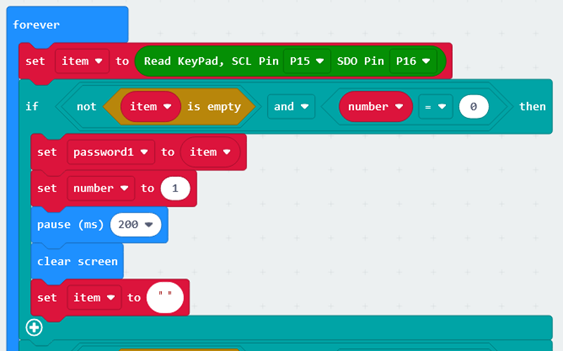 

 
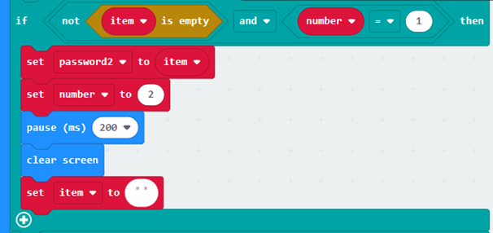 

 
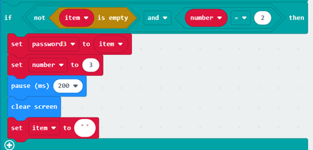 

 
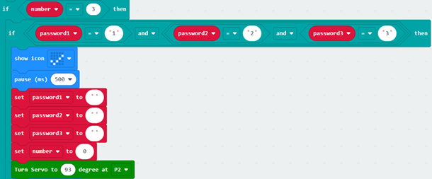 

 
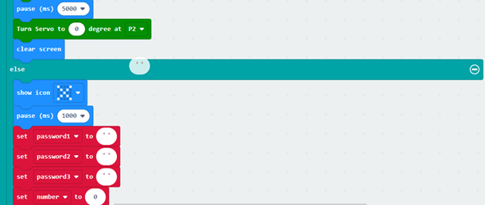 
 

<a href="https://makecode.microbit.org/_3M8WbgE6PMz5"> 
https://makecode.microbit.org/_3M8WbgE6PMz5 
</a> 

## Conclusion  

    
In this lesson, we understand the features and principles of the matrix keypad through the production of smart home access control, and master the programming logic of the password to open the door.

 
