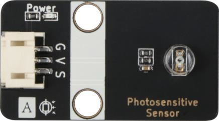
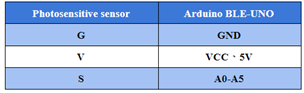
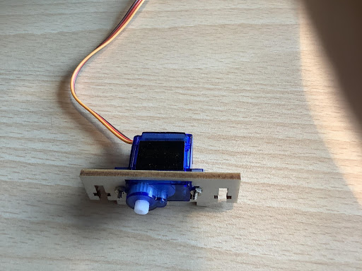
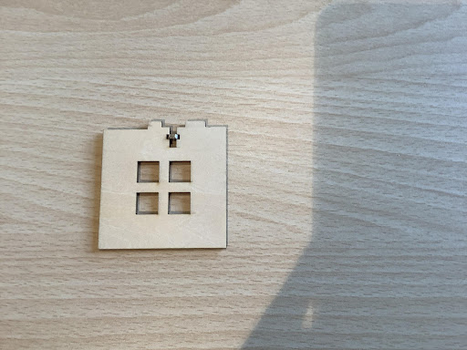
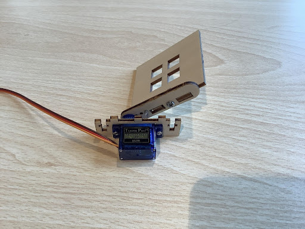
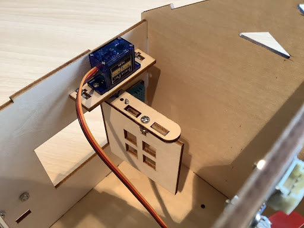
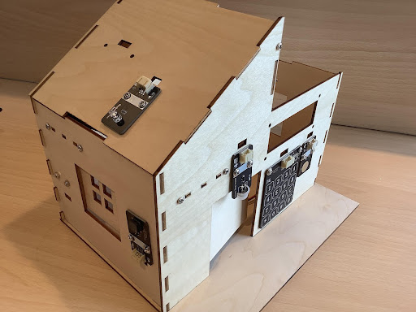
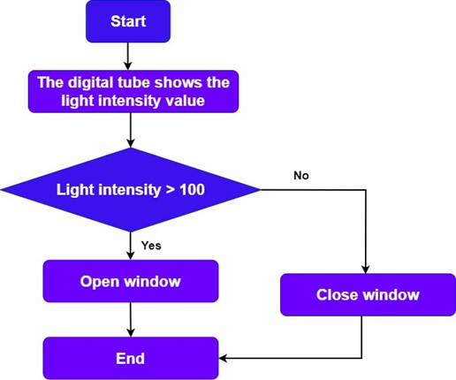
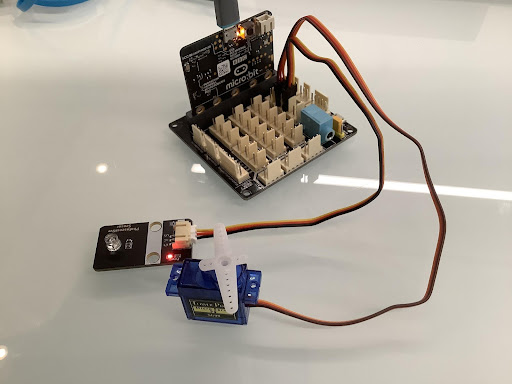
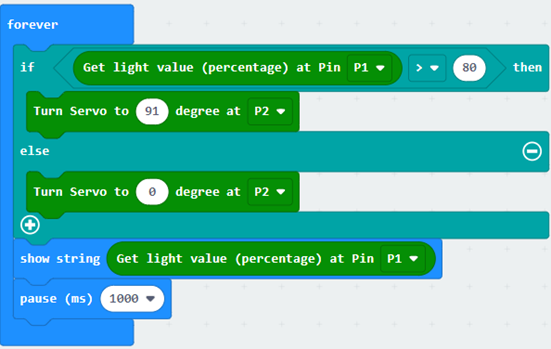

# Chapter 6 Light-controlled Automatic Windows

## Background  

    
Smart home windows are securer and more convenient than traditional windows. In this lesson, we will make a light-controlled automatic window, which has the function of automatically sensing the light intensity, so as to automatically adjust the window opening and closing according to the change of light. 

## Preparation  

    
Micro:bit motherboard, expansion board, battery box, AAA batteries, S90 servo, light sensor module, cable, data cable.  

 

## Learn About the Principle of Light-controlled Automatic Windows 

The principle is to use the light sensor to feel the external light intensity change and determine whether the light intensity is suitable for opening the window, if the light intensity is suitable, then the control servo to open the window; otherwise, if the light intensity is not suitable for opening the window, then close the window.  

## Learn About Photoreceptors and Digital Tube Displays

### Photosensitive sensor 

Photoresist is a special resistor made of semiconductor materials such as cadmium sulfide or cadmium selenide, and its working principle is based on the internal photoelectric effect. The stronger the light, the lower the resistance value, with the increase of light intensity, the resistance value decreases rapidly, and the bright resistance value can be as small as 1KΩ or less. Photoresistors are very sensitive to light, and when there is no light, the resistance is high, and the dark resistance is generally up to 1.5 MΩ. It can also be widely used in various light control circuits, such as control and regulation of lighting. Photoresistors are most sensitive to ambient light and are generally used to detect the brightness of light in the surrounding environment. 

  
 

In this course, G is GND ground, V is VCC high level, S is the data transmission pin. 

  
 

## Installation Of Light-controlled Automatic Window 

The windows in the course use the S90 servo as the power mechanism for the door opening and closing, so before installing the servo, the servo should be zeroed and the swing angle range of the servo should be clearly defined before installing it on the house, the installation steps are as follows:  

1）Zeroing the rudder to determine the direction of oscillation of the rudder arm 

2）Use M2 self-tapping screws to fix the window crossbar and rudder arm assembly, as Figure shows:

  
 

  
 

3）Use M2 screws to connect the servo and servo bracket assembly, as Figure shows: 

  
 

4）Install the door lever on the servo with M2 self-tapping screws, as Figure shows:  

  
 

5）Install the nut on the window body, and then install the window crossbar on the servo with M3*12 screws, as Figure shows: 

  
 

  
 

6）Install the nut on the window body, and then install the window crossbar on the servo with M3*12 screws, as Figure shows:

  
 

7）Install the light sensor on the roof board with M3*8 screws, as Figure shows: 

  
 

## Program Design 

### Algorithm Design

According to the principle of light-controlled automatic window, the algorithm is designed as follows:

Step 1: Set the threshold value of light intensity. 

Step 2: If the threshold is greater than the light intensity, the window opens; if it is less than the light intensity threshold, the window closes. 

Step 3: End the algorithm. 

  
 

### Hardware Connections

The photosensitive sensor is connected to P1, and the servo is connected to P2 on the expansion board. 

Sensors and Actuators|Main Control Board  
:--|:--
Photosensitive sensors |P1
Servo|P2 
  
 

### Sample Program 

Makecode program 

 

  
https://makecode.microbit.org/_gbLKKLEeiCiH 

## Conclusion 

In this lesson, we learn the characteristics of the light sensor and its use, and understand the principle of light-controlled windows, through the production of light-controlled automatic windows, to achieve the function of opening the window when the light is strong; conversely, close the window.  

 
