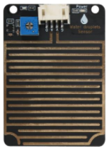
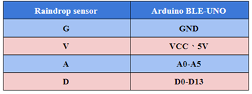
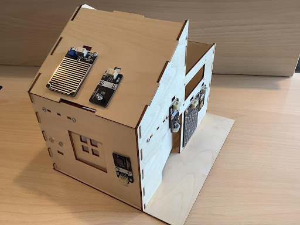
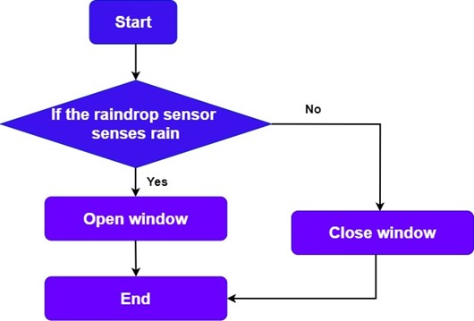
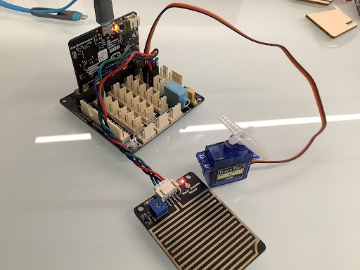
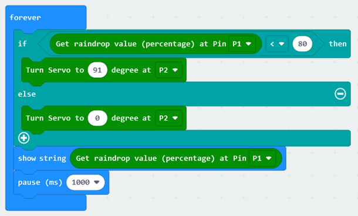

# Chapter 7  Smart Rain Control Windows

## Background

    In the last lesson, we learned and made an intelligent light-controlled window, since the window can be opened and closed according to the brightness of the light to control, that in the wind and rain, no one at home to close the window, can also make a rain-controlled window, so that you do not have to worry about no one at home to close the window, rain into the room, causing indoor moisture and other troubles. The following we will make an automatic intelligent rain-controlled window, to see what principle it is used to run.  

## Preparation 

Micro:bit motherboard, expansion board, battery box, AAA batteries, S90 servo, raindrop sensor module, connection cable, data cable.   

## Principle of Smart Rain Control Window

The automatic smart window of this course is realized by using the raindrop sensor and the tiller as the mechanism, the principle is that when the raindrop sensor senses the rain, the tiller executes the swing to close the window body.  

## Learn About Raindrop Sensor 

    The raindrop sensor is used to detect whether it is raining and the amount of rain, and is widely used in auto wiper systems, smart light systems and smart sunroof systems, etc. Output form: digital value output (0 and 1) and analog value A voltage output, using LM393 dual voltage comparator, when the sensor is connected to 5v power, there is no droplet on the sensor board, D output is at high level. When droplets are dropped, D output is at a low level. If we brush off the droplets, the output will return to a high level.  

    
  

Raindrop sensor module has four pins G, V, A, D. An analog output can detect the size of the raindrops above. D digital output can detect whether there is rain, by adjusting the size of the valve to adjust. 

    
  

## Construction of Automatic Smart Window  

We have already assembled the window in the previous lesson, so we will not repeat it in this lesson. Simply mount the raindrop sensor on the roof board, as Figure 7.1 shows:  

    
  

## Program Design 

### Algorithm Design

According to the principle of automatic smart windows, the algorithm is designed as follows:  

Step 1: Declare the state variables of the raindrop sensor. 

Step 2: Determine the return value of the raindrop sensor. If it is 0, i.e., it is raining, then the servo closes the window; if it is 1, then the servo opens the window. 

Step 3: End the algorithm.  

    
  

### Hardware Connections 

The servo is connected to pin P2, the raindrop sensor module is connected to pin P1 of the expansion board, and the analog data is read using pin P1.  

Sensors and Actuators |Main Control Board 
:--|:--
Raindrop Sensor |P1（A） 
Servo|P2 

    
  

### Sample Program  

Makecode program 

    
  

<a href="https://makecode.microbit.org/_C8D9WfJPt9P7">
https://makecode.microbit.org/_C8D9WfJPt9P7 
</a>

## Conclusion

In this lesson, we learn the characteristics of the raindrop sensor and its principle, and understand the principle of the rain-controlled window, which is programmed to control the movement of the raindrop sensor and the servo to realize the opening or closing of the window when it senses the change of weather. 

 
