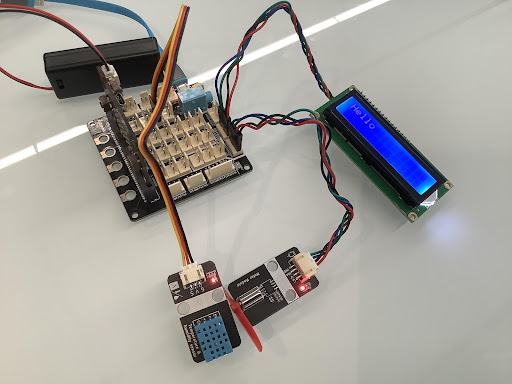
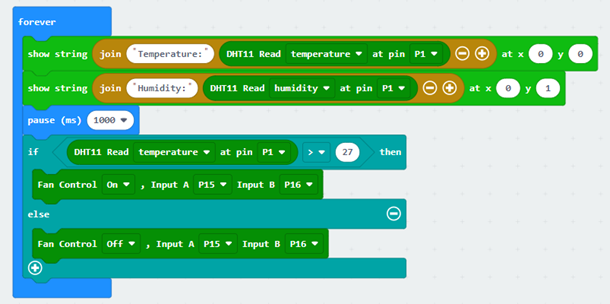

# Chapter 8  Environmental Monitoring System 

## Background 

With the continuous improvement of living standards, people are paying more and more attention to health and requirements. Whenever a new home is renovated, the toxic gases emitted from furniture and renovation materials can cause serious harm to the elderly and children, which is why smart home air quality detection systems are increasingly being used by more and more families. The task of this lesson is to complete an air quality detection system. 

## Preparation  

Micro:bit motherboard, expansion board, battery box, AAA batteries, DC motor fan module, temperature and humidity sensor, connection cable, USB data cable.  

## Learn About Environmental Monitoring Systems 

The environmental monitoring system uses sensing technology, short-range wireless communication technology such as Zigbee technology, voice synthesis technology (TTS technology), and smart air quality analysis software to detect, analyze, and alert the indoor air quality, and intelligently turn on the fan to give the family a healthy air environment. 

It is based on the principle of detecting the air quality through different air quality sensing modules installed in the room and transmitting it to the computer using Zigbee modules or Bluetooth modules, which can automatically analyze the quality of our surroundings and what measures to take to improve the air quality. This information can be broadcasted through the voice announcer to prompt the owner to take air purification measures and turn on the air purifier intelligently. 

If the indoor air does not meet the standard, the fan will start to purify the indoor air.  

## Learn About LCD Displays 

The display used in this course is LCD1602 display, which is a character LCD module specifically designed to display letters, numbers and symbols. It is widely used in industrial applications such as electronic clocks and temperature displays. "1602" means 2 lines and 16 characters per line. The LCD1602 display with an adapter board uses IIC communication, saving many I/O ports. 1602 Liquid Crystal Display (1602 LCD) is a common type of character LCD, named because it can display 16*2 characters. Usually we use a 1602 LCD with an integrated font chip. Through the API provided by LiquidCrystal class library, we can easily use 1602 LCD to display English letters and some symbols.  

  
 

  
 

In this module, we use IIC LCD1602 module with integrated IIC I/O expansion chip PCF8574, which makes the use of LCD 1602 easier. The two-wire IIC bus (serial clock line SCL, serial data line SDA) can be used to control the LCD 1602 display via Arduino IIC. It simplifies the circuit and saves I/O ports, so that Arduino can realize more functions. By setting the jumper, you can also set the address: 0x20-0x27, so that Arduino can control multiple LCD 1602.  

The wiring pins behind the LCD1602 display are GND, VCC, SDA, SCL (SDA and SCL are the data line and clock line for IIC communication).  

## Installation of Environmental Monitoring System  

The temperature and humidity sensor has been installed in the previous sections of the course, and the only thing you need to do in this lesson is to install the LCD display. Use M3*10 screws to mount the LCD display on the front of the house, as Figure shows:  

  
 

## Program Design 

### Algorithm Design  

First, use the temperature and humidity sensor to read the surrounding temperature and humidity figures, and then display them on the LCD display. And determine the temperature and humidity value, if greater than the set threshold, then start the fan; otherwise, turn off the fan. The procedure flow is as follows:  

Step 1: LCD Display shows the temperature and humidity changes. 

Step 2: Determine whether the temperature or humidity is greater than the threshold, if so, turn on the fan; otherwise, turn off the fan. 

Step 3: End the algorithm.

  
 

### Hardware Connections  

The LCD display is connected to pins A19 and P20 of the expansion board; the temperature and humidity sensor is connected to pin P1 of the expansion board; the DC motor fan module is connected to pins P15 and P16 of the expansion board.  

Sensors and Actuators|Main Control Board 
:--|:--
LCD Display |P19（SCL）、P20（SDA） 
Temperature and Humidity Sensor|P1 
DC Motor Fan Module|P15、P16 

  
 

### Sample Program  

Makecode program 

  
 

  
 

<a href="https://makecode.microbit.org/_b88MobFdC3ik">
https://makecode.microbit.org/_b88MobFdC3ik 
</a>

## Conclusion 

In this lesson, we learn the principle of the environmental monitoring system, using temperature and humidity sensors, LCD displays, and motor fan modules to make the room temperature and humidity change at any time, and to achieve the function of automatic air purification. In this process, we also master the principle of LCD display and the use of programmed control.  

